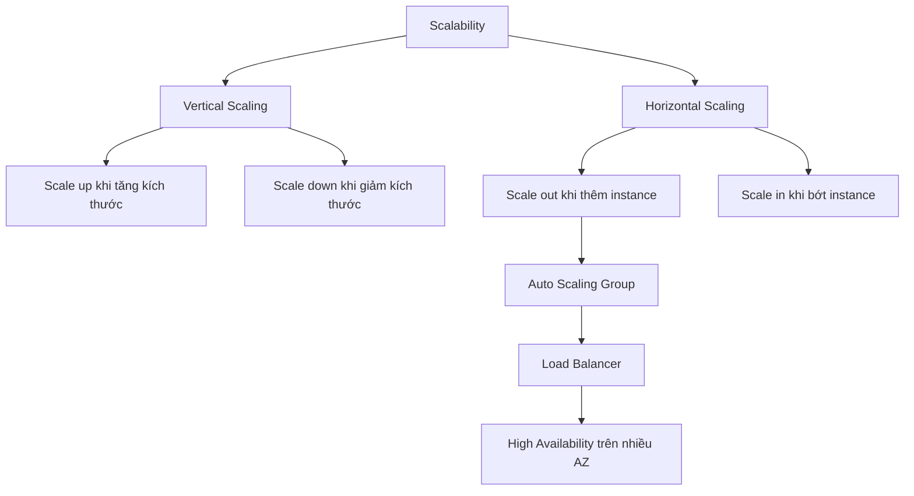

# 📈 Scalability, Elasticity và High Availability — Bộ ba khái niệm bạn phải phân biệt được

> Nguồn: `060-High-Availability-Scalability-Elasticity.txt` · [Udemy](https://ua.udemy.com/course/aws-certified-cloud-practitioner-new/learn/lecture/20055858)

Chào mừng các bạn đến với section **Elastic Load Balancing và Auto Scaling Groups** — section thể hiện rõ nhất sức mạnh của cloud, nơi ứng dụng của bạn có thể mở rộng một cách mượt mà. Trước khi động vào dịch vụ, chúng ta phải nắm thật chắc các khái niệm nền tảng: **scalability (khả năng mở rộng)**, **high availability (tính sẵn sàng cao)**, **elasticity (tính đàn hồi)** và **agility (tính linh hoạt)**.

*Đây là nhóm khái niệm rất hay xuất hiện trong đề thi, nên các bạn đừng bỏ qua nhé.*

---

### 🧱 Vertical Scaling — tăng sức mạnh của một chiếc máy

Vertical scaling (mở rộng theo chiều dọc) nghĩa là **tăng kích thước của instance**. Hãy tưởng tượng một tổng đài chăm sóc khách hàng: ta có một **junior operator (điện thoại viên mới)**; nếu "nâng cấp" cậu ấy thành **senior operator (điện thoại viên kỳ cựu)** thì người đó xử lý được nhiều cuộc gọi hơn hẳn. Trong AWS, ví dụ ứng dụng của bạn đang chạy trên **t2.micro**, vertical scaling tức là chuyển nó sang **t2.large**.

* Vertical scaling rất phổ biến với **hệ thống non-distributed (không phân tán)**, ví dụ **database**: muốn database nhanh hơn, bạn tăng kích thước của nó.
* Nhược điểm: luôn có **giới hạn của phần cứng** — dù ngày nay giới hạn đó đã rất, rất cao.

---

### 🌐 Horizontal Scaling — tăng số lượng chiếc máy

Horizontal scaling (mở rộng theo chiều ngang) là **tăng số lượng instance/hệ thống** thay vì tăng kích thước. Quay lại tổng đài: nếu một điện thoại viên không kham hết cuộc gọi, ta **thêm một điện thoại viên nữa**, rồi thêm nữa — từ 1 người có thể scale lên tới 6 người.

* Cách này yêu cầu **distributed system (hệ thống phân tán)** — với tổng đài thì quá hợp lý, vì mỗi người trực độc lập.
* Với **web application hiện đại**, người ta thường thiết kế theo hướng horizontal scaling ngay từ đầu.
* Trên AWS, việc scale trở nên cực dễ nhờ **Amazon EC2** kết hợp **Auto Scaling Group** — đúng chủ đề của section này.

---

### 🏢 High Availability — sống sót khi một trung tâm dữ liệu gặp sự cố

High availability nghĩa là chạy ứng dụng của bạn trên **ít nhất 2 Availability Zone (vùng sẵn sàng)**. Với tổng đài: ta đặt một trung tâm ở **New York** và một ở **San Francisco**. Nếu New York mất điện, các cuộc gọi vẫn được San Francisco tiếp nhận — tuy bận hơn, nhưng hệ thống vẫn sống sót.

Mục tiêu của high availability là **chịu được sự cố mất cả data center (trung tâm dữ liệu)** — có thể là động đất, mất điện, hoặc bất kỳ thảm họa nào. Trong AWS, các bạn sẽ dùng ASG ở chế độ **multi-AZ** kết hợp load balancer **multi-AZ**.

---

### 📏 Từ vựng chuẩn để không mất điểm

**Scalability** là khả năng hệ thống tiếp nhận tải lớn hơn bằng cách làm phần cứng mạnh hơn (**scale up**) hoặc thêm node (**scale out**).

**Elasticity** là bước tiến cloud-native hơn: một khi hệ thống đã scalable, nó sẽ có **auto scaling** để tự scale dựa trên tải nhận được, **trả tiền theo mức dùng (pay per use)**, khớp số server với nhu cầu và nhờ đó **tối ưu chi phí**.

**Agility** thì hoàn toàn **không liên quan** tới scalability hay elasticity — nó là **distractor (đáp án gây nhiễu)** trong đề thi. Agility nghĩa là tài nguyên IT "chỉ cách một cú click", giúp đưa tài nguyên đến tay developer **từ vài tuần xuống còn vài phút**, để tổ chức lặp nhanh hơn và đi nhanh hơn.

| Tiêu chí | Vertical Scaling | Horizontal Scaling |
|---|---|---|
| Cách làm | Tăng kích thước instance | Tăng số lượng instance |
| Thuật ngữ | Scale up / scale down | Scale out / scale in |
| Phù hợp với | Hệ thống non-distributed (database) | Hệ thống distributed (web app) |
| Giới hạn | Giới hạn của phần cứng | Linh hoạt hơn nhiều |

Về dải cấu hình EC2: từ **T2.nano** với **0.5 GB RAM và 1 vCPU** cho tới **u-12tb1.metal** — cái tên nghe đáng sợ với **12.3 TB RAM và 448 vCPU** (cấu hình có thể thay đổi theo thời gian).

---

### 🎯 Tự kiểm tra nhanh

**Câu 1:** Vertical scaling trong AWS nghĩa là gì?

<b>Xem đáp án</b>

**Đáp án:** Tăng kích thước của instance, ví dụ từ t2.micro lên t2.large.

Giải thích: Mục tiêu là làm "phần cứng" mạnh hơn để chịu tải lớn hơn.

Tham chiếu: Mục Vertical Scaling.

**Câu 2:** "Scale out" và "scale in" thuộc loại scalability nào?

<b>Xem đáp án</b>

**Đáp án:** Horizontal scaling — scale out là tăng số instance, scale in là giảm số instance.

Giải thích: Hai thuật ngữ này chỉ số lượng instance, không phải kích thước.

Tham chiếu: Mục Horizontal Scaling.

**Câu 3:** High availability trên AWS yêu cầu chạy ứng dụng ở đâu?

<b>Xem đáp án</b>

**Đáp án:** Trên ít nhất 2 Availability Zone.

Giải thích: Mục tiêu là chịu được sự cố mất một data center.

Tham chiếu: Mục High Availability.

**Câu 4:** Elasticity khác scalability ở điểm nào?

<b>Xem đáp án</b>

**Đáp án:** Elasticity là khi hệ thống scalable tự động scale theo tải, trả tiền theo mức dùng và tối ưu chi phí.

Giải thích: Elasticity là khái niệm cloud-native hơn, gắn với auto scaling và pay per use.

Tham chiếu: Mục Từ vựng chuẩn để không mất điểm.

**Câu 5:** Agility có phải là một dạng scalability hay elasticity không?

<b>Xem đáp án</b>

**Đáp án:** Không. Agility là distractor — nó nghĩa là tài nguyên IT chỉ cách một cú click, giúp giảm thời gian cấp phát từ vài tuần xuống vài phút.

Giải thích: Đừng để đề thi lừa giữa agility với scalability/elasticity.

Tham chiếu: Mục Từ vựng chuẩn để không mất điểm.

---

Vậy là các bạn đã nắm được bộ từ vựng nền tảng của section này. *Cứ nhớ kỹ bốn khái niệm — scalable, elastic, highly available và agile — thì mọi dịch vụ phía sau sẽ dễ hiểu hơn rất nhiều.*

Ở bài tiếp theo, chúng ta đến với dịch vụ đầu tiên giúp hệ thống elastic: **Elastic Load Balancing**. Hẹn gặp các bạn ở đó! 🚀
