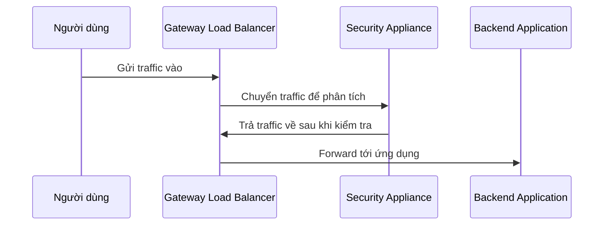

# ⚖️ Elastic Load Balancing (ELB) — "Người điều phối" traffic cho ứng dụng của bạn

> Nguồn: `061-Elastic-Load-Balancing-ELB-Overview.txt` · [Udemy](https://ua.udemy.com/course/aws-certified-cloud-practitioner-new/learn/lecture/20055864)

Tiếp nối bài trước, chúng ta đến với dịch vụ đầu tiên giúp hệ thống trở nên elastic: **Elastic Load Balancing**. Load balancer giống như một "người điều phối" đứng trước ứng dụng, nhận traffic từ internet và chia đều xuống các server phía sau. Đây là kiến thức chắc chắn có trong đề thi, nên các bạn chú ý nhé.

---

### 🔍 Load balancer hoạt động như thế nào?

Load balancer là một server **chuyển tiếp (forward) traffic internet xuống nhiều server phía sau (downstream)** — thường là các **backend EC2 instance**.

Kịch bản quen thuộc: load balancer là thứ duy nhất bạn public ra cho người dùng, phía sau nó là 3 EC2 instance. Người dùng thứ nhất gọi vào, load balancer đưa traffic tới một instance và trả kết quả về. Người dùng thứ hai vào, câu trả lời đến từ instance khác. Càng nhiều người dùng, load balancer càng chia đều tải — nhờ đó backend của bạn scale tốt hơn.

---

### 💡 Vì sao nên dùng load balancer?

* **Chia tải (spread the load)** xuống nhiều instance phía sau.
* **Một điểm truy cập duy nhất** qua **DNS hostname** cho ứng dụng.
* **Xử lý lỗi mượt mà**: load balancer chạy **health check (kiểm tra sức khỏe)** định kỳ; instance nào fail sẽ không nhận traffic nữa — "giấu" luôn sự cố đó khỏi người dùng.
* **SSL termination** — bật **HTTPS** cho website rất dễ dàng.
* Chạy **trên nhiều Availability Zone**, giúp ứng dụng **highly available**.

---

### ⚙️ ELB là dịch vụ được AWS quản lý

Với ELB, các bạn **không phải tự provision server** — AWS làm hết và cam kết nó hoạt động. AWS lo luôn **nâng cấp, bảo trì và high availability** cho load balancer; việc của bạn chỉ là cấu hình một vài thông số hành vi.

Bạn hoàn toàn có thể tự dựng load balancer trên EC2 với chi phí rẻ hơn, nhưng sẽ tốn nhiều công sức hơn cho **bảo trì, tích hợp, hệ điều hành, nâng cấp**... *Chọn ELB là chọn sự nhàn hạ, và đây cũng là cách AWS muốn bạn dùng.*

---

### 🗺️ Bốn loại load balancer và từ khóa thi

AWS cung cấp **4 loại load balancer**, và các bạn cần nắm rõ khác biệt:

| Loại | Layer | Protocol | Từ khóa cho đề thi |
|---|---|---|---|
| Application Load Balancer (ALB) | Layer 7 | HTTP, HTTPS, gRPC | HTTP routing, static DNS |
| Network Load Balancer (NLB) | Layer 4 | TCP, UDP | Ultra high performance, hàng triệu request/giây, static IP |
| Gateway Load Balancer (GWLB) | Layer 3 | GENEVE | Firewall, intrusion detection, deep packet inspection |
| Classic Load Balancer (CLB) | Layer 4 & 7 | — | Đời cũ, retired năm 2023, thay bởi ALB và NLB |

* Thấy **HTTP, HTTPS hoặc gRPC** → nghĩ ngay **Layer 7, ALB**. Cần **HTTP routing** hoặc **static DNS** (URL tĩnh) → cũng là ALB.
* **NLB** dùng **TCP/UDP**, hiệu năng cực cao (**hàng triệu request mỗi giây**), và cho bạn **static IP** thông qua **Elastic IP** — IP bạn sở hữu và có thể di chuyển. Kiến trúc giống hệt ALB, chỉ khác protocol và target.
* **CLB** bị khai tử vào năm 2023, giảng viên cho rằng nó sẽ không còn xuất hiện trong đề thi nữa.

---

### 🚦 Gateway Load Balancer — cân tải cho... firewall

GWLB dùng protocol **GENEVE** trên chính các **IP packet** (Layer 3). Nó không cân tải cho ứng dụng của bạn, mà cân tải traffic tới các **security virtual appliance (thiết bị bảo mật ảo) của bên thứ ba** chạy trên EC2 — phục vụ **firewall, intrusion detection (phát hiện xâm nhập)** hoặc **deep packet inspection (kiểm tra sâu gói tin)**.

Luồng đi: traffic vào GWLB → được chuyển tới các appliance để phân tích → trả về GWLB → mới forward tới ứng dụng.

Nắm được khác biệt giữa các loại load balancer là các bạn đã nắm chắc phần thi này.

---

### 🎯 Tự kiểm tra nhanh

**Câu 1:** ALB dùng cho protocol nào và ở layer mấy?

<b>Xem đáp án</b>

**Đáp án:** HTTP, HTTPS (và gRPC) — Layer 7.

Giải thích: ALB còn hỗ trợ HTTP routing và static DNS.

Tham chiếu: Mục Bốn loại load balancer và từ khóa thi.

**Câu 2:** NLB khác ALB ở điểm nào?

<b>Xem đáp án</b>

**Đáp án:** NLB là Layer 4, dùng TCP/UDP, hiệu năng cực cao (hàng triệu request/giây) và cung cấp static IP qua Elastic IP.

Giải thích: Kiến trúc NLB giống ALB, chỉ khác protocol và loại target.

Tham chiếu: Mục Bốn loại load balancer và từ khóa thi.

**Câu 3:** Gateway Load Balancer dùng protocol gì và cho use case nào?

<b>Xem đáp án</b>

**Đáp án:** Protocol GENEVE trên IP packet (Layer 3), dùng để route traffic tới firewall, intrusion detection, deep packet inspection trên các virtual appliance.

Giải thích: GWLB không cân tải ứng dụng mà cân tải traffic tới thiết bị bảo mật.

Tham chiếu: Mục Gateway Load Balancer.

**Câu 4:** Dùng ELB thay vì tự dựng load balancer trên EC2 được lợi gì?

<b>Xem đáp án</b>

**Đáp án:** AWS lo provision, nâng cấp, bảo trì và high availability; bạn chỉ cấu hình hành vi.

Giải thích: Tự dựng rẻ hơn nhưng tốn nhiều công bảo trì, tích hợp và nâng cấp.

Tham chiếu: Mục ELB là dịch vụ được AWS quản lý.

**Câu 5:** Khi một backend instance bị fail, load balancer xử lý thế nào?

<b>Xem đáp án</b>

**Đáp án:** Health check định kỳ phát hiện instance fail và load balancer ngừng gửi traffic tới instance đó.

Giải thích: Nhờ vậy sự cố của instance được "giấu" khỏi người dùng.

Tham chiếu: Mục Vì sao nên dùng load balancer.

---

Vậy là các bạn đã hiểu ELB làm gì và bốn loại load balancer khác nhau ra sao. *Phần lý thuyết khá gọn, nhưng đây là nội dung "ăn điểm" trong đề thi nên các bạn nhớ kỹ bảng so sánh nhé.*

Bài tiếp theo, chúng ta sẽ tự tay tạo một **Application Load Balancer** trên console. Hẹn gặp các bạn ở đó! 🚀
