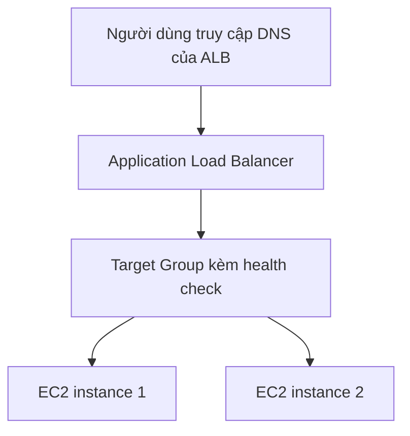

# 🧪 Thực hành Application Load Balancer: một URL cho hai EC2 instance

> Nguồn: `062-Application-Load-Balancer-ALB-Hands-On.txt` · [Udemy](https://ua.udemy.com/course/aws-certified-cloud-practitioner-new/learn/lecture/20055874)

Đã đến lúc tự tay làm! Trong bài này, chúng ta tạo hai EC2 instance rồi đặt trước chúng một **Application Load Balancer** để chỉ dùng **một URL duy nhất** mà traffic vẫn được chia đều. Các bạn hãy mở AWS console và làm theo mình nhé — *nhớ kỹ là mọi thao tác đều nằm trong free tier.*

---

### 🖥️ Bước 1: Tạo hai EC2 instance

1. Vào **Launch instances**, chọn **2 instances**, đặt tên **My First Instance** (instance thứ hai sẽ đổi tên sau).
2. Chọn **Amazon Linux 2**, instance type **t2.micro**.
3. Bỏ qua **key pair** vì không cần SSH — nếu cần vẫn có thể dùng **EC2 Instance Connect**.
4. Network settings: dùng security group có sẵn **Launch Wizard 1** (cho phép HTTP và SSH).
5. Giữ storage mặc định, mở **Advanced details** và dán **EC2 user data** như các bài trước.
6. Launch xong, vào **View all instances** và đổi tên instance thứ hai thành **My Second Instance**.

Khi cả hai instance ready, copy **IPv4 address** của từng máy và mở trên trình duyệt — các bạn sẽ thấy **hello world** từ mỗi instance, phần cuối thay đổi tùy máy. Mục tiêu của chúng ta: gộp hai địa chỉ này thành **một URL duy nhất**.

---

### 🔍 Bước 2: Xem qua các loại load balancer trên console

Trong mục **Load Balancers**, các bạn thấy đủ các loại:

* **Application Load Balancer (ALB)** — cho HTTP/HTTPS.
* **Network Load Balancer (NLB)** — cho TCP, UDP hoặc TLS over TCP, dùng khi cần **ultra high performance: hàng triệu request mỗi giây với độ trễ cực thấp**.
* **Gateway Load Balancer** — cho security, intrusion detection, firewall, phân tích traffic.
* **Classic Load Balancer** — đang bị khai tử, mình sẽ không đụng tới.

Bài này chúng ta tập trung vào **ALB**.

---

### ⚙️ Bước 3: Tạo Application Load Balancer

1. Đặt tên **DemoALB**, scheme **internet facing**, address type **IPv4**.
2. Network mapping: deploy trên **tất cả Availability Zone**.
3. Tạo security group mới **demo-sg-load-balancer**, chỉ cho phép **HTTP** từ mọi nơi (inbound), outbound giữ mặc định. Sau đó gán vào ALB và bỏ default security group, chỉ giữ lại một security group.

---

### 🎯 Bước 4: Tạo Target Group và gắn listener

Target group chỉ là **một nhóm các EC2 instance** của bạn.

1. Ở phần **Listeners and routing**: route **HTTP port 80** tới một target group.
2. Tạo target group mới tên **demo-tg-alb**: group instances, protocol **HTTP port 80**, HTTP version 1, health check mặc định.
3. **Register targets**: chọn cả hai EC2 instance trên **port 80**.
4. Quay lại ALB, refresh và chọn **demo-tg-alb** cho listener port 80, rồi nhấn **Create load balancer**.

---

### 🩺 Bước 5: Kiểm chứng load balancing và failover

Chờ ALB chuyển từ **provisioning** sang **active**, copy **DNS name** và mở trên tab mới. Các bạn sẽ thấy **hello world** — và khi refresh liên tục, **target thay đổi qua lại giữa hai instance**. Đó là bằng chứng load balancing đang hoạt động!

Kiểm tra trong **Target group**: cả hai target đều **healthy** — ALB sẽ gửi traffic lần lượt cho cả hai.

Giờ thử "đánh sập" một instance:

1. Vào EC2, **stop** instance thứ nhất → nó không còn phản hồi traffic.
2. Chờ khoảng **30 giây**, refresh target group: instance này chuyển sang trạng thái không khỏe và bị loại khỏi vòng chia tải.
3. Refresh DNS của ALB: mọi response chỉ còn đến từ instance đang chạy.
4. **Start** instance trở lại: sau trạng thái health ban đầu, nó chuyển về **healthy**, và hello world lại đến từ cả hai máy.

Vậy là chúng ta đã tạo thành công một ALB cùng hai target trong target group. *Các bạn cứ nghịch thử stop/start instance vài lần để thấy health check hoạt động — học bằng cách làm là cách nhớ lâu nhất!*

Bài tiếp theo, chúng ta sẽ để **Auto Scaling Group** tự động tạo và quản lý các instance này. Hẹn gặp các bạn ở đó! 🚀
