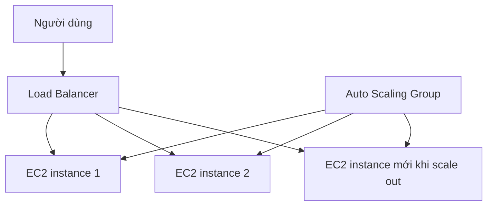

# 📈 Auto Scaling Groups (ASG) — Tự động thêm, bớt và thay thế EC2

> Nguồn: `063-Auto-Scaling-Groups-ASG-Overview.txt` · [Udemy](https://ua.udemy.com/course/aws-certified-cloud-practitioner-new/learn/lecture/20055886)

Ứng dụng của chúng ta đã biết cân bằng tải, nhưng các server phía sau được tạo ra bằng cách nào một cách tự động? Câu trả lời là **Auto Scaling Group (ASG — nhóm tự động mở rộng)**. Đây là dịch vụ giúp ứng dụng của các bạn thực sự "đàn hồi", và là một trong những chủ đề quan trọng nhất của section này.

---

### 🎯 Vì sao cần ASG? Vì tải luôn thay đổi

Trong thực tế, load lên website **thay đổi theo thời gian**. Ví dụ người dùng thường mua sắm **ban ngày** và ít mua sắm **ban đêm** — tải ban ngày cao hơn hẳn.

Trên cloud, ta có thể tạo và hủy server rất nhanh, nên mục tiêu của ASG là:

* **Scale out** — thêm EC2 instance để đáp ứng tải tăng.
* **Scale in** — bớt EC2 instance khi tải giảm.

ASG đảm bảo bạn luôn có **số máy tối thiểu và tối đa** chạy ở mọi thời điểm, và khi tạo/xóa instance, chúng sẽ được **đăng ký (register) hoặc hủy đăng ký (deregister)** khỏi load balancer — hai dịch vụ này làm việc rất ăn ý với nhau.

---

### ⚙️ Ba con số định hình nên ASG

* **Minimum size** — ví dụ 1 EC2 instance.
* **Desired capacity** — thường chính là kích thước thực tế của ASG.
* **Maximum size** — trần tối đa mà ASG có thể mở rộng.

ASG sẽ tự động scale out hoặc scale in quanh các con số này khi cần, và luôn làm việc song song với load balancer.

---

### 🛡️ Tự phát hiện và thay thế instance không khỏe mạnh

Nếu một server gặp sự cố — ví dụ **bug ứng dụng** — ASG sẽ phát hiện, **deregister** instance đó khỏi load balancer, **terminate** nó và **thay bằng một instance khỏe mạnh mới**. Bạn không cần làm gì cả, mọi thứ diễn ra tự động.

---

### 🔗 ASG + Load Balancer = tiết kiệm chi phí tối đa

Hai dịch vụ work hand in hand:

1. Traffic vào qua **load balancer** rồi được chuyển tới EC2 instance.
2. ASG scale out thêm instance → load balancer tự đăng ký và chia traffic cho chúng.
3. Càng nhiều instance, traffic càng được dàn mỏng — tối đa tới **maximum size**.

Lợi ích cuối cùng: **tiết kiệm chi phí cực lớn**, vì hệ thống chỉ chạy đúng **optimal capacity (công suất tối ưu)** — đây chính là nguyên lý chủ đạo của cloud: **elasticity**.

---

### 🎯 Tự kiểm tra nhanh

**Câu 1:** Mục tiêu chính của Auto Scaling Group là gì?

<b>Xem đáp án</b>

**Đáp án:** Scale out thêm instance khi tải tăng và scale in bớt instance khi tải giảm.

Giải thích: ASG giúp hệ thống khớp với nhu cầu thay đổi theo thời gian.

Tham chiếu: Mục Vì sao cần ASG.

**Câu 2:** Desired capacity của ASG là gì?

<b>Xem đáp án</b>

**Đáp án:** Là kích thước mong muốn, thường cũng chính là kích thước thực tế của ASG.

Giải thích: ASG scale quanh ba con số: minimum, desired và maximum.

Tham chiếu: Mục Ba con số định hình nên ASG.

**Câu 3:** Khi ASG tạo hoặc xóa EC2 instance, load balancer được cập nhật thế nào?

<b>Xem đáp án</b>

**Đáp án:** Instance mới được register, instance bị xóa được deregister khỏi load balancer.

Giải thích: ASG và load balancer làm việc hand in hand.

Tham chiếu: Mục Vì sao cần ASG.

**Câu 4:** ASG xử lý một instance bị bug ứng dụng như thế nào?

<b>Xem đáp án</b>

**Đáp án:** Phát hiện instance unhealthy, deregister, terminate và thay bằng instance khỏe mạnh mới.

Giải thích: Đây là cơ chế tự phục hồi của ASG.

Tham chiếu: Mục Tự phát hiện và thay thế instance không khỏe mạnh.

**Câu 5:** Vì sao ASG giúp tiết kiệm chi phí?

<b>Xem đáp án</b>

**Đáp án:** Vì hệ thống chỉ chạy ở đúng optimal capacity — nguyên lý elasticity của cloud.

Giải thích: Không trả tiền cho server nhàn rỗi, chỉ chạy đủ máy theo tải.

Tham chiếu: Mục ASG + Load Balancer.

---

Vậy là các bạn đã hiểu ASG hoạt động ra sao. *Phần lý thuyết khá nhẹ nhàng — bài sau chúng ta sẽ bắt tay vào console và tận mắt xem ASG tạo máy.*

Ở bài tiếp theo, chúng ta sẽ tái tạo mô hình **ASG + nhiều EC2 + Load Balancer** bằng thực hành. Hẹn gặp các bạn ở đó! 🚀
