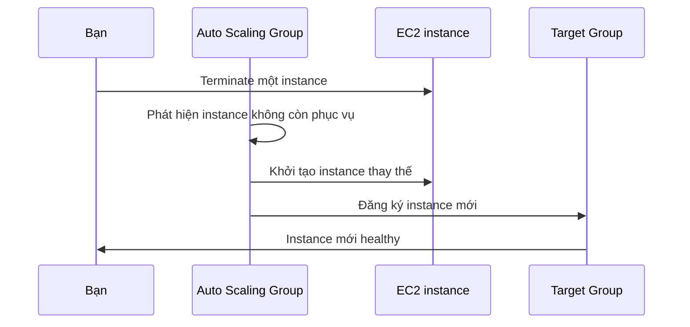

# 🧪 Thực hành Auto Scaling Group: tự tạo, tự thay thế, tự mở rộng

> Nguồn: `064-Auto-Scaling-Groups-ASG-Hands-On.txt` · [Udemy](https://ua.udemy.com/course/aws-certified-cloud-practitioner-new/learn/lecture/20055896)

Trong bài này, chúng ta tái tạo mô hình **ASG + nhiều EC2 + Load Balancer**. Các bạn sẽ tận mắt thấy ASG tự tạo instance, tự phát hiện instance bị "chết" và tự sinh máy mới thay thế. Mở console lên và làm theo mình nhé!

---

### 🧹 Bước 1: Dọn instance cũ và khởi tạo ASG

Trước tiên, **terminate hai instance** đã tạo ở bài ALB. Sau đó vào **Auto Scaling Groups** (góc dưới bên trái), chọn **Create Auto Scaling group** và đặt tên **DemoASG**.

ASG cần một **launch template** để biết cách tạo EC2 instance — mình đặt tên **DemoLaunchTemplate**.

---

### 📋 Bước 2: Tạo Launch Template

1. **Amazon Linux 2** từ Quick Start.
2. Instance type **t2.micro**.
3. **Không dùng key pair**, không cấu hình subnet trong template.
4. Security group có sẵn **launch-wizard-1**.
5. Advanced Network Configuration và EBS volumes: giữ nguyên.
6. **Advanced Details**: dán **user data** như các bài trước.

Tạo template xong, chọn **DemoLaunchTemplate Version 1** rồi nhấn **Next**.

---

### ⚙️ Bước 3: Cấu hình ASG

1. **Instance type requirements**: t2.micro đến từ launch template, không override.
2. **Network**: chọn VPC, chọn **3 Availability Zone**, AZ distribution để **balanced best efforts** (mặc định).
3. **Load balancing**: chọn **Attach to an existing load balancer** → target group **demo-tg-alb** đã tạo trước đó. Không đụng tới VPC Lattice hay zonal shift.
4. **Health checks**: EC2 health checks luôn bật; bật thêm **ELB health checks** để load balancer phát hiện instance lỗi và ASG tự terminate chúng.
5. **Group size**: desired **2**, min **1**, max tự động thành 2 — mình đổi max thành **4**.
6. **Automatic scaling**: chưa thiết lập (học ở bài sau). **Instance maintenance policy**: No Policy; capacity, notification, tags giữ mặc định.
7. Nhấn **Create Auto Scaling group**.

---

### 🩺 Bước 4: Quan sát và tinh chỉnh health check

ASG đang ở trạng thái **updating capacity** (từ 0 lên 2 instance). Vào tab **Activity** — có 2 hoạt động launch instance; vào **Instance Management** — 2 instance đang **pending**. Bên EC2 console cũng thấy 2 instance running do ASG tạo ra.

Vào target group **demo-tg-alb**: đã có **2 targets** do ASG đăng ký tự động, nhưng đang **unhealthy** vì instance chưa khởi động xong. Muốn chúng healthy nhanh hơn, mình vào **Health checks** của target group, sửa trong **Advanced settings**:

* **Healthy threshold = 2**
* **Interval = 5 giây**
* **Timeout = 2 giây** (phải nhỏ hơn interval)

Lưu lại, refresh targets — cả hai instance đều **healthy**. Mở DNS name của load balancer: hello world đến từ cả hai instance do ASG tạo.

---

### 🔁 Bước 5: Xem ASG tự thay thế instance

Giờ đến phần thú vị nhất:

1. Vào EC2, chọn một instance của ASG và **Terminate Instance**.
2. Mở **Activity history** của ASG: bạn sẽ thấy hoạt động terminate instance bị terminating, rồi ngay sau đó là **"an instance was launched in response to an unhealthy instance needing to be replaced"**.
3. Trong lúc chuyển tiếp, bạn thấy một instance **pending**, một instance **terminating**, một instance **in service**.

ASG đã tự phát hiện và tự sinh máy thay thế. *Các bạn có thể chơi thêm: sửa desired capacity xuống 1 để giữ lại một máy, hoặc lên 4 để ASG tạo thêm máy và load balancer chia traffic cho cả 4.*

Vậy là các bạn đã thấy đủ các tính năng chính của ASG: tự tạo instance, đăng ký vào load balancer, tự thay thế máy hỏng và thay đổi capacity theo ý bạn. *Cứ nghịch thử các con số desired capacity, các bạn sẽ hiểu nhanh hơn nhiều.*

Bài tiếp theo, chúng ta sẽ tìm hiểu các **chiến lược scaling** khác nhau mà ASG hỗ trợ. Hẹn gặp các bạn ở đó! 🚀
