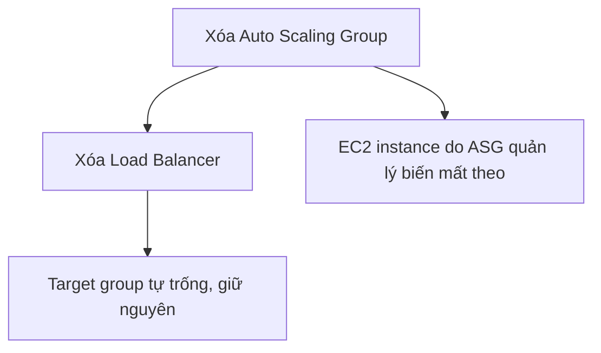

# 🧹 Dọn dẹp section ELB & ASG đúng cách — đừng xóa nhầm EC2!

> Nguồn: `066-Section-Cleanup.txt` · [Udemy](https://ua.udemy.com/course/aws-certified-cloud-practitioner-new/learn/lecture/20207708)

Học xong section rồi, chúng ta dọn dẹp tài nguyên để không tốn tiền. Nhưng cẩn thận — với Auto Scaling Group, thao tác "nghĩ là đúng" lại không hoạt động như bạn tưởng. Cùng làm theo thứ tự chuẩn dưới đây nhé.

---

### ⚠️ Vì sao không thể terminate EC2 trực tiếp?

Bạn thử vào EC2 và **terminate hai instance** xem — mọi thứ sẽ **không như ý bạn**, vì ASG sẽ **tự động tạo lại chúng** ngay sau đó. Lý do rất đơn giản: ASG vẫn giữ desired capacity, và nhiệm vụ của nó là đảm bảo luôn đủ số instance đó. Bạn xóa bao nhiêu, ASG "mọc" lại bấy nhiêu.

Vì vậy, phải xử lý từ gốc là **chính chiếc Auto Scaling Group**, chứ không phải các instance con của nó.

---

### 🗑️ Thứ tự dọn dẹp đúng

1. **Xóa Auto Scaling Group**: vào Auto Scaling Groups, chọn ASG của bạn rồi **Delete** — gõ chữ **`Delete`** vào ô xác nhận để hoàn tất.
2. **Xóa Load Balancer**: tìm application load balancer của bạn, chọn **Actions** → **Delete** → xác nhận đồng ý là xong.
3. **Target group**: **không cần xóa** — target group **không tốn tiền**, và sau khi ASG cùng load balancer bị xóa, nó sẽ **tự trống**.

---

### ✅ Kết quả: sạch sẽ và vẫn trong free tier

Khi ASG biến mất, các EC2 instance mà nó quản lý cũng **biến mất theo** — bạn không cần (và không nên) đi xóa thủ công từng máy. Mọi thứ sạch hoàn toàn.

*Các bạn cứ yên tâm: sau bước dọn dẹp này, chúng ta vẫn nằm trong **free tier (gói miễn phí)** của khóa học.*

Vậy là xong phần dọn dẹp. Hẹn gặp các bạn ở bài tổng kết của section! 🚀
