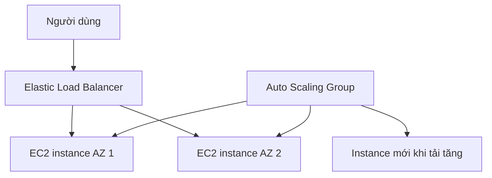

# 🏁 Tổng kết ELB & ASG: cặp bài trùng đưa ứng dụng lên tầm cao mới

> Nguồn: `067-ELB-ASG-Summary.txt` · [Udemy](https://ua.udemy.com/course/aws-certified-cloud-practitioner-new/learn/lecture/20260630)

Chúng ta đã đi hết section ELB & ASG. Đây là lúc ôn nhanh toàn bộ khái niệm và dịch vụ để các bạn tự tin bước vào đề thi — mình sẽ tóm gọn đúng những gì cần nhớ, kèm một quiz nhỏ ở cuối bài.

---

### 🧠 Bốn khái niệm phải phân biệt

* **High availability** — chạy ứng dụng trên **nhiều Availability Zone**.
* **Vertical scaling** — tăng **kích thước** của instance.
* **Horizontal scaling** — tăng **số lượng** instance.
* **Elasticity** — khả năng scale up/down **theo nhu cầu**.
* **Agility** — tạo và xóa tài nguyên **rất nhanh**, giúp doanh nghiệp làm việc nhanh hơn.

Việc map đúng khái niệm với đặc điểm là cực kỳ quan trọng trong đề thi.

---

### ⚖️ Load Balancer — ôn nhanh 4 loại

ELB giúp **phân phối traffic tới các backend EC2 instance**, có thể trải trên nhiều AZ, kèm **health check** đảm bảo instance phía sau thực sự khỏe mạnh.

| Loại | Layer | Dùng cho |
|---|---|---|
| Classic Load Balancer | 4 & 7 | Đời cũ, đã retired |
| Application Load Balancer | 7 | Workload HTTP |
| Network Load Balancer | 4 | Hiệu năng cực cao, TCP |
| Gateway Load Balancer | 3 | Route qua virtual appliance |

---

### 📈 Auto Scaling Group — trái tim của elasticity

ASG cho phép **hiện thực hóa elasticity**: trải load trên nhiều AZ, scale instance theo nhu cầu hệ thống, và **thay thế instance không khỏe mạnh**. ASG và ELB có **tích hợp chặt chẽ (tight integration)** — chính vì vậy chúng là một **cặp bài trùng tuyệt vời**.

Kết hợp lại, chúng ta đạt được **high availability, scalability, elasticity và agility** trên cloud.

---

### 🎯 Tự kiểm tra nhanh

**Câu 1:** High availability nghĩa là gì?

<b>Xem đáp án</b>

**Đáp án:** Chạy ứng dụng trên nhiều Availability Zone.

Giải thích: Mục tiêu là chịu được sự cố của một data center.

Tham chiếu: Mục Bốn khái niệm phải phân biệt.

**Câu 2:** Vertical scaling và horizontal scaling khác nhau thế nào?

<b>Xem đáp án</b>

**Đáp án:** Vertical là tăng kích thước instance; horizontal là tăng số lượng instance.

Giải thích: Đây là hai hướng mở rộng khác nhau của hệ thống.

Tham chiếu: Mục Bốn khái niệm phải phân biệt.

**Câu 3:** Load balancer nào dùng cho workload HTTP ở layer 7?

<b>Xem đáp án</b>

**Đáp án:** Application Load Balancer (ALB).

Giải thích: ALB xử lý HTTP; NLB là layer 4 cho TCP, GWLB là layer 3.

Tham chiếu: Mục Load Balancer.

**Câu 4:** Auto Scaling Group giúp gì cho ứng dụng?

<b>Xem đáp án</b>

**Đáp án:** Hiện thực hóa elasticity, trải load trên nhiều AZ, scale theo nhu cầu và thay thế instance không khỏe mạnh.

Giải thích: ASG là trái tim của elasticity trong section này.

Tham chiếu: Mục Auto Scaling Group.

**Câu 5:** Vì sao nói ASG và ELB là "cặp bài trùng"?

<b>Xem đáp án</b>

**Đáp án:** Vì chúng tích hợp chặt chẽ với nhau, cùng đem lại high availability, scalability, elasticity và agility.

Giải thích: ASG đăng ký/hủy đăng ký instance với ELB, ELB chia traffic tới các instance đó.

Tham chiếu: Mục Auto Scaling Group.

---

Vậy là chúng ta đã hoàn thành section **ELB & ASG**. *Các bạn nhớ ôn lại bảng so sánh load balancer và các chiến lược scaling — đây là những điểm "ăn tiền" trong đề thi chứng chỉ.*

Hẹn gặp các bạn ở section tiếp theo trên hành trình chinh phục CLF-C02! 🚀
