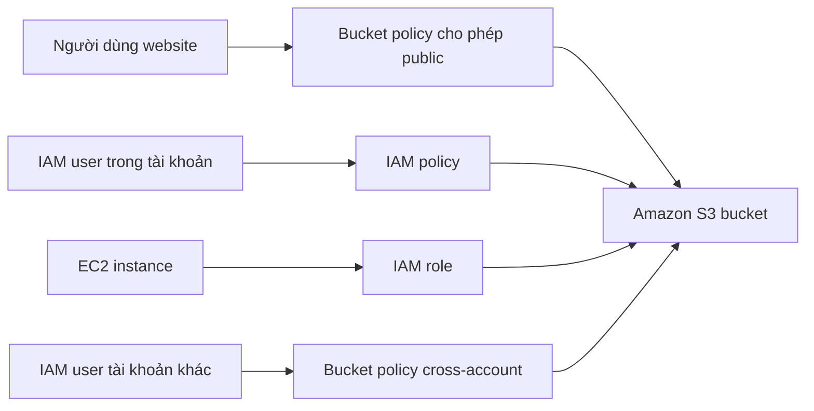

# 🔐 Bảo mật Amazon S3: Bucket Policy và các lớp kiểm soát truy cập

> Nguồn: `070-S3-Security-Bucket-Policy.txt` · [Udemy](https://ua.udemy.com/course/aws-certified-cloud-practitioner-new/learn/lecture/20055916)

Sau khi đã tạo bucket và upload object, câu hỏi tiếp theo là: **ai được phép truy cập dữ liệu của mình?** Bài này mình sẽ nói về **S3 Security** với hai lớp chính — **User-Based** và **Resource-Based** — và tập trung vào **Bucket Policy**, công cụ phổ biến nhất để bảo mật (và public) bucket S3.

---

### 🧱 Các lớp bảo mật của Amazon S3

**1. User-Based (theo người dùng):** bạn có thể gắn **IAM policy** cho một **IAM user** cụ thể — IAM sẽ quyết định những **API call** nào user đó được phép gọi.

**2. Resource-Based (theo tài nguyên):** mới hơn, cho phép gắn rule trực tiếp lên tài nguyên:

* **S3 Bucket policies** — các rule phạm vi toàn bucket, gán trực tiếp từ S3 console; dùng để cho một user từ tài khoản khác (**cross-account**) truy cập bucket của bạn, hoặc để **public** bucket.
* **Object ACL (Access Control List)** — bảo mật mức chi tiết hơn, có thể **disable**.
* **Bucket ACL** — ít phổ biến hơn, cũng có thể disable.

Cách làm security phổ biến nhất hiện nay cho S3 bucket chính là **Bucket policies**.

**3. Encryption:** cách bảo mật khác là **mã hóa object bằng encryption key** — mình sẽ nói chi tiết ở bài S3 Encryption.

---

### 🔍 Khi nào một IAM principal truy cập được object?

Một **IAM principal** có thể truy cập object S3 khi:

* **IAM permissions cho phép** — hoặc —
* **Resource policy cho phép**,
* và **không có explicit deny (từ chối tường minh)** nào trong action đó.

Nếu thỏa điều kiện trên, principal được thực hiện **API call** đã chỉ định lên object. Chúng ta sẽ xem các tình huống cụ thể ngay sau đây.

---

### 📜 Bucket Policy trông như thế nào?

Bucket policy là **JSON document** khá dễ đọc. Cấu trúc gồm những thành phần chính:

* **Resource** — policy áp dụng cho bucket và object nào; dấu `*` nghĩa là **mọi object** trong bucket ví dụ.
* **Effect** — **Allow** hoặc **Deny**.
* **Action** — tập API được Allow/Deny; ví dụ `GetObject` (lấy object về).
* **Principal** — account hoặc user mà policy áp dụng; `"*"` nghĩa là **bất kỳ ai**.

```json
{
  "Version": "2012-10-17",
  "Statement": [
    {
      "Effect": "Allow",
      "Principal": "*",
      "Action": "s3:GetObject",
      "Resource": "arn:aws:s3:::example-bucket/*"
    }
  ]
}
```

Policy trên cho phép **bất kỳ ai GetObject mọi object** trong bucket — tức là **public read toàn bộ bucket**. Ba use case chính của bucket policy:

* **Grant public access** cho bucket.
* **Force objects to be encrypted at upload** (buộc object phải được mã hóa khi upload).
* **Grant access to another account** (cấp truy cập cho account khác).

---

### 🔀 Các tình huống truy cập thực tế



* **Website visitor** ở ngoài internet: gắn một **bucket policy cho phép public access** lên bucket — sau đó truy cập được mọi object trong đó (sẽ thực hành ngay ở bài sau).
* **IAM user** trong tài khoản của bạn: gán **IAM permissions** cho user đó — user truy cập được bucket.
* **EC2 instance** cần truy cập S3: IAM user **không phù hợp** cho trường hợp này; phải dùng **IAM role**. Tạo **EC2 instance role** với đúng IAM permissions — instance sẽ truy cập được S3.
* **Cross-account access** (nâng cao): IAM user ở tài khoản AWS khác muốn truy cập bucket của bạn — bắt buộc dùng **Bucket Policy** để cho phép user đó gọi API vào bucket.

---

### ⚠️ Block Public Access — "lá chắn" chống rò rỉ dữ liệu

Một setting quan trọng các bạn cần biết: **Block Public Access** ở cấp bucket (chính là setting chúng ta giữ nguyên khi tạo bucket ở bài trước).

* Đây là lớp bảo vệ **bổ sung do AWS tạo ra nhằm ngăn rò rỉ dữ liệu doanh nghiệp**.
* **Kể cả khi bạn gắn bucket policy public**, nếu setting này đang bật thì bucket **sẽ không bao giờ public**.
* Nếu chắc chắn bucket không bao giờ được public, hãy **giữ setting này bật** — đây là lớp bảo vệ trước những người vô tình gắn sai bucket policy.
* Nếu **không có bucket nào** nên public, bạn có thể bật setting này ở **cấp account**.

---

### 🎯 Tự kiểm tra nhanh

**Câu 1:** Cách phổ biến nhất hiện nay để bảo mật bucket S3 là gì?

<details>
<summary><b>Xem đáp án</b></summary>

**Đáp án:** S3 Bucket policies.

Giải thích: Object ACL và Bucket ACL ít phổ biến hơn, và có thể disable.

Tham chiếu: Mục Các lớp bảo mật của Amazon S3.

</details>

**Câu 2:** Một IAM principal truy cập được object S3 khi hội đủ điều kiện nào?

<details>
<summary><b>Xem đáp án</b></summary>

**Đáp án:** IAM permissions cho phép hoặc resource policy cho phép, và không có explicit deny trong action đó.

Giải thích: Chỉ cần một trong hai phía (IAM hoặc resource policy) cho phép, miễn là không bị từ chối tường minh.

Tham chiếu: Mục Khi nào một IAM principal truy cập được object.

</details>

**Câu 3:** Policy public read trên bucket thường chứa những thành phần nào?

<details>
<summary><b>Xem đáp án</b></summary>

**Đáp án:** Effect Allow, Principal `*`, Action GetObject, Resource là ARN bucket kèm `/*`.

Giải thích: Cấu trúc này cho phép bất kỳ ai đọc mọi object trong bucket.

Tham chiếu: Mục Bucket Policy trông như thế nào.

</details>

**Câu 4:** EC2 instance cần truy cập S3 thì nên dùng gì?

<details>
<summary><b>Xem đáp án</b></summary>

**Đáp án:** IAM role (EC2 instance role), không dùng IAM user.

Giải thích: IAM user không phù hợp cho EC2 instance — cần gắn role với đúng permissions.

Tham chiếu: Mục Các tình huống truy cập thực tế.

</details>

**Câu 5:** Nếu bucket policy cho phép public nhưng Block Public Access đang bật thì điều gì xảy ra?

<details>
<summary><b>Xem đáp án</b></summary>

**Đáp án:** Bucket sẽ không bao giờ public.

Giải thích: Đây là lớp bảo vệ bổ sung của AWS nhằm ngăn rò rỉ dữ liệu.

Tham chiếu: Mục Block Public Access.

</details>

---

Vậy là các bạn đã nắm được các lớp bảo mật của S3, cách đọc bucket policy và các tình huống truy cập phổ biến. Đây là kiến thức **rất hay xuất hiện trong đề thi**, nên các bạn hãy nắm thật chắc nhé.

Ở bài tiếp theo, chúng ta sẽ vào console và tự tay gắn bucket policy để public một object. Hẹn gặp các bạn! 🚀
