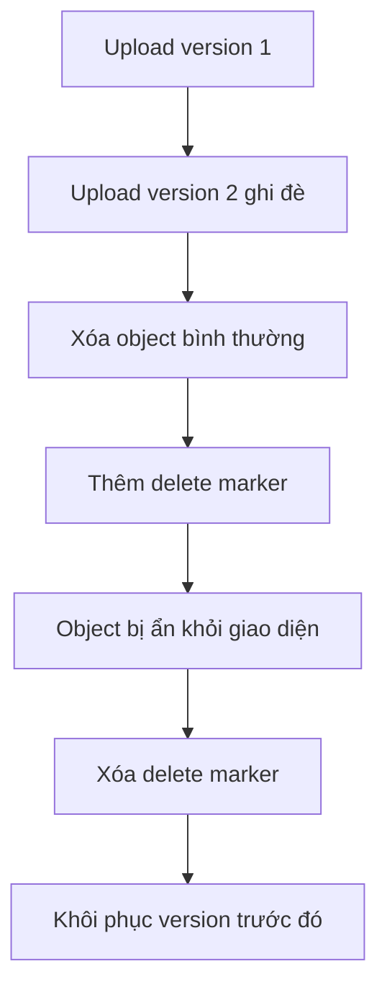

# 🧪 Thực hành S3 Versioning: Rollback và xử lý delete marker

> Nguồn: `075-S3-Versioning-Hands-On.txt` · [Udemy](https://ua.udemy.com/course/aws-certified-cloud-practitioner-new/learn/lecture/20207474)

Giờ chúng ta sẽ "chơi" với **S3 versioning**: bật tính năng, cập nhật website, rollback về bản cũ và tìm hiểu cách **delete marker** hoạt động. Đây là bài thực hành rất trực quan — mình khuyến khích các bạn làm theo.

---

### ⚙️ Bước 1: Bật versioning

Vào bucket → tab **Properties** → tìm **Bucket versioning** → **Edit** → **Enable**. Từ giờ, mọi file bị ghi đè sẽ được **thêm version mới** thay vì mất bản cũ.

---

### 📝 Bước 2: Cập nhật website và tạo version mới

1. Website đang hiển thị **"I love coffee"**. Mình muốn đổi thành **"I really love coffee"**.
2. Mở file `index.html`, sửa nội dung, lưu lại.
3. Upload lại file này vào bucket → file được **ghi đè** thành công.
4. Refresh trang web → nội dung mới **"I REALLY love coffee"** xuất hiện.

Điều gì xảy ra phía sau? Bật toggle **Show versions**, các bạn sẽ thấy **version ID** của từng file:

* `beach.jpg` và `coffee.jpg` có version ID **null** — vì chúng được upload **trước khi bật versioning**.
* `index.html` có **2 version**: một bản **null** (upload trước khi bật) và một bản có **version ID mới** (vừa upload xong).

---

### ⏪ Bước 3: Rollback về version cũ

Muốn quay về **"I love coffee"**:

1. Đảm bảo **Show versions** đang bật.
2. Click vào **version ID mới nhất** của `index.html` → **Delete**.
3. Đây là **permanent delete (xóa vĩnh viễn)** — thao tác phá hủy, **không thể hoàn tác**. Gõ **permanently delete** vào ô xác nhận → **Delete objects**.
4. Quay lại website, refresh → chúng ta đã về bản **"I love coffee"**.

---

### 🗑️ Bước 4: Xóa object bình thường và delete marker

Bây giờ tắt **Show versions** và thử xóa `coffee.jpg`:

* Lần này bạn chỉ gõ **delete** (không phải permanently delete) — S3 **không xóa version thật**, mà thêm một **delete marker**.
* Trên giao diện thường, `coffee.jpg` trông như đã biến mất.
* Nhưng bật **Show versions**, bạn sẽ thấy **delete marker** trên `coffee.jpg` — file thật vẫn còn trong bucket, chỉ bị "che" bởi delete marker.

Kiểm chứng trên website: refresh mạnh bằng **Command + Shift + R**, ảnh không còn hiển thị; mở ảnh ở tab mới nhận lỗi **404 Not Found**.

Cách khôi phục:

1. Click vào **delete marker** → chọn xóa nó → **permanently delete** delete marker đó.
2. Version trước đó của object được **khôi phục**.
3. Refresh website → `coffee.jpg` đã trở lại.

*Các bạn cứ thoải mái thử nghiệm: thêm bao nhiêu version cũng được, xóa thử và xem điều gì xảy ra.*

---

Vậy là chúng ta đã bật versioning, tạo version mới, rollback và hiểu rõ delete marker. *Đây là những thao tác rất đáng thực hành nhiều lần.*

Ở bài tiếp theo, chúng ta sẽ học **S3 Replication** — nhân bản dữ liệu giữa các bucket. Hẹn gặp lại! 🚀
