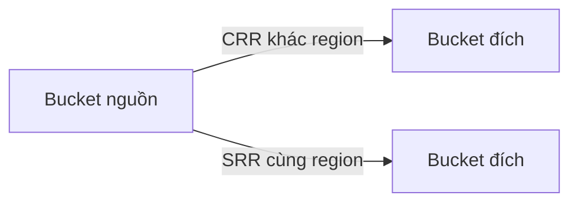

# 🌍 S3 Replication: CRR và SRR — nhân bản dữ liệu giữa các bucket

> Nguồn: `076-S3-Replication-Overview.txt` · [Udemy](https://ua.udemy.com/course/aws-certified-cloud-practitioner-new/learn/lecture/20055940)

Làm sao để dữ liệu S3 của bạn tồn tại ở nhiều nơi cùng lúc? Câu trả lời là **Amazon S3 Replication**. Bài này mình sẽ giới thiệu hai "hương vị" của replication, điều kiện để thiết lập và các use case thực tế.

---

### 🔀 Hai kiểu replication

* **CRR — Cross-Region Replication (nhân bản khác region).**
* **SRR — Same-Region Replication (nhân bản cùng region).**

Ý tưởng chung: bạn có một **S3 bucket nguồn** ở một region và một **S3 bucket đích**, và muốn thiết lập **replication bất đồng bộ (asynchronous)** giữa hai bucket.

---

### ⚙️ Điều kiện và cơ chế

Để replication hoạt động, các bạn cần:

1. **Bật versioning** trên **cả bucket nguồn lẫn bucket đích** — đây là điều kiện bắt buộc.
2. Với **CRR**, hai region **phải khác nhau**; với **SRR**, hai region **giống nhau**.
3. Hai bucket có thể nằm ở **các AWS account khác nhau**.
4. Cấp **IAM permissions phù hợp cho dịch vụ S3** để nó có quyền **đọc và ghi** từ các bucket đã chỉ định.

Quá trình copy diễn ra **bất đồng bộ** — mọi thứ chạy ngầm phía sau (behind the scenes), bạn không cần chờ đợi thao tác upload của mình.

---

### 🎯 Use case của từng loại

**CRR (cross-region):**

* Hỗ trợ **compliance (tuân thủ)**.
* Cung cấp **truy cập độ trễ thấp hơn** cho người dùng vì dữ liệu nằm ở region khác.
* **Replicate dữ liệu giữa các account**.

**SRR (same-region):**

* **Tổng hợp log** từ nhiều S3 bucket.
* **Live replication giữa production và test account** — tạo môi trường test riêng từ dữ liệu production.

---

### 🎯 Tự kiểm tra nhanh

**Câu 1:** CRR và SRR khác nhau ở điểm nào?

<b>Xem đáp án</b>

**Đáp án:** CRR là nhân bản khác region, SRR là nhân bản cùng region.

Giải thích: CRR = Cross-Region Replication; SRR = Same-Region Replication.

Tham chiếu: Mục Hai kiểu replication.

**Câu 2:** Điều kiện bắt buộc để bật replication là gì?

<b>Xem đáp án</b>

**Đáp án:** Bật versioning trên cả bucket nguồn và bucket đích.

Giải thích: Không có versioning, replication không hoạt động.

Tham chiếu: Mục Điều kiện và cơ chế.

**Câu 3:** Replication giữa hai bucket diễn ra đồng bộ hay bất đồng bộ?

<b>Xem đáp án</b>

**Đáp án:** Bất đồng bộ (asynchronous).

Giải thích: Quá trình copy chạy ngầm phía sau.

Tham chiếu: Mục Điều kiện và cơ chế.

**Câu 4:** Dịch vụ S3 cần gì để thực hiện replication?

<b>Xem đáp án</b>

**Đáp án:** IAM permissions phù hợp để đọc và ghi từ các bucket đã chỉ định.

Giải thích: S3 service cần quyền trên cả bucket nguồn và đích.

Tham chiếu: Mục Điều kiện và cơ chế.

**Câu 5:** Use case nào phù hợp với SRR?

<b>Xem đáp án</b>

**Đáp án:** Tổng hợp log từ nhiều bucket hoặc live replication giữa production và test account.

Giải thích: SRR giữ dữ liệu trong cùng region.

Tham chiếu: Mục Use case của từng loại.

---

Vậy là các bạn đã nắm được hai kiểu replication, điều kiện bắt buộc (versioning!) và use case của từng loại. *Đây là chủ đề rất hay vào đề thi, đặc biệt là sự khác biệt CRR vs SRR.*

Ở bài sau, chúng ta sẽ thực hành tạo replication rule và nhân bản dữ liệu từ châu Âu sang Mỹ. Hẹn gặp lại! 🚀
