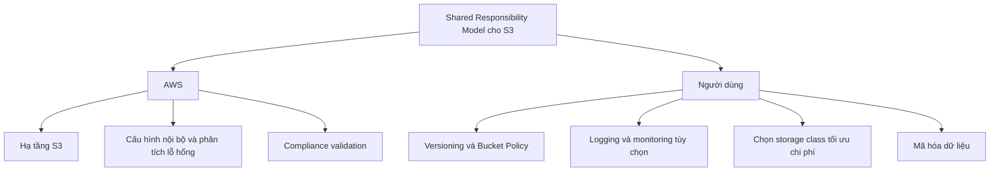

# 🤝 Shared Responsibility Model trong Amazon S3: AWS lo gì, bạn lo gì?

> Nguồn: `083-Shared-Responsibility-Model-for-S3.txt` · [Udemy](https://ua.udemy.com/course/aws-certified-cloud-practitioner-new/learn/lecture/20055960)

Như mọi dịch vụ khác trên AWS, S3 cũng có **Shared Responsibility Model (mô hình trách nhiệm chung)**. Nắm rõ ranh giới trách nhiệm giữa AWS và bạn sẽ giúp trả lời không ít câu hỏi trong đề thi.

---

### 🧭 Nguyên tắc chung

* **AWS chịu trách nhiệm về hạ tầng (infrastructure)**.
* **Bạn chịu trách nhiệm về cấu hình và dữ liệu** trong tài khoản của mình.

---

### ☁️ AWS chịu trách nhiệm những gì?

* Toàn bộ hạ tầng của S3, gồm cả những đặc tính then chốt của dịch vụ.
* Khả năng chịu đựng việc **mất đồng thời hai cơ sở hạ tầng (facility)**.
* Việc **cấu hình nội bộ** và **phân tích lỗ hổng (vulnerability analysis)** trong hệ thống của AWS.
* Việc **kiểm định tuân thủ (compliance validation)** bên trong hạ tầng AWS.

---

### 👤 Bạn chịu trách nhiệm những gì?

1. Thiết lập đúng **S3 Versioning** để bảo vệ dữ liệu.
2. Cấu hình **S3 Bucket Policy** phù hợp để dữ liệu trong bucket được bảo vệ.
3. Nếu muốn dùng tính năng xác minh, bạn phải **tự thiết lập**.
4. **Logging và monitoring** là tùy chọn → bạn phải tự bật nếu cần.
5. Chọn **storage class tối ưu chi phí nhất** — đây cũng là việc của bạn.
6. **Mã hóa dữ liệu** trong bucket S3 (nếu muốn) — bạn tự quyết định.

*Ranh giới rất rõ: AWS lo "phần cứng và hạ tầng", còn mọi cấu hình bảo vệ dữ liệu là trách nhiệm của bạn.*

---

### 🧪 Tự kiểm tra nhanh

**Câu 1:** Trong Shared Responsibility Model của S3, AWS chịu trách nhiệm gì?

<b>Xem đáp án</b>

**Đáp án:** Toàn bộ hạ tầng của S3.
Giải thích: Bao gồm khả năng chịu mất đồng thời hai facility, cấu hình nội bộ và compliance validation.
Tham chiếu: Mục AWS chịu trách nhiệm những gì.

**Câu 2:** Ai chịu trách nhiệm bật logging và monitoring cho bucket S3?

<b>Xem đáp án</b>

**Đáp án:** Bạn — người dùng S3.
Giải thích: Logging và monitoring là tùy chọn, bạn phải tự bật.
Tham chiếu: Mục Bạn chịu trách nhiệm những gì.

**Câu 3:** Để bảo vệ dữ liệu trong bucket, bạn cần thiết lập những gì?

<b>Xem đáp án</b>

**Đáp án:** S3 Versioning và S3 Bucket Policy đúng đắn.
Giải thích: Đây là hai cấu hình bảo vệ dữ liệu thuộc trách nhiệm người dùng.
Tham chiếu: Mục Bạn chịu trách nhiệm những gì.

**Câu 4:** Việc chọn storage class tối ưu chi phí là trách nhiệm của ai?

<b>Xem đáp án</b>

**Đáp án:** Của bạn.
Giải thích: Chọn class phù hợp nhất về chi phí là trách nhiệm người dùng S3.
Tham chiếu: Mục Bạn chịu trách nhiệm những gì.

**Câu 5:** Việc mã hóa dữ liệu trên bucket S3 do ai quyết định?

<b>Xem đáp án</b>

**Đáp án:** Bạn — nếu muốn mã hóa thì tự thiết lập.
Giải thích: Mã hóa dữ liệu trong bucket là trách nhiệm của người dùng.
Tham chiếu: Mục Bạn chịu trách nhiệm những gì.

---

Vậy là các bạn đã thấy rõ "phần việc" của mỗi bên trong Amazon S3. *Đây là dạng câu hỏi rất hay gặp, nên hãy nhớ: hạ tầng là của AWS, còn cấu hình bảo vệ dữ liệu là của bạn.*

Bài tiếp theo chúng ta sẽ rời màn hình console một chút để tìm hiểu **AWS Snow Family** — giải pháp di trú dữ liệu bằng thiết bị vật lý. Hẹn gặp các bạn ở đó! 🚀
