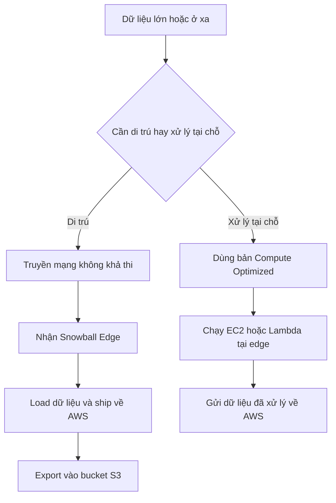

# ❄️ AWS Snow Family: Di trú petabyte và xử lý dữ liệu tại biên

> Nguồn: `084-AWS-Snow-Family-Overview.txt` · [Udemy](https://ua.udemy.com/course/aws-certified-cloud-practitioner-new/learn/lecture/24682476)

Hôm nay chúng ta nói về **AWS Snowball** — giải pháp đặc biệt khi mạng internet không đủ nhanh để di trú dữ liệu. Đây là thiết bị vật lý, bảo mật cao, giúp bạn vừa di trú dữ liệu vào/ra AWS, vừa xử lý dữ liệu ngay tại nơi nó được sinh ra.

---

### ❄️ Snowball là gì?

* Là thiết bị **portable (di động), bảo mật cao**, cho phép thu thập và xử lý dữ liệu **tại edge (biên)** và di trú dữ liệu vào/ra AWS.
* Nếu bạn cần di trú lượng dữ liệu cỡ **petabyte**, Snowball là một use case rất phù hợp.

---

### 📦 Hai phiên bản Snowball Edge

| Thiết bị | Dung lượng | Mục đích |
|---|---|---|
| Edge Storage Optimized | 210 TB | Lưu trữ |
| Edge Compute Optimized | 28 TB | Tính toán |

*Sự khác biệt giữa hai thiết bị nằm ở dung lượng lưu trữ — một bản dành cho storage, bản còn lại dùng cho compute.*

---

### 🚚 Vì sao cần Snowball để di trú dữ liệu?

Truyền dữ liệu qua mạng theo một băng thông giới hạn tốn rất nhiều thời gian. Ví dụ: chuyển **100 TB qua kết nối 1 Gbps sẽ mất 12 ngày**.

Các thách thức khiến việc truyền qua mạng không khả thi:

* Kết nối chậm, connectivity hạn chế
* Băng thông (bandwidth) hạn chế, phải chia sẻ với ứng dụng khác
* Chi phí network rất cao
* Kết nối có thể không ổn định

Nếu mất **hơn một tuần** để truyền dữ liệu qua mạng, giảng viên khuyến nghị dùng **Snowball**.

So sánh nhanh:

* **Upload trực tiếp lên S3**: đơn giản nhưng có thể dùng hết băng thông của bạn.
* **Dùng Snowball**: bạn nhận thiết bị vật lý, tự load dữ liệu, gửi trả AWS; sau đó có một quy trình **export** đưa dữ liệu từ Snowball vào bucket S3.

---

### ⛏️ Edge computing — xử lý dữ liệu ngay tại nơi sinh ra

* Dữ liệu sinh ra ở những nơi **không có hoặc ít internet** và thiếu compute: xe tải trên đường, tàu trên biển, trạm khai thác trên mặt đất.
* Bạn order Snowball Edge (bản **Compute Optimized** dành cho use case này) và thực hiện edge computing.
* Vì thiết bị có khả năng tính toán, bạn có thể chạy **EC2 instance hoặc Lambda function** ngay trên thiết bị.
* Sau khi dữ liệu được tạo và xử lý, gửi trả về AWS.
* Lợi ích: **pre-process dữ liệu, machine learning tại edge, transcode media trực tiếp tại edge**.

*Tóm lại: Snowball phục vụ đúng hai việc — di trú dữ liệu và edge computing.*

---

### 🧪 Tự kiểm tra nhanh

**Câu 1:** Hai phiên bản Snowball Edge khác nhau ở điểm nào?

<b>Xem đáp án</b>

**Đáp án:** Dung lượng: Edge Storage Optimized 210 TB, Edge Compute Optimized 28 TB.
Giải thích: Một bản dành cho lưu trữ, bản kia dành cho tính toán.
Tham chiếu: Mục Hai phiên bản Snowball Edge.

**Câu 2:** Chuyển 100 TB qua kết nối 1 Gbps mất bao lâu?

<b>Xem đáp án</b>

**Đáp án:** 12 ngày.
Giải thích: Đây là ví dụ cho thấy truyền dữ liệu lớn qua mạng rất tốn thời gian.
Tham chiếu: Mục Vì sao cần Snowball để di trú dữ liệu.

**Câu 3:** Khi nào nên cân nhắc dùng Snowball?

<b>Xem đáp án</b>

**Đáp án:** Khi truyền dữ liệu qua mạng mất hơn một tuần, hoặc gặp các vấn đề về băng thông, chi phí network, kết nối không ổn định.
Giải thích: Đây là khuyến nghị của giảng viên.
Tham chiếu: Mục Vì sao cần Snowball để di trú dữ liệu.

**Câu 4:** Trên Snowball Edge có thể chạy những gì cho edge computing?

<b>Xem đáp án</b>

**Đáp án:** EC2 instance hoặc Lambda function.
Giải thích: Thiết bị có khả năng tính toán nên chạy được các workload này trực tiếp.
Tham chiếu: Mục Edge computing.

**Câu 5:** Kể vài ví dụ về môi trường edge computing.

<b>Xem đáp án</b>

**Đáp án:** Xe tải trên đường, tàu trên biển, trạm khai thác trên mặt đất.
Giải thích: Đây là những nơi không có hoặc hạn chế internet và compute.
Tham chiếu: Mục Edge computing.

---

Vậy là các bạn đã nắm bức tranh Snow Family: di trú dữ liệu cỡ lớn và xử lý tại biên. *Nhớ cặp số 210 TB và 28 TB nhé — đề thi rất thích hỏi kiểu này.*

Bài tiếp theo chúng ta sẽ **thực hành quy trình đặt hàng Snow Family** trên console. Hẹn gặp các bạn ở đó! 🚀
