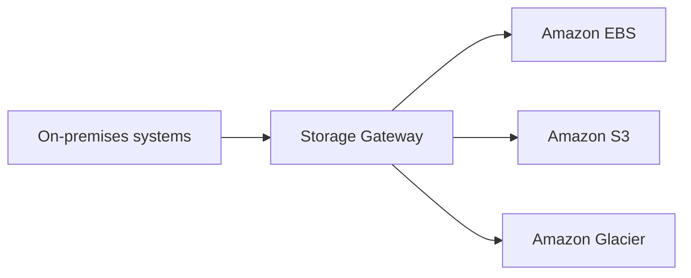

# 🌉 AWS Storage Gateway: Cây cầu nối lưu trữ on-premises lên cloud

> Nguồn: `087-Storage-Gateway-Overview.txt` · [Udemy](https://ua.udemy.com/course/aws-certified-cloud-practitioner-new/learn/lecture/20055966)

Chúng ta đã biết S3 là dịch vụ lưu trữ độc lập trên cloud. Nhưng nếu doanh nghiệp của bạn vẫn còn hệ thống **on-premises (tại chỗ)** và muốn dùng S3? Đó là lúc **Storage Gateway** xuất hiện — cây cầu nối giữa hai thế giới.

---

### ☁️ Hybrid cloud — vì sao tồn tại?

**Hybrid cloud (cloud lai)** là mô hình một phần hạ tầng nằm **on-premises**, phần còn lại nằm **trên cloud**. Các lý do thường gặp:

* Hạ tầng on-premises đã được xây dựng từ trước, việc migration lên cloud có thể kéo dài.
* Yêu cầu về **security (bảo mật)** hoặc **compliance (tuân thủ)**.
* Chiến lược của doanh nghiệp: phần thì trên cloud, phần thì giữ on-premises.

*Có rất nhiều use case khác nhau cho cách làm IT "hai nơi" này.*

---

### 🧱 Bức tranh storage trên AWS và vị trí của Storage Gateway

| Loại storage | Dịch vụ |
|---|---|
| Block storage | EBS hoặc EC2 instance store |
| File storage | Network file system — Amazon EFS |
| Object storage | Amazon S3 hoặc Glacier |

S3 là **proprietary storage technology (công nghệ lưu trữ riêng của AWS)** — không giống EFS hay giao thức NFS có thể dùng trực tiếp trên server on-premises. Muốn "phơi" dữ liệu S3 ra môi trường on-premises, bạn **phải dùng Storage Gateway**.

---

### 🔌 Storage Gateway hoạt động thế nào?

* Storage Gateway **bridge (bắc cầu)** dữ liệu on-premises và dữ liệu trên cloud.
* Nhờ **hybrid storage**, hệ thống on-premises có thể dùng cloud một cách liền mạch để **mở rộng dung lượng lưu trữ**.
* Use case: **disaster recovery, backup and restore, tiered storage**.
* Bên dưới, Storage Gateway sử dụng **Amazon EBS, Amazon S3 và Glacier**.

---

### 📚 Các loại Storage Gateway

* **File Gateway**
* **Volume Gateway**
* **Tape Gateway**

*Với đề Cloud Practitioner, bạn chưa cần nắm chi tiết từng loại.* Điều cần nhớ: Storage Gateway cho phép **bridge mọi thứ on-premises trực tiếp vào AWS Cloud**. Nếu sau này học khóa **Solutions Architect Associate**, bạn sẽ hiểu sâu hơn về dịch vụ này.

---

### 🧪 Tự kiểm tra nhanh

**Câu 1:** Hybrid cloud là gì?

<b>Xem đáp án</b>

**Đáp án:** Mô hình một phần hạ tầng on-premises, phần còn lại trên cloud.
Giải thích: Đây là kiểu triển khai "hai nơi" mà Storage Gateway phục vụ.
Tham chiếu: Mục Hybrid cloud — vì sao tồn tại.

**Câu 2:** Vì sao không thể dùng S3 trực tiếp như EFS/NFS trên server on-premises?

<b>Xem đáp án</b>

**Đáp án:** Vì S3 là proprietary storage technology của AWS.
Giải thích: Muốn expose dữ liệu S3 on-premises phải qua Storage Gateway.
Tham chiếu: Mục Bức tranh storage trên AWS.

**Câu 3:** File storage trên AWS tương ứng với dịch vụ nào?

<b>Xem đáp án</b>

**Đáp án:** Amazon EFS — network file system.
Giải thích: Block là EBS/instance store, object là S3/Glacier.
Tham chiếu: Mục Bức tranh storage trên AWS.

**Câu 4:** Kể tên ba loại Storage Gateway.

<b>Xem đáp án</b>

**Đáp án:** File Gateway, Volume Gateway và Tape Gateway.
Giải thích: Đề Cloud Practitioner chưa yêu cầu nắm chi tiết từng loại.
Tham chiếu: Mục Các loại Storage Gateway.

**Câu 5:** Storage Gateway dùng những dịch vụ nào bên dưới?

<b>Xem đáp án</b>

**Đáp án:** Amazon EBS, Amazon S3 và Glacier.
Giải thích: Đây là các dịch vụ lưu trữ đứng sau Storage Gateway.
Tham chiếu: Mục Storage Gateway hoạt động thế nào.

---

Vậy là các bạn đã hiểu vai trò của Storage Gateway trong bức tranh hybrid cloud: mở rộng lưu trữ on-premises lên AWS mà không cần thay đổi hệ thống hiện có. *Nhớ một câu duy nhất: Storage Gateway = cầu nối on-premises vào AWS Cloud.*

Bài tiếp theo chúng ta sẽ **tổng kết toàn bộ chương Amazon S3**. Hẹn gặp các bạn ở đó! 🚀
