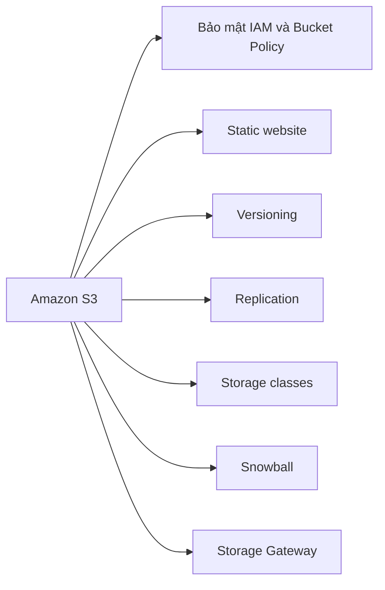

# 🎓 Tổng kết Amazon S3: Toàn bộ kiến thức cần nhớ

> Nguồn: `088-S3-Summary.txt` · [Udemy](https://ua.udemy.com/course/aws-certified-cloud-practitioner-new/learn/lecture/20260634)

Chúng ta đã đi qua rất nhiều nội dung về Amazon S3 — từ bucket, object, bảo mật, website, versioning, replication cho tới storage class, Snowball và Storage Gateway. Bài này mình hệ thống lại toàn bộ để các bạn nắm chắc trước khi sang chương mới.

---

### 🗂️ Bucket và Object

* **Bucket** phải có **tên duy nhất toàn cầu (globally unique)** và gắn với một **region** cụ thể.
* **Object** sống bên trong các bucket này.

---

### 🔐 Bảo mật, website và mã hóa

* Gắn **IAM policy** cho user hoặc role.
* Dùng **S3 bucket policy** — ví dụ để cấp quyền public cho một bucket.
* Dùng **S3 encryption** để bảo vệ file.
* Có thể bật **static website hosting** trên bucket S3: trước tiên bucket phải **public**, sau đó bạn host các file tĩnh.

---

### 🔄 Versioning và Replication

* **S3 Versioning**: giữ nhiều phiên bản cho một file, chống **xóa nhầm** và cho phép **rollback** về phiên bản trước.
* Có **hai kiểu replication**: **same-region (cùng region)** và **cross-region (khác region)**.
* Điều kiện bắt buộc để replication hoạt động: phải **bật versioning trước**.

---

### 📦 Storage classes, Snowball và Storage Gateway

* Các **storage class**: Standard, Infrequent Access, One Zone-Infrequent Access, Intelligent Tiering và **ba lớp Glacier** cho mục đích archival.
* **Snowball**: dùng thiết bị vật lý để **import dữ liệu vào S3**, và có thể làm **edge computing** ngay trên thiết bị.
* **Storage Gateway**: giải pháp **hybrid**, mở rộng lưu trữ on-premises — ví dụ lên Amazon S3.

---

### 🧪 Tự kiểm tra nhanh

**Câu 1:** Yêu cầu về tên bucket và region là gì?

<b>Xem đáp án</b>

**Đáp án:** Tên bucket phải globally unique và bucket gắn với một region cụ thể.
Giải thích: Object nằm bên trong bucket.
Tham chiếu: Mục Bucket và Object.

**Câu 2:** Muốn host static website trên S3 cần điều kiện gì?

<b>Xem đáp án</b>

**Đáp án:** Bucket phải public.
Giải thích: Sau đó bạn có thể host các file tĩnh trên bucket.
Tham chiếu: Mục Bảo mật, website và mã hóa.

**Câu 3:** S3 Versioning giúp gì cho bạn?

<b>Xem đáp án</b>

**Đáp án:** Giữ nhiều phiên bản của file, chống xóa nhầm và cho phép rollback.
Giải thích: Đây là cách bảo vệ dữ liệu trước các thay đổi ngoài ý muốn.
Tham chiếu: Mục Versioning và Replication.

**Câu 4:** Điều kiện tiên quyết để bật replication là gì?

<b>Xem đáp án</b>

**Đáp án:** Phải bật versioning trước.
Giải thích: Cả same-region và cross-region replication đều cần versioning.
Tham chiếu: Mục Versioning và Replication.

**Câu 5:** Snowball và Storage Gateway khác nhau ở điểm cốt lõi nào?

<b>Xem đáp án</b>

**Đáp án:** Snowball là thiết bị vật lý để import dữ liệu và edge computing; Storage Gateway là giải pháp hybrid mở rộng lưu trữ on-premises.
Giải thích: Hai dịch vụ phục vụ hai bài toán khác nhau.
Tham chiếu: Mục Storage classes, Snowball và Storage Gateway.

---

Vậy là chương Amazon S3 đã khép lại với một bức tranh khá đầy đủ: lưu trữ, bảo mật, versioning, replication, storage class và các giải pháp di trú — hybrid. *Các bạn hãy tự kiểm tra lại bằng 5 câu quiz trên; nếu trả lời trôi chảy, bạn đã sẵn sàng cho chương tiếp theo.*

Ở bài tiếp theo, chúng ta sẽ bước sang chủ đề mới trong hành trình chinh phục chứng chỉ **CLF-C02**. Hẹn gặp các bạn ở đó! 🚀
