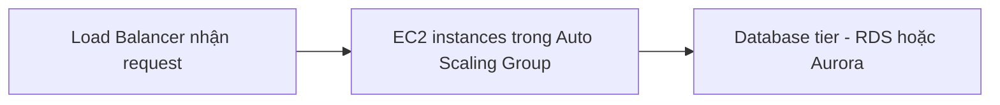
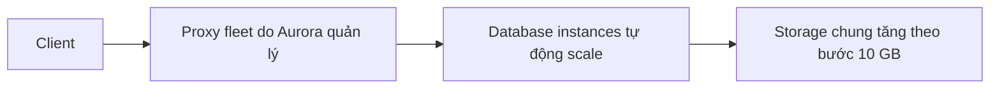

# 🗃️ RDS & Aurora: Hai cách tạo cơ sở dữ liệu quan hệ trên AWS

> Nguồn: `090-RDS-Aurora-Overview.txt` · [Udemy](https://ua.udemy.com/course/aws-certified-cloud-practitioner-new/learn/lecture/20055978)

Relational database là loại database đầu tiên chúng ta tìm hiểu, và dịch vụ dành cho nó trên AWS là **RDS (Relational Database Service)**. Hãy cùng mình xem RDS mang lại những gì, rồi khám phá **Aurora** — database cloud-native của AWS.

---

### 🔍 RDS là gì và hỗ trợ những engine nào?

RDS là **managed database service** cho các database dùng **SQL** làm ngôn ngữ truy vấn — nói cách khác, chỉ dành cho relational database. Bạn có thể tạo database trên cloud và **AWS quản lý toàn bộ** cho mình.

Các engine mà RDS hỗ trợ:

* **PostgreSQL**
* **MySQL**
* **MariaDB**
* **Oracle**
* **Microsoft SQL Server**
* **IBM DB2**
* và **Aurora** — database riêng của AWS (proprietary), sẽ nói ở cuối bài.

---

### ⚙️ Vì sao dùng RDS thay vì tự cài database trên EC2?

Đây là câu hỏi rất hay, và đây là những gì RDS làm sẵn cho bạn:

* **Provision database tự động**.
* **AWS patch hệ điều hành** — bạn không cần lo.
* **Backup liên tục** cùng tùy chọn restore với **point-in-time restore (khôi phục tại thời điểm)**.
* **Monitoring dashboard** để theo dõi sức khỏe database.
* **Read replica** giúp scale khả năng đọc, cải thiện hiệu năng đọc.
* **Multi-AZ** sẵn sàng cho **disaster recovery (phục hồi sau thảm họa)** khi cả một Availability Zone gặp sự cố.
* **Maintenance window** cho các đợt nâng cấp.
* **Scale dọc và ngang** linh hoạt.
* Storage được hỗ trợ bởi **EBS**.

Điều duy nhất bạn **không thể làm** với RDS: **SSH vào instance database**. AWS quản lý hoàn toàn, nên bạn chỉ dùng dịch vụ chứ không thể SSH xem bên trong database.

---

### 🏗️ RDS nằm ở đâu trong kiến trúc ứng dụng?

Các bạn hãy tưởng tượng kiến trúc kinh điển: **load balancer** đứng trước, đằng sau là nhiều **EC2 instance** (có thể nằm trong **Auto Scaling Group**). Các instance này cần lưu và chia sẻ dữ liệu **có cấu trúc** — vì vậy chúng không dùng EBS, EFS hay Instance Store, mà kết nối vào **relational database**.

Ba tầng quen thuộc: **load balancer** nhận web request → **EC2 backend** xử lý logic ứng dụng → **database tier** đọc ghi dữ liệu. Đây là kiến trúc kinh điển, không chỉ với RDS mà với mọi loại database.

---

### 🚀 Aurora — database cloud-native của AWS

**Aurora** được AWS tạo ra, **không phải open source**, và hoạt động tương tự RDS: EC2 instance kết nối trực tiếp vào Amazon Aurora. Aurora hỗ trợ 2 engine: **PostgreSQL** và **MySQL**.

Điểm mạnh của Aurora:

* **Tối ưu cho cloud**.
* Hiệu năng **nhanh gấp 5 lần MySQL trên RDS** và **nhanh gấp 3 lần Postgres trên RDS**.
* Storage **tự động tăng theo từng bước 10 GB**, lên tới **256 TB** — bạn không cần lo về dung lượng.
* Đắt hơn RDS **khoảng 20%**, nhưng hiệu quả hơn nên thường **tiết kiệm chi phí hơn**.

*Từ góc nhìn đề thi:* RDS và Aurora là hai cách tạo relational database trên AWS. Cả hai đều managed, Aurora **cloud-native hơn**, còn RDS chạy chính các công nghệ quen thuộc dưới dạng managed service.

---

### ⚡ Aurora Serverless — không cần quản lý server

Aurora còn có bản **Serverless**:

* Database được **khởi tạo tự động**, **autoscaling theo mức sử dụng thực tế**.
* Hỗ trợ cả **PostgreSQL** và **MySQL**.
* **Không cần capacity planning (lập kế hoạch dung lượng)**, không phải quản lý server.
* Trả tiền **theo giây** — rất hiệu quả khi workload **thưa thớt, gián đoạn hoặc khó dự đoán**.

Về cách hoạt động: client kết nối vào **proxy fleet do Aurora quản lý**, Aurora phía sau tự khởi tạo database instance khi cần scale lên/xuống. Các database này **luôn chia sẻ cùng một storage volume**.

*Mẹo thi:* thấy Aurora kèm từ khóa "no management overhead", hãy nghĩ ngay đến **Aurora Serverless**.

---

### 🎯 Tự kiểm tra nhanh

**Câu 1:** RDS hỗ trợ những engine nào?

<b>Xem đáp án</b>

**Đáp án:** PostgreSQL, MySQL, MariaDB, Oracle, Microsoft SQL Server, IBM DB2 và Aurora.

Giải thích: RDS là managed service chỉ dành cho relational database dùng SQL.

Tham chiếu: Mục RDS là gì và hỗ trợ những engine nào.

**Câu 2:** Vì sao nên dùng RDS thay vì tự cài database trên EC2?

<b>Xem đáp án</b>

**Đáp án:** Vì RDS là managed service: provision tự động, AWS patch OS, backup liên tục với point-in-time restore, monitoring, read replica, Multi-AZ cho disaster recovery, maintenance window, scale dọc và ngang.

Giải thích: Lợi ích lớn nhất là bạn không phải tự lo vận hành hạ tầng database.

Tham chiếu: Mục Vì sao dùng RDS thay vì tự cài database trên EC2.

**Câu 3:** Điều gì bạn KHÔNG thể làm với RDS?

<b>Xem đáp án</b>

**Đáp án:** SSH vào instance database.

Giải thích: AWS quản lý hoàn toàn database, bạn chỉ sử dụng dịch vụ chứ không truy cập được vào bên trong.

Tham chiếu: Mục Vì sao dùng RDS thay vì tự cài database trên EC2.

**Câu 4:** Aurora nhanh hơn RDS bao nhiêu lần, và storage tăng như thế nào?

<b>Xem đáp án</b>

**Đáp án:** Nhanh hơn 5 lần so với MySQL trên RDS và 3 lần so với Postgres trên RDS; storage tự động tăng theo bước 10 GB lên tới 256 TB.

Giải thích: Aurora tối ưu cho cloud, đắt hơn RDS khoảng 20% nhưng hiệu quả hơn nên thường tiết kiệm chi phí hơn.

Tham chiếu: Mục Aurora.

**Câu 5:** Khi nào nên chọn Aurora Serverless?

<b>Xem đáp án</b>

**Đáp án:** Khi có workload thưa thớt, gián đoạn hoặc khó dự đoán — không muốn quản lý server hay capacity planning, và trả tiền theo giây.

Giải thích: Client kết nối qua proxy fleet, Aurora tự khởi tạo instance khi cần và mọi database chia sẻ cùng một storage volume.

Tham chiếu: Mục Aurora Serverless.

---

Vậy là các bạn đã nắm được bộ đôi **RDS** và **Aurora** — nền tảng của relational database trên AWS. *Nhớ kỹ các con số 5X, 3X, 256 TB và 20% nhé, đề thi rất thích những chi tiết này.*

Ở bài tiếp theo, chúng ta sẽ cùng nhau tạo một RDS database thật trên console. Hẹn gặp các bạn ở đó! 🚀
