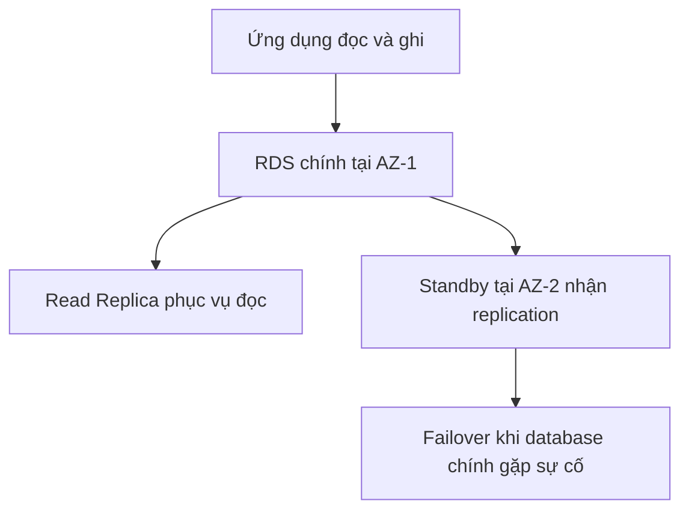

# 🧭 Ba kiểu triển khai RDS: Read Replica, Multi-AZ và Multi-Region

> Nguồn: `092-RDS-Deployments-Options.txt` · [Udemy](https://ua.udemy.com/course/aws-certified-cloud-practitioner-new/learn/lecture/24682526)

Khi triển khai RDS database, có nhiều **lựa chọn kiến trúc** mà các bạn cần hiểu để chọn đúng cho từng tình huống — và đây cũng là chủ đề rất hay xuất hiện trong đề thi. Cùng mình đi qua ba kiểu: **Read Replica, Multi-AZ và Multi-Region** nhé.

---

### 📖 Read Replica — mở rộng khả năng đọc tới 15 bản sao

Hãy tưởng tượng ứng dụng đang đọc từ RDS database chính. Khi có ngày càng nhiều ứng dụng cần đọc ngày càng nhiều dữ liệu, bạn cần **scale read workload**.

Cách làm: tạo các **Read Replica** — những bản sao của RDS database. Ứng dụng có thể đọc từ cả replica, nhờ đó **phân tải việc đọc ra nhiều database**.

* Bạn có thể tạo tối đa **15 Read Replica**.
* Ví dụ: 2 read replica đặt trên database chính, ứng dụng đọc được từ tất cả.
* **Ghi dữ liệu chỉ diễn ra trên database chính** — ứng dụng vẫn phải ghi về một database RDS trung tâm duy nhất.

*Tóm gọn: Read Replica dùng để scale reads.*

---

### 🛡️ Multi-AZ — failover khi Availability Zone gặp sự cố

Khi bạn cần **failover trong trường hợp một AZ (Availability Zone) gặp sự cố**, Multi-AZ chính là câu trả lời — nó mang lại **high availability**.

Cách hoạt động:

* Ứng dụng đọc và ghi vào cùng một database RDS chính.
* RDS thiết lập **replication cross-AZ** sang một AZ khác — đây là database **failover (standby)**. Gọi là *Multi-AZ* vì nó nằm ở AZ khác.
* Nếu database chính gặp sự cố — do lỗi của chính nó hoặc do AZ gặp vấn đề — RDS sẽ **trigger failover**, ứng dụng chuyển sang database ở AZ khác.
* Trong điều kiện bình thường, dữ liệu **chỉ được đọc ghi trên database chính**. Database failover là **passive**, **không truy cập được** cho tới khi có sự cố.
* Bạn chỉ có thể có **một AZ khác** làm failover AZ.

---

### 🌍 Multi-Region — bản sao xuyên khu vực

Kiểu triển khai thứ ba là **Multi-Region** — cũng là read replica, nhưng thay vì cùng region, chúng nằm ở **các region khác nhau**.

Ví dụ:

* Database RDS chính ở **EU-West-1**.
* Tạo read replica ở **US-East-2** — ứng dụng tại Mỹ đọc trực tiếp từ replica local.
* Khi cần ghi, dữ liệu phải **ghi xuyên region** về database chính.
* Có thể thêm region **AP-Southeast-2** (Australia) với cùng cách làm.

Vì sao nên dùng Multi-Region?

1. **Disaster recovery**: nếu EU-West-1 gặp sự cố cấp region, bạn có bản sao ở US-East-2 hoặc AP-Southeast-2.
2. **Hiệu năng tốt hơn**: ứng dụng ở các region khác đọc từ database local nên **độ trễ thấp hơn**.

Lưu ý về chi phí: vì dữ liệu được replicate xuyên region, sẽ có **replication cost** cho việc truyền dữ liệu giữa các region.

---

### 🧰 Chọn kiểu nào cho tình huống nào?

| Tiêu chí | Read Replica | Multi-AZ | Multi-Region |
|---|---|---|---|
| Mục tiêu | Scale khả năng đọc | High availability, failover theo AZ | Disaster recovery và giảm latency toàn cầu |
| Số lượng | Tối đa 15 bản sao | 1 standby ở AZ khác | Read replica ở region khác |
| Ghi dữ liệu | Chỉ database chính | Chỉ database chính | Chỉ database chính, ghi xuyên region |
| Truy cập | Ứng dụng đọc trực tiếp | Standby bị động, chờ failover | Ứng dụng đọc local tại region replica |
| Chi phí thêm | Chi phí cho replica | Chi phí cho standby | Replication cost giữa các region |

*Trong đề thi, tình huống đưa ra sẽ giúp bạn xác định rõ nên chọn kiểu triển khai nào — hãy đọc kỹ yêu cầu về đọc, ghi, failover hay disaster recovery.*

---

### 🎯 Tự kiểm tra nhanh

**Câu 1:** Bạn tạo được tối đa bao nhiêu Read Replica?

<b>Xem đáp án</b>

**Đáp án:** 15.

Giải thích: Read Replica dùng để scale read workload, phân tải việc đọc ra nhiều database.

Tham chiếu: Mục Read Replica.

**Câu 2:** Multi-AZ giải quyết vấn đề gì?

<b>Xem đáp án</b>

**Đáp án:** Failover khi một Availability Zone gặp sự cố — mang lại high availability.

Giải thích: RDS replication cross-AZ sang database standby; khi database chính gặp sự cố, RDS trigger failover.

Tham chiếu: Mục Multi-AZ.

**Câu 3:** Database standby trong Multi-AZ có truy cập được không?

<b>Xem đáp án</b>

**Đáp án:** Không — nó là passive, chỉ được dùng khi có sự cố với database chính.

Giải thích: Dữ liệu bình thường chỉ đọc ghi trên database chính.

Tham chiếu: Mục Multi-AZ.

**Câu 4:** Multi-Region mang lại lợi ích gì?

<b>Xem đáp án</b>

**Đáp án:** Disaster recovery khi region gặp sự cố, và hiệu năng tốt hơn cho ứng dụng ở xa nhờ đọc từ database local.

Giải thích: Đổi lại, bạn phải chịu replication cost do truyền dữ liệu giữa các region.

Tham chiếu: Mục Multi-Region.

**Câu 5:** Khi dùng Read Replica, ứng dụng ghi dữ liệu ở đâu?

<b>Xem đáp án</b>

**Đáp án:** Chỉ ghi vào database RDS chính.

Giải thích: Read Replica chỉ phục vụ việc đọc; mọi thao tác ghi vẫn tập trung về database trung tâm.

Tham chiếu: Mục Read Replica.

---

Vậy là các bạn đã phân biệt được ba kiểu triển khai RDS — *hãy đọc kỹ tình huống đề bài để nhận ra tín hiệu "scale reads", "AZ outage" hay "region disaster" nhé*.

Ở bài tiếp theo, chúng ta sẽ khám phá **ElastiCache** — giải pháp cache in-memory giúp database nhẹ gánh hơn. Hẹn gặp các bạn ở đó! 🚀
