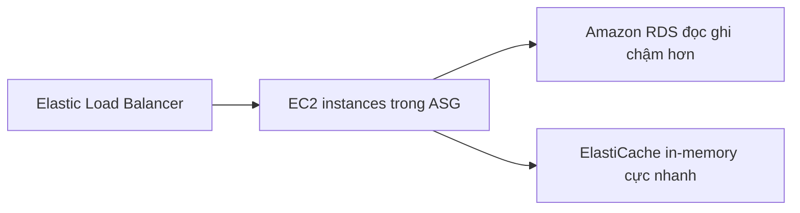

# ⚡ ElastiCache: Bộ đệm in-memory giúp database "thở phào"

> Nguồn: `093-ElastiCache-Overview.txt` · [Udemy](https://ua.udemy.com/course/aws-certified-cloud-practitioner-new/learn/lecture/20055990)

Tiếp theo, chúng ta sẽ nói về loại database thứ hai trên AWS: **Amazon ElastiCache**. Nếu RDS mang đến cho bạn relational database được quản lý, thì ElastiCache mang đến **managed Redis hoặc Memcached** — những bộ đệm siêu nhanh. Cùng tìm hiểu nhé!

---

### 🧠 ElastiCache là gì?

* Giống như bạn dùng **RDS** để có relational database được quản lý, bạn dùng **ElastiCache** để có **managed Redis hoặc Memcached**.
* Đây là các **in-memory database (database trong bộ nhớ)** với **hiệu năng cao, độ trễ thấp**.
* *Mẹo thi cực quan trọng:* bất cứ khi nào đề bài nói cần **in-memory database**, các bạn hãy nghĩ ngay đến **ElastiCache**.

---

### 🔁 Vì sao cần cache?

ElastiCache giúp **giảm tải cho database có read-intensive workload (workload đọc nhiều)**.

Hãy tưởng tượng: bạn có một RDS database và liên tục chạy rất nhiều query — trong đó có những query lặp đi lặp lại — điều này tạo áp lực lên RDS. Thay vì cứ "hỏi" database chính mãi, bạn dùng **cache** để các query được trả về trực tiếp từ **in-memory database** thông qua ElastiCache.

Kiến trúc quen thuộc:

* **Elastic Load Balancer** chuyển request tới các **EC2 instance** (có thể nằm trong **ASG**).
* Các instance đọc ghi dữ liệu với **Amazon RDS** — tốc độ chậm hơn.
* Những giá trị có thể cache sẽ được lưu vào **Amazon ElastiCache** — rất nhanh vì là **in-memory**.

Nhờ đó, áp lực được chuyển từ RDS database chính sang ElastiCache. *Ý tưởng cốt lõi của cache là lưu query ở nơi khác để chúng luôn sẵn sàng, truy cập dễ dàng và giảm tải cho database chính.*

---

### 🤖 AWS quản lý những gì cho bạn?

Vì ElastiCache là **managed database**, AWS sẽ lo hết:

* **OS maintenance và patching** (bảo trì, vá hệ điều hành).
* **Optimizations** — tối ưu.
* **Setup và configuration** — thiết lập, cấu hình.
* **Monitoring** — giám sát.
* **Failure recovery** — phục hồi khi có lỗi.
* **Backups** — sao lưu.

---

### 🎯 Tự kiểm tra nhanh

**Câu 1:** ElastiCache hỗ trợ những engine nào?

<b>Xem đáp án</b>

**Đáp án:** Redis và Memcached.

Giải thích: ElastiCache cung cấp managed Redis hoặc Memcached — tương tự cách RDS cung cấp managed relational database.

Tham chiếu: Mục ElastiCache là gì.

**Câu 2:** Trong đề thi, từ khóa nào dẫn bạn đến ElastiCache?

<b>Xem đáp án</b>

**Đáp án:** "In-memory database".

Giải thích: ElastiCache là in-memory database với hiệu năng cao, độ trễ thấp.

Tham chiếu: Mục ElastiCache là gì.

**Câu 3:** ElastiCache giúp gì cho database chính?

<b>Xem đáp án</b>

**Đáp án:** Giảm tải cho database có read-intensive workload bằng cách trả query từ cache in-memory.

Giải thích: Các query lặp lại được lưu trong cache thay vì liên tục "hỏi" RDS.

Tham chiếu: Mục Vì sao cần cache.

**Câu 4:** Vì sao ElastiCache cho truy vấn nhanh?

<b>Xem đáp án</b>

**Đáp án:** Vì nó là in-memory database — dữ liệu nằm trong bộ nhớ, độ trễ rất thấp.

Giải thích: Cache lưu các giá trị sẵn sàng để truy cập nhanh, giảm áp lực lên RDS.

Tham chiếu: Mục Vì sao cần cache.

**Câu 5:** Vì là managed database, AWS lo những việc gì cho ElastiCache?

<b>Xem đáp án</b>

**Đáp án:** OS maintenance và patching, tối ưu, setup, cấu hình, monitoring, failure recovery và backups.

Giải thích: Bạn chỉ cần dùng dịch vụ, không phải vận hành hạ tầng.

Tham chiếu: Mục AWS quản lý những gì cho bạn.

---

Vậy là các bạn đã nắm trọn những gì cần biết về **ElastiCache** cho kỳ thi: **in-memory, Redis/Memcached, giảm tải database**. *Hãy nhớ từ khóa "in-memory database" — đề chỉ cần thấy nó là đáp án gần như đã lộ diện!*

Ở bài tiếp theo, chúng ta sẽ bước sang thế giới NoSQL với **DynamoDB**. Hẹn gặp các bạn ở đó! 🚀
