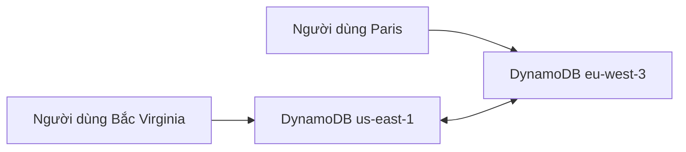

# 🌍 DynamoDB Global Tables: Đa vùng, độ trễ thấp, ghi ở đâu cũng được

> Nguồn: `096-DynamoDB-Global-Tables.txt` · [Udemy](https://ua.udemy.com/course/aws-certified-cloud-practitioner-new/learn/lecture/29102352)

Trong bài này, chúng ta sẽ nói về **DynamoDB Global Tables** — một tính năng quan trọng của DynamoDB mà các bạn cần biết cho kỳ thi. Đây là cách giúp bảng DynamoDB **truy cập với độ trễ thấp ở nhiều region**. Cùng tìm hiểu nhé!

---

### 🔄 Global table hoạt động thế nào?

Hãy lấy một ví dụ cụ thể:

* Bạn có bảng DynamoDB đặt tại **us-east-1** và thiết lập nó thành **global table**.
* Người dùng có thể **đọc và ghi** vào bảng này ở Northern Virginia như bình thường.
* Bạn hoàn toàn có thể thiết lập **replication** cho global table: tạo thêm một global table tại **Paris eu-west-3**.
* Hai bảng này được replicate **hai chiều** với nhau — nghĩa là dữ liệu giống nhau ở cả **us-east-1** và **eu-west-3**.
* Người dùng ở gần Paris giờ có thể truy cập global table **với độ trễ thấp ngay tại Paris**.
* Bạn có thể mở rộng mô hình này cho **từ 1 đến 10 region**.

---

### ⚡ Active-active replication — ghi ở region nào cũng được

Một global table là **thực sự toàn cầu (truly global)**:

* Người dùng có thể **đọc và ghi** vào bảng ở **bất kỳ region cụ thể nào**.
* Dữ liệu sẽ được **replicate** giữa các bảng với nhau.
* Vì có thể **actively write** vào mọi region và dữ liệu được replicate chủ động sang các region khác, người ta gọi đây là **active-active replication**.

*Tóm gọn cho đề thi: Global Tables = DynamoDB đa region, đọc ghi ở mọi region, replicate hai chiều, độ trễ thấp cho người dùng toàn cầu.*

---

Vậy là các bạn đã nắm được tính năng **Global Tables** — chỉ với vài ý chính nhưng rất dễ xuất hiện trong đề thi. *Nhớ nhé: global table + low latency ở nhiều region + active-active replication.*

Ở bài tiếp theo, chúng ta sẽ khám phá **Redshift** — kho dữ liệu phục vụ phân tích. Hẹn gặp các bạn ở đó! 🚀
