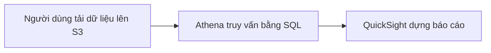

# 🔍 Amazon Athena: Truy vấn dữ liệu trên S3 bằng SQL không cần server

> Nguồn: `099-Athena-Overview.txt` · [Udemy](https://ua.udemy.com/course/aws-certified-cloud-practitioner-new/learn/lecture/20056008)

Tiếp nối hành trình **Databases & Analytics**, bài này chúng ta đến với **Amazon Athena** — dịch vụ giúp bạn phân tích dữ liệu ngay trên **Amazon S3** mà không cần load dữ liệu đi đâu cả. *Đây là một dịch vụ "dễ thương" bậc nhất trong đề thi vì chỉ cần nhớ vài từ khóa là ra đáp án.*

---

### 🎯 Athena là gì?

**Amazon Athena** là một **serverless query service (dịch vụ truy vấn không cần quản lý server)** dùng để **thực hiện analytics (phân tích)** trên các object lưu trong **Amazon S3**.

* Bạn dùng **SQL** để truy vấn dữ liệu.
* **Không cần load dữ liệu** vào đâu cả — file chỉ cần nằm trong S3, Athena lo phần còn lại.
* Hỗ trợ nhiều định dạng file: **CSV, JSON, ORC, Avro và Parquet**.
* Athena được xây dựng trên engine **Presto** (*chi tiết này dành cho bạn nào muốn hiểu sâu hơn*).

---

### ⚙️ Cách hoạt động

Người dùng đưa dữ liệu lên **Amazon S3**, sau đó dùng **Amazon Athena** để query và phân tích dữ liệu. Nếu muốn, bạn có thể dựng thêm phần **reporting (báo cáo)** lên trên Athena, ví dụ bằng **Amazon QuickSight**.

Rất đơn giản phải không nào?

---

### 💰 Chi phí và mẹo tiết kiệm

* Athena tính khoảng **$5 mỗi terabyte dữ liệu được scan (quét)**.
* Nếu dữ liệu được **nén (compressed)** hoặc lưu theo **columnar fashion (dạng cột)**, bạn sẽ **tiết kiệm chi phí** vì lượng dữ liệu phải scan ít hơn.

---

### 🧰 Use case và mẹo thi

Athena phù hợp với rất nhiều bài toán:

* **Business intelligence (BI — tình báo doanh nghiệp)**, **analytics** và **reporting**.
* Phân tích **VPC Flow Logs**, **ELB Logs**, **CloudTrail logs** và nhiều **platform logs** khác trên AWS.

*Mẹo thi:* khi đề có **serverless + analyze data in S3 + SQL**, hãy nghĩ ngay đến **Amazon Athena**.

---

### 🎯 Tự kiểm tra nhanh

**Câu 1:** Athena là loại dịch vụ gì?

<b>Xem đáp án</b>

**Đáp án:** Serverless query service dùng để phân tích dữ liệu trên Amazon S3.

Giải thích: Bạn không cần quản lý server và không cần load dữ liệu vào hệ thống nào khác.

Tham chiếu: Mục Athena là gì.

**Câu 2:** Athena hỗ trợ những định dạng file nào?

<b>Xem đáp án</b>

**Đáp án:** CSV, JSON, ORC, Avro và Parquet.

Giải thích: Athena được xây dựng trên engine Presto.

Tham chiếu: Mục Athena là gì.

**Câu 3:** Athena tính phí ra sao?

<b>Xem đáp án</b>

**Đáp án:** Khoảng $5 mỗi terabyte dữ liệu được scan.

Giải thích: Dùng dữ liệu nén hoặc lưu dạng cột sẽ giảm chi phí vì scan ít dữ liệu hơn.

Tham chiếu: Mục Chi phí và mẹo tiết kiệm.

**Câu 4:** Bộ từ khóa nào trong đề thi dẫn bạn đến Athena?

<b>Xem đáp án</b>

**Đáp án:** Serverless, analyze data in S3 và SQL.

Giải thích: Athena truy vấn trực tiếp object trong S3 bằng ngôn ngữ SQL.

Tham chiếu: Mục Use case và mẹo thi.

**Câu 5:** Những loại log nào thường được phân tích bằng Athena?

<b>Xem đáp án</b>

**Đáp án:** VPC Flow Logs, ELB Logs, CloudTrail logs và các platform logs.

Giải thích: Đây là các use case phân tích log tiêu biểu của Athena trên AWS.

Tham chiếu: Mục Use case và mẹo thi.

---

Vậy là bạn đã nắm được **Amazon Athena** với bộ ba từ khóa: *serverless, S3, SQL*. Giá **$5/TB scan** và mẹo dùng dữ liệu nén hoặc columnar cũng rất dễ nhớ đúng không?

Ở bài tiếp theo, chúng ta sẽ tìm hiểu **Amazon QuickSight** — công cụ dựng dashboard và BI trên AWS. Hẹn gặp các bạn ở đó! 🚀
