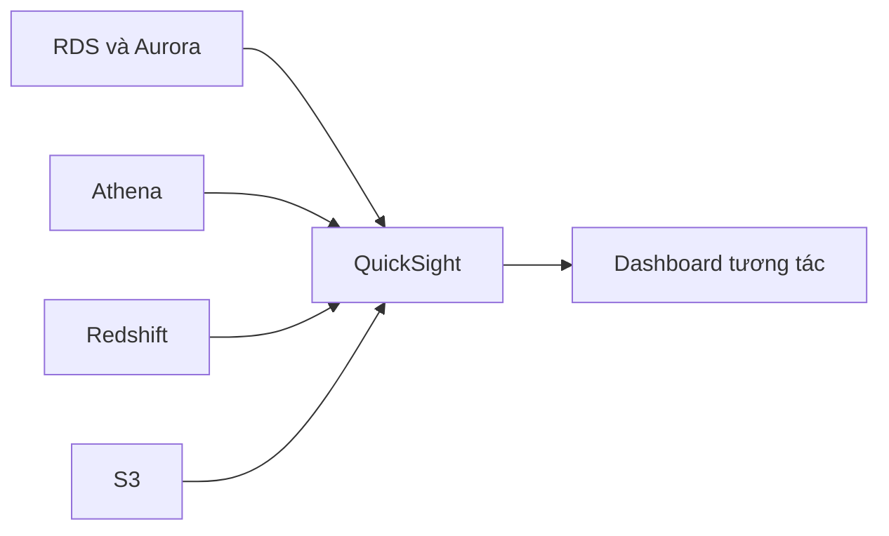

# 📊 Amazon QuickSight: Dashboard BI serverless với sức mạnh machine learning

> Nguồn: `100-QuickSight-Overview.txt` · [Udemy](https://ua.udemy.com/course/aws-certified-cloud-practitioner-new/learn/lecture/24682528)

Đã biết truy vấn dữ liệu với Athena, câu hỏi tiếp theo là: làm sao để **trực quan hóa dữ liệu** cho người dùng doanh nghiệp? Câu trả lời quen thuộc của AWS là **Amazon QuickSight**. Cùng mình tìm hiểu nhé!

---

### 🎯 QuickSight là gì?

**Amazon QuickSight** là dịch vụ **business intelligence (BI — tình báo doanh nghiệp)** theo kiểu **serverless**, được hỗ trợ bởi **machine learning**, dùng để tạo các **interactive dashboard (dashboard tương tác)**.

Nghe tagline có vẻ phức tạp, nhưng điều duy nhất bạn cần nhớ là: **QuickSight cho phép tạo dashboard trên database của bạn** để **thể hiện dữ liệu một cách trực quan**, giúp người dùng doanh nghiệp nhìn thấy những **insight (thông tin giá trị)** mà họ đang tìm kiếm.

*Bạn có thể tạo đủ loại graph, chart trông rất "ngầu" với QuickSight.*

---

### ✨ Những điểm nổi bật

* **Nhanh** và **tự động scale (automatically scalable)**.
* **Embeddable (nhúng được)** vào ứng dụng của bạn.
* Tính giá **theo session (per-session pricing)**.
* **Không phải provision server** — không cần quản lý hạ tầng.

---

### 🔌 Use case và tích hợp

Use case tiêu biểu của QuickSight:

* **Business analytics (phân tích kinh doanh)**.
* **Xây dựng visualization (trực quan hóa dữ liệu)**.
* **Phân tích ad-hoc**.
* Rút ra **business insight** từ dữ liệu.

QuickSight có rất nhiều tích hợp, ví dụ:

* **RDS**
* **Aurora**
* **Athena**
* **Redshift**
* **Amazon S3**

*Mẹo thi:* **QuickSight chính là công cụ BI mặc định trên AWS** — đề hỏi dashboard, BI hay visualization thì cứ chọn QuickSight.

---

### 🎯 Tự kiểm tra nhanh

**Câu 1:** QuickSight là dịch vụ gì?

<b>Xem đáp án</b>

**Đáp án:** Dịch vụ business intelligence serverless, được hỗ trợ bởi machine learning, dùng để tạo dashboard tương tác.

Giải thích: QuickSight giúp thể hiện dữ liệu trực quan cho người dùng doanh nghiệp.

Tham chiếu: Mục QuickSight là gì.

**Câu 2:** Vì sao dùng QuickSight không cần lo hạ tầng?

<b>Xem đáp án</b>

**Đáp án:** Vì đây là dịch vụ serverless, tự động scale và tính giá theo session — không phải provision server.

Giải thích: Bạn chỉ trả tiền theo phiên sử dụng, không quản lý máy chủ.

Tham chiếu: Mục Những điểm nổi bật.

**Câu 3:** QuickSight có thể chạy trên những nguồn dữ liệu nào?

<b>Xem đáp án</b>

**Đáp án:** RDS, Aurora, Athena, Redshift, Amazon S3 và nhiều nguồn khác.

Giải thích: QuickSight tích hợp rất rộng với các dịch vụ dữ liệu của AWS.

Tham chiếu: Mục Use case và tích hợp.

**Câu 4:** Use case tiêu biểu của QuickSight là gì?

<b>Xem đáp án</b>

**Đáp án:** Business analytics, xây dựng visualization, phân tích ad-hoc và rút ra business insight từ dữ liệu.

Giải thích: Đây là các bài toán BI mà QuickSight sinh ra để giải quyết.

Tham chiếu: Mục Use case và tích hợp.

**Câu 5:** Từ khóa nào trong đề thi dẫn bạn đến QuickSight?

<b>Xem đáp án</b>

**Đáp án:** Dashboard, BI, visualization.

Giải thích: QuickSight là công cụ BI mặc định trên AWS.

Tham chiếu: Mục Use case và tích hợp.

---

Vậy là bạn đã có thêm một mảnh ghép quan trọng: **Athena truy vấn dữ liệu trên S3, còn QuickSight biến dữ liệu thành dashboard trực quan** cho người dùng doanh nghiệp.

Ở bài tiếp theo, chúng ta sẽ chuyển sang thế giới NoSQL với **Amazon DocumentDB**. Hẹn gặp các bạn ở đó! 🚀
