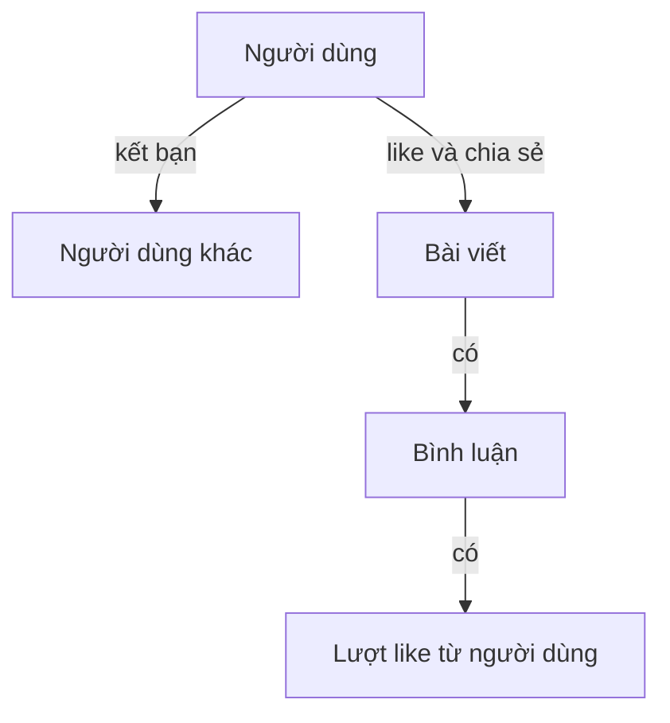

# 🕸️ Amazon Neptune: Cơ sở dữ liệu đồ thị cho dữ liệu liên kết chằng chịt

> Nguồn: `102-Neptune-Overview.txt` · [Udemy](https://ua.udemy.com/course/aws-certified-cloud-practitioner-new/learn/lecture/24682534)

Bài này chúng ta gặp một loại database rất thú vị: **graph database (cơ sở dữ liệu đồ thị)** — và cái tên gắn liền với nó trên AWS là **Amazon Neptune**. Cùng xem graph dataset là gì và vì sao Neptune là lựa chọn số một cho kiểu dữ liệu này nhé!

---

### 🎯 Neptune là gì?

**Amazon Neptune** là một **fully-managed graph database**. Nói đơn giản, đây là database được thiết kế để lưu và truy vấn dữ liệu mà ở đó **các thực thể liên kết với nhau chằng chịt**.

---

### 🌐 Ví dụ dễ hiểu: mạng xã hội

Mạng xã hội là ví dụ ai cũng biết về graph dataset:

* Mọi người **là bạn, thích (like), kết nối, đọc, bình luận** với nhau...
* Người dùng có **bạn bè**; bài viết có **bình luận**; bình luận có **lượt like** từ người dùng; người dùng **chia sẻ (share)** và **thích** bài viết.
* Tất cả những thứ này **liên kết với nhau** và tạo thành một **graph (đồ thị)**.

*Chính vì vậy, Neptune là lựa chọn tuyệt vời cho các bài toán graph dataset.*

---

### ⚙️ Khả năng của Neptune

* **Replication qua 3 AZ**, hỗ trợ tới **15 read replicas (bản sao chỉ đọc)**.
* Dùng để **xây dựng và vận hành các ứng dụng với dataset liên kết chặt chẽ**, ví dụ mạng xã hội.
* Được **tối ưu cho các query phức tạp và khó** trên graph dataset.
* Lưu trữ tới **hàng tỷ quan hệ (relations)** và truy vấn graph với **độ trễ chỉ vài mili giây (milliseconds)**.
* **Highly available** nhờ trải rộng trên nhiều **Availability Zone**.

---

### 💡 Graph database dùng cho việc gì?

* **Knowledge graph (đồ thị tri thức)** — ví dụ database của **Wikipedia** là một knowledge graph, vì mọi bài viết đều liên kết với nhau.
* **Fraud detection (phát hiện gian lận)**.
* **Recommendation engine (hệ thống gợi ý)**.
* **Social networking (mạng xã hội)**.

*Mẹo thi:* thấy **graph database** → nghĩ ngay đến **Neptune**, không cần nghĩ thêm.

---

### 🎯 Tự kiểm tra nhanh

**Câu 1:** Neptune là loại database gì?

<b>Xem đáp án</b>

**Đáp án:** Fully-managed graph database.

Giải thích: Neptune chuyên cho dữ liệu có quan hệ liên kết chằng chịt.

Tham chiếu: Mục Neptune là gì.

**Câu 2:** Ví dụ điển hình của graph dataset là gì?

<b>Xem đáp án</b>

**Đáp án:** Mạng xã hội — người dùng kết bạn, like, bình luận, chia sẻ bài viết với nhau.

Giải thích: Các liên kết giữa người dùng, bài viết, bình luận tạo thành một đồ thị.

Tham chiếu: Mục Ví dụ dễ hiểu.

**Câu 3:** Neptune có replication và read replica như thế nào?

<b>Xem đáp án</b>

**Đáp án:** Replication qua 3 AZ và tối đa 15 read replicas.

Giải thích: Nhờ đó Neptune có tính sẵn sàng cao trên nhiều Availability Zone.

Tham chiếu: Mục Khả năng của Neptune.

**Câu 4:** Neptune xử lý dữ liệu lớn đến mức nào?

<b>Xem đáp án</b>

**Đáp án:** Lưu tới hàng tỷ quan hệ và truy vấn với độ trễ chỉ vài mili giây.

Giải thích: Neptune được tối ưu cho các query phức tạp trên graph dataset.

Tham chiếu: Mục Khả năng của Neptune.

**Câu 5:** Ngoài mạng xã hội, Neptune còn hợp với use case nào?

<b>Xem đáp án</b>

**Đáp án:** Knowledge graph, fraud detection, recommendation engine và social networking.

Giải thích: Wikipedia là ví dụ knowledge graph vì các bài viết liên kết với nhau.

Tham chiếu: Mục Graph database dùng cho việc gì.

---

Vậy là bạn đã nắm được **Amazon Neptune** — *graph database cho dữ liệu liên kết: 3 AZ, 15 read replicas, hàng tỷ quan hệ, độ trễ mili giây*. Chỉ cần nhớ "graph → Neptune" là xong!

Ở bài tiếp theo, chúng ta sẽ tìm hiểu **Amazon Timestream** — database cho dữ liệu chuỗi thời gian. Hẹn gặp các bạn ở đó! 🚀
