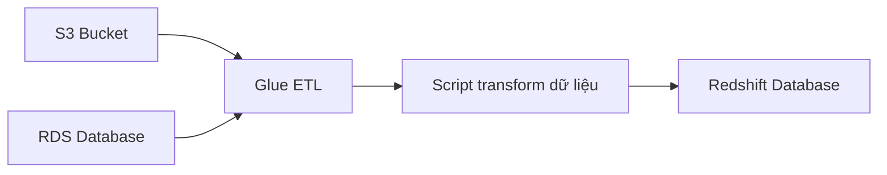

# 🧪 AWS Glue: ETL serverless và Glue Data Catalog

> Nguồn: `105-Glue-Overview.txt` · [Udemy](https://ua.udemy.com/course/aws-certified-cloud-practitioner-new/learn/lecture/20514614)

Dữ liệu thô thường không nằm ở đúng định dạng bạn cần cho analytics — và đó là lúc **ETL** tỏa sáng. Bài này mình giới thiệu **AWS Glue**, dịch vụ ETL được quản lý hoàn toàn của AWS. *Đây là một trong những dịch vụ "phải nhớ" của đề thi đấy!*

---

### 🎯 AWS Glue là gì?

**AWS Glue** là một **managed extract, transform, and load service (dịch vụ ETL được quản lý)**.

* *Mẹo thi:* đề thi chỉ cần bạn biết đến đó — **Glue = ETL**.
* Nhưng hiểu sâu một chút sẽ giúp bạn nhớ lâu hơn, nên mình cùng "deep dive" một đoạn ngắn nhé.

---

### 🔄 ETL là gì và vì sao cần Glue?

Khi bạn có dataset nhưng chúng **chưa đúng dạng hoặc đúng định dạng** cần thiết để phân tích, bạn cần một **ETL service** để **chuẩn bị và biến đổi (transform)** dữ liệu.

* Cách truyền thống: bạn phải dùng **server** để làm việc này.
* Với Glue: **fully serverless** — bạn chỉ lo phần **biến đổi dữ liệu**, Glue lo phần còn lại.

Trong ví dụ trên: Glue đứng ở giữa, **extract** dữ liệu từ cả **S3 bucket** lẫn **Amazon RDS**, sau đó bạn viết **script** cho phần **transform**, rồi **load** dữ liệu đã biến đổi vào **Amazon Redshift** để làm analytics cho đúng bài.

*Glue rất mạnh vì bạn có thể làm mọi kiểu biến đổi dữ liệu rồi load đến nhiều nơi khác nhau.*

---

### 📚 Glue Data Catalog

**Glue Data Catalog** — tuy được giảng viên lưu ý là **không có trong đề thi**, nhưng vẫn rất đáng biết vì thuộc họ Glue:

* Là **catalog (danh mục) của các dataset** trong hạ tầng AWS của bạn.
* Lưu **thông tin tham chiếu** về mọi thứ: **tên cột (column names), tên field (field names), kiểu field (field types)**...
* Được các dịch vụ như **Athena, Redshift và EMR** dùng để **khám phá dataset (discover)** và **xây dựng schema** phù hợp cho chúng.

---

### 🎯 Tự kiểm tra nhanh

**Câu 1:** AWS Glue là dịch vụ gì?

<b>Xem đáp án</b>

**Đáp án:** Managed extract, transform, and load service — dịch vụ ETL được quản lý.

Giải thích: Đây là điều duy nhất bạn cần nhớ cho đề thi về Glue.

Tham chiếu: Mục AWS Glue là gì.

**Câu 2:** ETL hữu ích trong trường hợp nào?

<b>Xem đáp án</b>

**Đáp án:** Khi dataset chưa đúng dạng hoặc đúng định dạng cần thiết để phân tích.

Giải thích: ETL giúp chuẩn bị và biến đổi dữ liệu trước khi phân tích.

Tham chiếu: Mục ETL là gì và vì sao cần Glue.

**Câu 3:** Glue khác gì cách làm ETL truyền thống?

<b>Xem đáp án</b>

**Đáp án:** Glue là fully serverless — bạn không quản lý server, chỉ lo việc biến đổi dữ liệu.

Giải thích: Cách truyền thống phải dùng server để chạy ETL.

Tham chiếu: Mục ETL là gì và vì sao cần Glue.

**Câu 4:** Trong ví dụ của giảng viên, Glue extract dữ liệu từ đâu và load vào đâu?

<b>Xem đáp án</b>

**Đáp án:** Extract từ S3 bucket và Amazon RDS, transform bằng script, rồi load vào Amazon Redshift.

Giải thích: Redshift là nơi bạn làm analytics sau khi dữ liệu đã được biến đổi.

Tham chiếu: Mục ETL là gì và vì sao cần Glue.

**Câu 5:** Glue Data Catalog lưu gì và được dùng bởi những dịch vụ nào?

<b>Xem đáp án</b>

**Đáp án:** Lưu thông tin tham chiếu như tên cột, tên field, kiểu field; được Athena, Redshift và EMR dùng để discover dataset và xây dựng schema.

Giải thích: Tuy không có trong đề thi, Data Catalog là phần quan trọng của họ Glue.

Tham chiếu: Mục Glue Data Catalog.

---

Vậy là bạn đã nắm được **AWS Glue**: *managed ETL + serverless + Glue Data Catalog*. Nhớ "ETL → Glue" là bạn đã nắm chắc điểm phần này!

Ở bài tiếp theo, chúng ta sẽ tìm hiểu **AWS DMS** — dịch vụ di chuyển database. Hẹn gặp các bạn ở đó! 🚀
