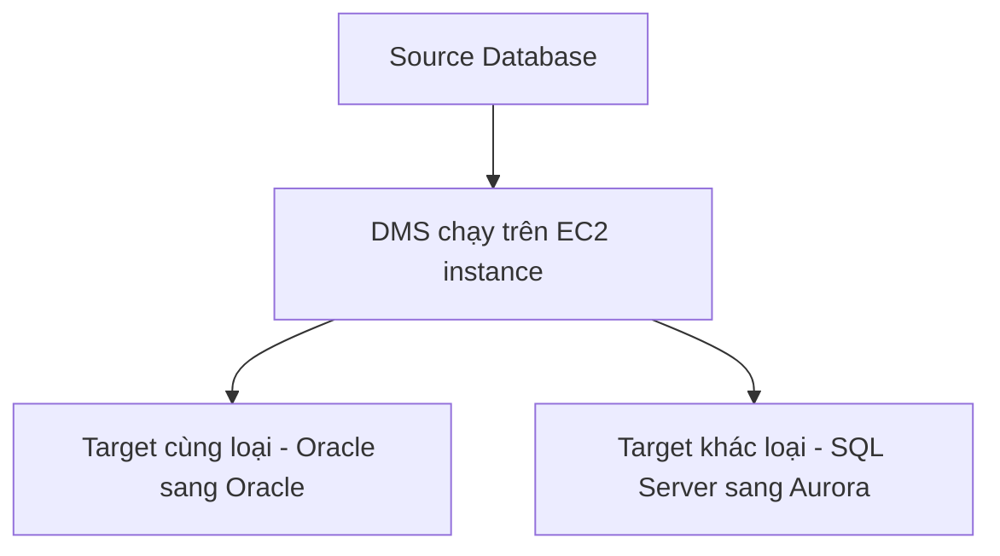

# 🔄 AWS DMS: Di chuyển cơ sở dữ liệu lên AWS không gián đoạn

> Nguồn: `106-DMS-Overview.txt` · [Udemy](https://ua.udemy.com/course/aws-certified-cloud-practitioner-new/learn/lecture/20056010)

Chúng ta đã đi qua rất nhiều công nghệ database trong section này. Vậy câu hỏi đặt ra là: **làm sao di chuyển dữ liệu từ database này sang database khác?** Câu trả lời của AWS là **DMS — Database Migration Service**. Cùng tìm hiểu nhé!

---

### 🎯 DMS là gì?

**DMS (Database Migration Service — dịch vụ di chuyển cơ sở dữ liệu)** giúp bạn **migrate (di chuyển) dữ liệu từ database nguồn sang database đích** một cách nhanh chóng và an toàn.

Cách hoạt động:

1. Bạn có **source database (database nguồn)** cần lấy dữ liệu ra.
2. DMS chạy trên một **EC2 instance** với phần mềm DMS.
3. DMS **extract dữ liệu** từ source database.
4. DMS **insert dữ liệu** vào **target database (database đích)** nằm ở nơi khác.

---

### 🌟 Lợi ích của DMS

* Migration **nhanh và an toàn (quick and secure)** lên AWS.
* **Resilient (kiên cường)** và **self-healing (tự phục hồi)**.
* "Cherry on the cake" — điểm cộng tuyệt vời: **source database vẫn hoạt động trong suốt quá trình migration**, bạn **không cần tắt nó đi**.

---

### 🔀 Hai kiểu migration

* **Homogeneous migration (đồng nhất)**: source và target dùng **cùng công nghệ database** — ví dụ **Oracle sang Oracle**.
* **Heterogeneous migration (không đồng nhất)**: source và target **khác công nghệ** — ví dụ **Microsoft SQL Server sang Aurora**. Trong trường hợp này, DMS **đủ thông minh để chuyển đổi dữ liệu** từ source sang target.

*Mẹo thi:* bất cứ khi nào đề nói đến **migration of a database**, **DMS chính là đáp án**.

---

### 🎯 Tự kiểm tra nhanh

**Câu 1:** DMS là viết tắt của gì và dùng để làm gì?

<b>Xem đáp án</b>

**Đáp án:** Database Migration Service — dịch vụ di chuyển dữ liệu giữa các database.

Giải thích: Đề thi thấy migration database thì chọn DMS.

Tham chiếu: Mục DMS là gì.

**Câu 2:** DMS chạy ở đâu và luồng hoạt động ra sao?

<b>Xem đáp án</b>

**Đáp án:** Chạy trên một EC2 instance; extract dữ liệu từ source database rồi insert vào target database.

Giải thích: Target database có thể nằm ở nơi khác.

Tham chiếu: Mục DMS là gì.

**Câu 3:** Lợi ích lớn nhất của DMS khi migration là gì?

<b>Xem đáp án</b>

**Đáp án:** Source database vẫn hoạt động trong suốt quá trình migration — không cần tắt nó.

Giải thích: Ngoài ra DMS còn nhanh, an toàn, resilient và self-healing.

Tham chiếu: Mục Lợi ích của DMS.

**Câu 4:** Homogeneous và heterogeneous migration khác nhau thế nào?

<b>Xem đáp án</b>

**Đáp án:** Homogeneous là cùng công nghệ (Oracle sang Oracle); heterogeneous là khác công nghệ (SQL Server sang Aurora).

Giải thích: Với heterogeneous, DMS tự biết cách chuyển đổi dữ liệu sang target.

Tham chiếu: Mục Hai kiểu migration.

**Câu 5:** Từ khóa nào trong đề thi dẫn bạn đến DMS?

<b>Xem đáp án</b>

**Đáp án:** Migration of a database.

Giải thích: DMS là đáp án mặc định cho mọi câu hỏi về di chuyển database trên AWS.

Tham chiếu: Mục Hai kiểu migration.

---

Vậy là bạn đã nắm được **AWS DMS**: *di chuyển database nhanh, an toàn, không downtime, hỗ trợ cả homogeneous lẫn heterogeneous migration*. Nhớ "migration → DMS" là xong!

Ở bài tiếp theo, chúng ta sẽ tổng kết toàn bộ section **Databases & Analytics** để sẵn sàng bước vào đề thi. Hẹn gặp các bạn ở đó! 🚀
