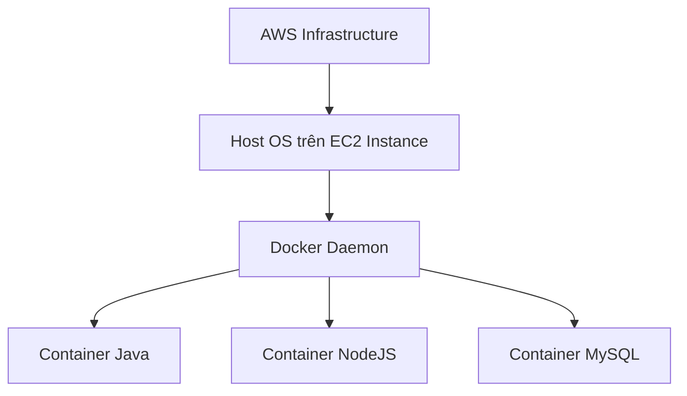

# 🐳 Docker là gì? Nền tảng container bạn cần biết trước khi học ECS

> Nguồn: `108-What-is-Docker.txt` · [Udemy](https://ua.udemy.com/course/aws-certified-cloud-practitioner-new/learn/lecture/20056040)

Chúng ta sắp bước vào phần **ECS**, nhưng trước đó mình cần nói về **Docker** — thứ mà chắc hẳn bạn đã nghe ở đâu đó rồi. *Docker có thể dạy cả một khóa học dài 12 tiếng, nhưng ở đây mình sẽ cố gắng gói gọn trong 4 phút thôi nhé!*

---

### 📦 Docker là gì?

**Docker là một nền tảng phát triển phần mềm (software development platform) dùng để triển khai ứng dụng (deploy apps).**

Trước đây, cách triển khai ứng dụng là cài chúng lên Linux rồi để chúng chạy. Với Docker, bạn **đóng gói ứng dụng vào một thứ gọi là container (vùng chứa)** — và container này rất đặc biệt:

* Chạy được trên **mọi hệ điều hành** một cách dễ dàng.
* Ứng dụng trong container chạy **giống hệt nhau**, bất kể chạy ở đâu — không có vấn đề tương thích (compatibility issues), hành vi luôn đoán trước được (predictable behavior).
* Ít công việc hơn, dễ bảo trì và triển khai hơn.
* Hoạt động với **mọi ngôn ngữ lập trình, mọi hệ điều hành, mọi công nghệ**.
* Có thể **scale (mở rộng/thu nhỏ) container cực nhanh, chỉ trong vài giây**.

Nhờ đó, Docker ngày nay là công cụ cực kỳ mạnh mẽ để triển khai ứng dụng.

---

### 🖥️ Docker trên EC2 trông như thế nào?

Hãy tưởng tượng một **EC2 instance** chạy nhiều container cùng lúc:

* Một container chạy code **Java**, một container chạy code **NodeJS**.
* Một container chạy **MySQL Database**, thêm một container Java nữa...

Tất cả cùng nằm trên **cùng một EC2 instance**. Ý tưởng ở đây là: nếu đã đóng gói được ứng dụng vào Docker container, việc chạy nó trên EC2 sẽ trở nên rất dễ dàng.

---

### 🗄️ Docker image và Docker repository

**Docker image** là thứ bạn phải tạo ra — container sẽ được chạy từ image này. Image được lưu trong các **Docker repository (kho chứa image)**:

* **Docker Hub** — kho Docker **công khai (public)**, nơi bạn tìm thấy base image cho rất nhiều công nghệ và hệ điều hành: **Ubuntu** (hệ điều hành Linux), **MySQL** (công nghệ cơ sở dữ liệu), **NodeJS**, **Java**...
* **Amazon ECR** — **private Docker repository** của AWS, nơi bạn lưu các Docker image riêng tư. Chúng ta sẽ gặp lại dịch vụ này ngay trong phần này.

---

### ⚖️ Docker hay máy ảo? Khác nhau ở đâu?

Docker là một dạng công nghệ ảo hóa (virtualization) — nhưng không hẳn. Điểm mấu chốt: **tài nguyên được chia sẻ với host (máy chủ)**, nên bạn có thể chạy **rất nhiều container trên một server**.

Với cách truyền thống, hệ thống xếp lớp như sau: **infrastructure** (hạ tầng trên AWS) → **Host Operating System** → **Hypervisor** (những thứ ta không truy cập được) → các **EC2 instance**, mỗi instance mang theo **Guest Operating System** và ứng dụng của nó. Muốn thêm instance thứ hai, thứ ba, hệ thống lại tạo thêm một chồng tương tự — kèm cả một hệ điều hành đầy đủ.

Với Docker, mọi thứ gọn hơn hẳn: **infrastructure** → **Host OS** (chính là EC2 instance) → **Docker Daemon**. Khi Docker Daemon chạy, bạn có thể chạy **nhiều container nhẹ hơn** trên nó — vì container **không mang theo cả một hệ điều hành đầy đủ** như máy ảo. Nhờ vậy Docker rất linh hoạt, rất dễ scale và rất dễ vận hành.

---

### 🎯 Ghi nhớ cho kỳ thi

Bạn **không cần biết Docker để đi thi** — đây chỉ là phần giới thiệu nhỏ mình tặng thêm cho những bạn tò mò. Nhưng hiểu Docker sẽ giúp bạn nắm ngay bài tiếp theo: cách chạy Docker trên AWS, tức là **ECS**. *Đừng lo nếu bạn chưa từng đụng tới container bao giờ — cứ từng bước một nhé!*

---

### 🧪 Tự kiểm tra nhanh

**Câu 1:** Docker đóng gói ứng dụng vào thứ gì?

<b>Xem đáp án</b>

**Đáp án:** Container.

Giải thích: Docker đóng gói app vào container, và container chạy được trên mọi hệ điều hành.

Tham chiếu: Mục Docker là gì.

**Câu 2:** Vì sao ứng dụng trong container chạy giống hệt nhau ở mọi nơi?

<b>Xem đáp án</b>

**Đáp án:** Vì app đã được đóng gói vào container nên không có vấn đề tương thích, hành vi luôn đoán trước được.

Giải thích: Dù chạy trên máy nào, container vẫn cho kết quả như nhau.

Tham chiếu: Mục Docker là gì.

**Câu 3:** Docker Hub và Amazon ECR khác nhau thế nào?

<b>Xem đáp án</b>

**Đáp án:** Docker Hub là repository công khai, còn ECR là private Docker repository trên AWS.

Giải thích: ECR dùng để lưu Docker image riêng tư của bạn.

Tham chiếu: Mục Docker image và Docker repository.

**Câu 4:** Vì sao container nhẹ hơn máy ảo?

<b>Xem đáp án</b>

**Đáp án:** Container chia sẻ tài nguyên với host và không mang theo cả một hệ điều hành đầy đủ.

Giải thích: Nhờ vậy có thể chạy nhiều container trên cùng một server.

Tham chiếu: Mục Docker hay máy ảo.

**Câu 5:** Trên một EC2 instance, Docker có thể chạy những gì?

<b>Xem đáp án</b>

**Đáp án:** Nhiều container khác nhau cùng lúc, ví dụ Java, NodeJS và MySQL.

Giải thích: Container chia sẻ tài nguyên host nên một instance chạy được nhiều container.

Tham chiếu: Mục Docker trên EC2 trông như thế nào.

---

Vậy là bạn đã có nền tảng để hiểu **cách Docker hoạt động trên AWS**. Ở bài tiếp theo, chúng ta sẽ gặp **ECS**, **Fargate** và **ECR** — bộ ba giúp chạy container trên AWS. Hẹn gặp các bạn ở đó! 🚀
