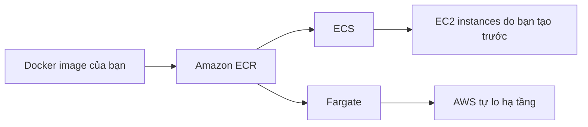

# 🚢 ECS, Fargate và ECR: Bộ ba chạy Docker container trên AWS

> Nguồn: `109-ECS-Fargate-ECR-Overview.txt` · [Udemy](https://ua.udemy.com/course/aws-certified-cloud-practitioner-new/learn/lecture/20056046)

Sau khi đã hiểu Docker, câu hỏi tiếp theo là: làm sao chạy container trên AWS? Câu trả lời xoay quanh ba cái tên **ECS**, **Fargate** và **ECR**. Đây là nhóm kiến thức rất dễ xuất hiện trong đề thi, nên các bạn chú ý nhé!

---

### 🚢 ECS — Elastic Container Service

**ECS (Elastic Container Service)** là dịch vụ dùng để **chạy các Docker container trên AWS**.

Điều quan trọng nhất cần nhớ: với ECS, **bạn phải tự provision (cung cấp) và bảo trì hạ tầng**, nghĩa là bạn cần **tạo EC2 instance từ trước**. AWS sẽ lo việc **khởi động và dừng container** cho bạn, và ECS có **tích hợp với application load balancer** nếu bạn muốn làm ứng dụng web.

Hình dung đơn giản: bạn có nhiều EC2 instance được tạo sẵn, và **ECS service** sẽ chạy các container khác nhau trên đó. Mỗi khi có Docker container mới, ECS đủ thông minh để **tìm xem nên đặt container đó lên EC2 instance nào**.

> 💡 **Mẹo thi:** Đề bài nói "tôi muốn chạy Docker container trên AWS" → hãy nghĩ ngay đến **ECS**.

---

### ⚡ Fargate — chạy container không cần quản lý hạ tầng

Fargate cũng dùng để **chạy Docker container trên AWS**, nhưng khác một điểm lớn: **bạn không cần provision bất kỳ hạ tầng nào**, không cần tạo và quản lý EC2 instance.

* Đây là một offering **serverless** của AWS, vì bạn không quản lý server nào cả.
* AWS sẽ tự chạy container dựa trên **thông số CPU và RAM** mà bạn chỉ định cho từng container.
* Bạn không biết chính xác container chạy ở đâu — nó chỉ đơn giản là chạy.

Thú thật là mình **rất thích Fargate** vì nó đơn giản hơn hẳn: ECS thì bạn phải tạo EC2 trước, còn Fargate thì không. *Nhưng điểm chung quan trọng nhất: cả hai dịch vụ đều cho phép bạn chạy Docker container trên AWS.*

---

### 🗄️ ECR — Elastic Container Registry

Để chạy Docker image trên AWS, bạn cần có **container registry (kho chứa image)**. Đó là lúc dùng **ECR (Elastic Container Registry)**:

* ECR là **private Docker registry trên AWS**.
* Đây là nơi bạn lưu Docker image để **ECS service hoặc Fargate service** có thể chạy chúng.

Ví dụ luồng hoàn chỉnh: bạn lưu image của ứng dụng lên **Amazon ECR** → **Fargate** đọc các image này, tạo container từ đó và chạy trực tiếp. Bạn có thể có nhiều image khác nhau tạo ra nhiều container khác nhau trên Fargate.

---

### 📊 So sánh nhanh ECS và Fargate

| Tiêu chí | ECS | Fargate |
|---|---|---|
| Hạ tầng | Bạn tự tạo và quản lý EC2 instances | Không cần provision gì |
| Serverless | Không | Có |
| Cách chạy container | ECS tự chọn EC2 instance phù hợp | Dựa trên CPU và RAM bạn chỉ định |

Còn **ECR** thì đứng ở vai trò khác: nó là **kho lưu Docker image** cho cả hai dịch vụ trên.

---

### 🎯 Ghi nhớ cho kỳ thi

Chỉ cần nhớ bộ ba **ECS — Fargate — ECR** là bạn đã nắm trọn phần này. *Đơn giản vậy thôi, đừng lo nhé!* Ở bài tiếp theo, chúng ta sẽ nâng cấp lên một bước với **Kubernetes** và dịch vụ **Amazon EKS**.

---

### 🧪 Tự kiểm tra nhanh

**Câu 1:** Dịch vụ nào chạy Docker container trên AWS nhưng yêu cầu bạn tự tạo EC2 instance trước?

<b>Xem đáp án</b>

**Đáp án:** ECS.

Giải thích: Với ECS, bạn phải provision và bảo trì hạ tầng, tức là tạo EC2 instance từ trước.

Tham chiếu: Mục ECS — Elastic Container Service.

**Câu 2:** Fargate khác ECS ở điểm then chốt nào?

<b>Xem đáp án</b>

**Đáp án:** Fargate là serverless — không cần provision hay quản lý EC2 instance.

Giải thích: AWS tự chạy container theo CPU và RAM bạn chỉ định.

Tham chiếu: Mục Fargate — chạy container không cần quản lý hạ tầng.

**Câu 3:** ECR là gì?

<b>Xem đáp án</b>

**Đáp án:** Private Docker registry trên AWS, nơi lưu Docker image.

Giải thích: Image trong ECR được ECS hoặc Fargate đọc và chạy thành container.

Tham chiếu: Mục ECR — Elastic Container Registry.

**Câu 4:** Đề thi nói "chạy Docker container trên AWS" thì bạn nghĩ tới dịch vụ nào?

<b>Xem đáp án</b>

**Đáp án:** ECS.

Giải thích: Đây là cách nhận diện nhanh trong đề thi mà giảng viên nhấn mạnh.

Tham chiếu: Mục ECS — Elastic Container Service.

**Câu 5:** Fargate quyết định tài nguyên cho container dựa trên gì?

<b>Xem đáp án</b>

**Đáp án:** Thông số CPU và RAM của mỗi container.

Giải thích: Bạn chỉ cần chỉ định cấu hình, AWS lo phần chạy container.

Tham chiếu: Mục Fargate — chạy container không cần quản lý hạ tầng.

---

Vậy là bạn đã nắm được cách chạy Docker container trên AWS. Ở bài sau, chúng ta sẽ làm quen với **Amazon EKS** — dịch vụ giúp quản lý **Kubernetes** trên AWS. Hẹn gặp các bạn! 🚀
