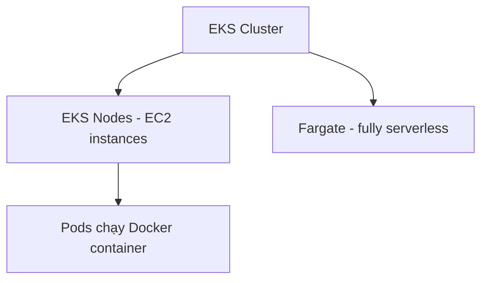

# ☸️ Amazon EKS: Quản lý Kubernetes trên AWS trong vài phút

> Nguồn: `110-Amazon-EKS.txt` · [Udemy](https://ua.udemy.com/course/aws-certified-cloud-practitioner-new/learn/lecture/46803349)

Tiếp nối chủ đề container, bài này mình giới thiệu **Amazon EKS** — dịch vụ giúp bạn chạy và quản lý **Kubernetes** trên AWS. Nghe có vẻ cao siêu, nhưng thực ra chỉ cần nắm vài ý cốt lõi là đủ cho kỳ thi.

---

### 🧩 EKS và Kubernetes là gì?

**EKS (Elastic Kubernetes Service)** cho phép bạn **khởi chạy và quản lý Kubernetes cluster (cụm Kubernetes) trên AWS**.

Vậy **Kubernetes** là gì? Đây là một **hệ thống mã nguồn mở (open source), dùng để quản lý, triển khai và scale các ứng dụng container hóa (containerized applications)** — thường là các container được quản lý bởi Docker, nhưng cũng có thể là những loại container khác.

Các container và **pod (đơn vị chạy nhỏ nhất trong Kubernetes)** này có thể được chạy trên:

* **EC2 instance** — gọi là các **EKS node**, hoặc
* **Fargate** — nếu bạn muốn hoàn toàn serverless.

---

### ⚙️ EKS chạy container như thế nào?

Khi dùng một **EKS cluster** (cụm Kubernetes do EKS quản lý), bạn sẽ có các **EKS node** — ví dụ chính là các EC2 instance. Mỗi khi bạn chạy một Docker container lên cluster, **các pod sẽ tự động được khởi chạy trên những EC2 instance đó**.

*Đừng lo nếu bạn chưa từng chạm tới Kubernetes — mình chỉ cần bạn nắm được bức tranh tổng thể ở đây.*

---

### 🌍 Vì sao dùng Kubernetes và vì sao dùng EKS?

Hai câu hỏi thường gặp, và câu trả lời rất hợp lý:

* **Vì sao dùng EKS?** Vì tự khởi chạy Kubernetes **khá khó**. Dùng một **managed service (dịch vụ được quản lý)** để vận hành cluster là một ý tưởng hay — đó chính là lý do Amazon EKS ra đời.
* **Vì sao dùng Kubernetes?** Nếu bạn làm việc với **nhiều cloud (multi-cloud)** hoặc cả **hạ tầng on-premises (tại chỗ)**, Kubernetes chạy được ở mọi nơi. Nó **cloud agnostic (không phụ thuộc cloud cụ thể)** — học một lần, bạn có thể chạy container trên AWS, Azure, GCP hay bất cứ đâu.

---

### 🎯 Ghi nhớ cho kỳ thi

Góc nhìn đề thi cực kỳ đơn giản: khi bạn thấy từ **Kubernetes** trong câu hỏi, hãy nghĩ ngay đến **Amazon EKS**.

---

### 🧪 Tự kiểm tra nhanh

**Câu 1:** EKS là viết tắt của gì?

<b>Xem đáp án</b>

**Đáp án:** Elastic Kubernetes Service.

Giải thích: Dịch vụ cho phép khởi chạy và quản lý Kubernetes cluster trên AWS.

Tham chiếu: Mục EKS và Kubernetes là gì.

**Câu 2:** Kubernetes là gì?

<b>Xem đáp án</b>

**Đáp án:** Hệ thống mã nguồn mở dùng để quản lý, triển khai và scale các ứng dụng container hóa.

Giải thích: Kubernetes thường quản lý Docker container, nhưng cũng hỗ trợ loại container khác.

Tham chiếu: Mục EKS và Kubernetes là gì.

**Câu 3:** Pod và container trên EKS có thể chạy trên những đâu?

<b>Xem đáp án</b>

**Đáp án:** EC2 instance (EKS node) hoặc Fargate nếu muốn hoàn toàn serverless.

Giải thích: Khi chạy Docker container lên cluster, pod sẽ tự động được khởi chạy trên các EC2 instance.

Tham chiếu: Mục EKS chạy container như thế nào.

**Câu 4:** Vì sao nên dùng EKS thay vì tự dựng Kubernetes?

<b>Xem đáp án</b>

**Đáp án:** Vì tự khởi chạy Kubernetes khá khó; dùng managed service sẽ dễ dàng hơn.

Giải thích: EKS giúp bạn vận hành Kubernetes cluster mà không phải tự vật lộn với mọi thứ.

Tham chiếu: Mục Vì sao dùng Kubernetes và vì sao dùng EKS.

**Câu 5:** Lợi ích lớn nhất của Kubernetes là gì?

<b>Xem đáp án</b>

**Đáp án:** Chạy được ở mọi nơi — cloud agnostic, kể cả multi-cloud và on-premises.

Giải thích: Học Kubernetes một lần, bạn có thể chạy container trên AWS, Azure, GCP...

Tham chiếu: Mục Vì sao dùng Kubernetes và vì sao dùng EKS.

---

Vậy là xong phần Kubernetes. Ở bài tiếp theo, chúng ta sẽ chuyển sang một chủ đề cực kỳ quan trọng của kỳ thi CLF-C02: **Serverless**. Hẹn gặp các bạn! 🚀
