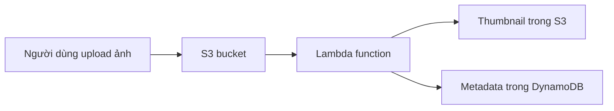

# 🐑 AWS Lambda: Chạy function không cần server — những điều bắt buộc nhớ

> Nguồn: `112-Lambda-Overview.txt` · [Udemy](https://ua.udemy.com/course/aws-certified-cloud-practitioner-new/learn/lecture/20056024)

Giờ là lúc nói về **AWS Lambda** — dịch vụ serverless nổi tiếng nhất và cũng là "ngôi sao" của đề thi CLF-C02. Bài này khá dài và nhiều ý, nên các bạn đọc chậm mà chắc nhé!

---

### 🔄 Từ EC2 đến Lambda — một cách suy nghĩ mới

Với **EC2 instance**, bạn có một **máy chủ ảo trên cloud**, nhưng bị giới hạn bởi lượng **memory và CPU** bạn cấp cho nó. Instance **chạy liên tục**, kể cả khi bạn không dùng. Muốn scale thì phải dùng **Auto Scaling group**, tức là thêm/bớt server theo thời gian — việc này có thể **hơi chậm hoặc khá phức tạp**.

Với **Lambda**, mọi thứ khác hẳn: **không có server, chỉ có các virtual function (hàm ảo)**. Và:

* Function **bị giới hạn về thời gian**, dành cho những tác vụ ngắn.
* Function **chạy theo nhu cầu (on demand)**: khi cần mới chạy, khi không cần thì **không chạy và bạn không bị tính tiền**.
* Việc **scale đã được tự động hóa** sẵn trong dịch vụ Lambda.

Chính vì vậy Lambda là một trong những dịch vụ được yêu thích nhất của AWS.

---

### 🎁 Lợi ích của AWS Lambda

* **Pricing cực kỳ đơn giản**: bạn trả **theo request và theo thời gian compute**.
* **Free tier rất hào phóng**: mỗi tháng bạn được **1 triệu Lambda invocations** và **400.000 gigabyte-giây (GB-s) thời gian compute** — đủ để chạy nhiều dịch vụ hay ho miễn phí.
* **Tích hợp với toàn bộ hệ sinh thái AWS**: rất nhiều dịch vụ chúng ta đã học đều kết nối được với Lambda.
* **Event-driven (hướng sự kiện)**: function chỉ được AWS gọi khi **có sự kiện xảy ra** hoặc khi cần thiết — điều này khiến Lambda trở thành dịch vụ **reactive (phản ứng)**. Đây là ý **rất quan trọng cho kỳ thi**.
* **Hỗ trợ nhiều ngôn ngữ lập trình**.
* **Giám sát dễ dàng** qua **CloudWatch** — giải pháp monitoring của AWS mà chúng ta sẽ học sau.
* **Dễ tăng tài nguyên cho mỗi function**: tối đa **10 GB RAM** cho một function. Đặc biệt, khi tăng RAM thì **CPU và chất lượng network cũng tăng theo**.

---

### 🗣️ Ngôn ngữ hỗ trợ và chuyện container

Lambda chạy được nhiều ngôn ngữ: **Node.js/JavaScript, Python, Java, C#** (cả **.NET Core** hoặc **PowerShell**), **Ruby**... Ngoài ra, Lambda hỗ trợ thêm nhiều ngôn ngữ khác qua **Custom Runtime API** — ví dụ **Rust** hoặc **Golang**.

Bạn cũng có thể dùng **container image** trên Lambda, nhưng phải implement một thứ gọi là **Lambda Runtime API**. Nghe có vẻ nâng cao, nhưng điều mình muốn bạn nhớ cho kỳ thi là:

> Muốn chạy Docker image thì luôn ưu tiên **ECS hoặc Fargate** hơn Lambda — dù Lambda có hỗ trợ một mức nhất định các Docker image tùy biến.

Bạn **không cần nhớ hết danh sách ngôn ngữ**, chỉ cần biết Lambda có hỗ trợ — quan trọng nhất là **Node.js và Python**.

---

### 🖼️ Hai use case kinh điển

**1. Dịch vụ tạo thumbnail serverless:** người dùng upload ảnh (ví dụ ảnh bãi biển) lên một **S3 bucket** → S3 **trigger** một **Lambda function** → function tạo **thumbnail (ảnh thu nhỏ)** và đẩy lại vào **Amazon S3**, đồng thời ghi **metadata** (kích thước ảnh, tên ảnh, ngày tạo...) vào **DynamoDB**. Toàn bộ luồng **event-driven và serverless 100%** — scale cực tốt mà không cần provision server.

**2. Serverless CRON job:** **CRON** cho phép bạn định nghĩa lịch chạy — mỗi giờ, mỗi ngày, mỗi thứ Hai... để chạy một script. Mặc định CRON job chạy trên **Linux AMI**, tức là trên máy Linux. Nhưng vì ta đang serverless, không thể provision EC2 instance, nên thay vào đó dùng **CloudWatch Events hoặc EventBridge** để **trigger Lambda function mỗi giờ**. Kết quả: **không có server nào cả** — CloudWatch Events serverless, Lambda serverless.

---

### 💰 Pricing và mẹo thi

Lambda tính phí cực kỳ đơn giản, gồm hai phần:

* **Số lần gọi (calls/requests):** 1 triệu invocation đầu tiên **miễn phí**, sau đó chỉ **0,20 USD cho mỗi 1 triệu request**.
* **Thời gian chạy (duration):** free tier là **400.000 GB-giây** — nghĩa là **400.000 giây nếu function có 1 GB RAM**, hoặc **3,2 triệu giây nếu function có 128 MB RAM**. Sau đó, bạn trả **1 USD cho 600.000 GB-giây**.

Tóm lại, chạy Lambda trên AWS **rất rẻ**. Và điều cần nhớ khi vào phòng thi:

> **Lambda pricing dựa trên calls và duration** (số lần gọi và thời gian chạy).

---

### 🧪 Tự kiểm tra nhanh

**Câu 1:** Lambda khác EC2 cơ bản ở điểm nào?

<b>Xem đáp án</b>

**Đáp án:** Lambda không có server, chỉ có virtual function chạy theo nhu cầu; EC2 là máy chủ ảo chạy liên tục.

Giải thích: Lambda giới hạn thời gian chạy và không tính tiền khi không được gọi.

Tham chiếu: Mục Từ EC2 đến Lambda.

**Câu 2:** Free tier của Lambda gồm những gì?

<b>Xem đáp án</b>

**Đáp án:** 1 triệu invocation và 400.000 GB-giây compute mỗi tháng.

Giải thích: Sau đó bạn trả 0,20 USD/1 triệu request và 1 USD/600.000 GB-giây.

Tham chiếu: Mục Lợi ích của AWS Lambda và Mục Pricing.

**Câu 3:** Lambda có tính chất gì đặc biệt quan trọng cho kỳ thi?

<b>Xem đáp án</b>

**Đáp án:** Event-driven/reactive — function chỉ chạy khi có sự kiện hoặc khi cần.

Giải thích: Đây là điểm nhấn giảng viên nhắc riêng cho phần thi.

Tham chiếu: Mục Lợi ích của AWS Lambda.

**Câu 4:** Muốn chạy Docker image trên AWS, đề thi ưu tiên dịch vụ nào?

<b>Xem đáp án</b>

**Đáp án:** ECS hoặc Fargate, hơn là Lambda.

Giải thích: Lambda chỉ hỗ trợ container image nếu implement Lambda Runtime API, không phải lựa chọn tiêu chuẩn.

Tham chiếu: Mục Ngôn ngữ hỗ trợ và chuyện container.

**Câu 5:** Khi tăng RAM cho Lambda function thì điều gì xảy ra?

<b>Xem đáp án</b>

**Đáp án:** CPU và chất lượng network cũng được cải thiện.

Giải thích: Lambda cho tối đa 10 GB RAM mỗi function, kéo theo CPU/network tốt hơn.

Tham chiếu: Mục Lợi ích của AWS Lambda.

---

Vậy là bạn đã nắm được Lambda từ khái niệm đến pricing. Ở bài tiếp theo, chúng ta sẽ **thực hành trực tiếp trên console**: tạo function, test và xem log. Hẹn gặp các bạn! 🚀
