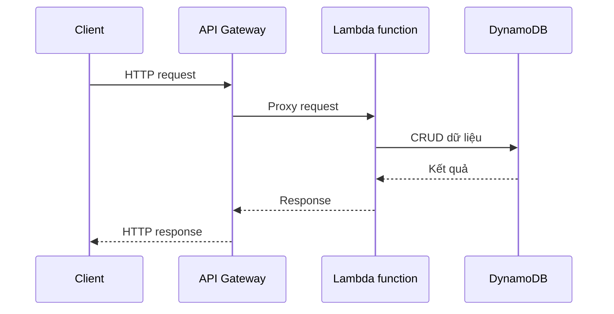

# 🚪 Amazon API Gateway: Đưa Lambda của bạn ra thế giới bên ngoài

> Nguồn: `114-API-Gateway-Overview.txt` · [Udemy](https://ua.udemy.com/course/aws-certified-cloud-practitioner-new/learn/lecture/24682546)

Bài này mình giới thiệu nhanh **Amazon API Gateway** — dịch vụ giúp bạn xây dựng **serverless HTTP API**. Đây là mảnh ghép còn thiếu để ứng dụng Lambda của bạn có thể "nói chuyện" với thế giới bên ngoài.

---

### 🚪 Vì sao cần API Gateway?

Hãy bắt đầu từ use case rất hay gặp trong đề thi: bạn muốn xây dựng một **serverless HTTP API**. Trong ví dụ này:

* Ta dùng **Lambda** — công nghệ serverless.
* Ta **Create, Read, Update, Delete (tạo, đọc, cập nhật, xóa) dữ liệu** trong **DynamoDB** — cũng là công nghệ serverless.
* Nhưng ta còn cần **client bên ngoài truy cập được vào Lambda function**.

Vấn đề nằm ở chỗ: **Lambda function không tự động được expose như một API**. Muốn làm điều đó, ta cần đưa nó ra ngoài qua **API Gateway** — dịch vụ cung cấp cho client **REST HTTP API** để kết nối trực tiếp tới website của bạn.

---

### 🔀 Luồng hoạt động

Luồng đi rất đơn giản:

1. **Client** gọi vào **API Gateway**.
2. API Gateway **proxy request** (chuyển tiếp yêu cầu) tới **Lambda function**.
3. Lambda thực hiện **các phép biến đổi dữ liệu** cần thiết.

---

### 🛡️ API Gateway làm được gì?

* Là **fully managed service (dịch vụ được quản lý hoàn toàn)**: cho phép lập trình viên dễ dàng **tạo, publish, bảo trì, giám sát và bảo mật API trên cloud**.
* Là **công nghệ serverless** và **scale hoàn toàn tự động**.
* Hỗ trợ **RESTful APIs**, cùng **WebSocket APIs** cho việc **stream dữ liệu thời gian thực**.
* Hỗ trợ **security (bảo mật), user authentication (xác thực người dùng), API throttling (giới hạn tần suất gọi), API keys, monitoring (giám sát)**... và nhiều thứ khác.

---

### 🎯 Mẹo thi

Khi đề thi nói đến việc **tạo serverless API**, hãy nghĩ ngay đến cặp đôi **API Gateway + Lambda**.

*Đây là một trong những cặp dịch vụ "đi cùng nhau" kinh điển nhất của AWS — nhớ nhanh, nhớ chắc nhé!*

---

### 🧪 Tự kiểm tra nhanh

**Câu 1:** Vì sao cần API Gateway khi đã có Lambda?

<b>Xem đáp án</b>

**Đáp án:** Vì Lambda function không tự động được expose như một API.

Giải thích: API Gateway cung cấp REST HTTP API để client kết nối vào Lambda.

Tham chiếu: Mục Vì sao cần API Gateway.

**Câu 2:** API Gateway là loại dịch vụ gì?

<b>Xem đáp án</b>

**Đáp án:** Fully managed, serverless và fully scalable.

Giải thích: Bạn không cần quản lý hạ tầng, dịch vụ tự scale.

Tham chiếu: Mục API Gateway làm được gì.

**Câu 3:** API Gateway hỗ trợ những loại API nào?

<b>Xem đáp án</b>

**Đáp án:** RESTful APIs và WebSocket APIs cho stream dữ liệu thời gian thực.

Giải thích: WebSocket phục vụ các tình huống cần dữ liệu realtime.

Tham chiếu: Mục API Gateway làm được gì.

**Câu 4:** API Gateway hỗ trợ những tính năng bảo mật nào?

<b>Xem đáp án</b>

**Đáp án:** Security, user authentication, API throttling, API keys và monitoring.

Giải thích: Đây là các năng lực sẵn có của dịch vụ.

Tham chiếu: Mục API Gateway làm được gì.

**Câu 5:** Đề bài yêu cầu tạo serverless API thì bạn nghĩ tới gì?

<b>Xem đáp án</b>

**Đáp án:** API Gateway và Lambda.

Giải thích: Đây là tổ hợp được nhắc riêng cho kỳ thi.

Tham chiếu: Mục Mẹo thi.

---

Vậy là bạn đã biết cách đưa Lambda ra ngoài qua API Gateway. Ở bài tiếp theo, chúng ta sẽ tìm hiểu **AWS Batch** — dịch vụ dành cho các **batch job** quy mô lớn. Hẹn gặp các bạn! 🚀
