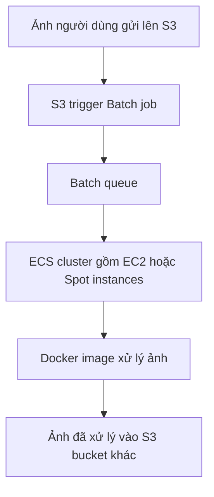

# 📦 AWS Batch: Xử lý hàng trăm nghìn batch job mà không lo hạ tầng

> Nguồn: `115-Batch-Overview.txt` · [Udemy](https://ua.udemy.com/course/aws-certified-cloud-practitioner-new/learn/lecture/20515556)

Bài này mình nói về **AWS Batch** — một dịch vụ được đặt tên đúng theo việc nó làm. Nghe tên là hiểu ngay: đây là dịch vụ xử lý **batch processing** ở mọi quy mô.

---

### 📦 Batch và batch job là gì?

**AWS Batch là một fully managed batch processing service (dịch vụ xử lý theo lô được quản lý hoàn toàn)**, cho phép bạn xử lý theo lô ở **bất kỳ quy mô nào**. Với Batch, bạn có thể chạy **hàng trăm nghìn computing batch job** trên AWS một cách rất dễ dàng.

Vậy **batch job** là gì?

* Là job **có điểm bắt đầu và điểm kết thúc**.
* Ngược lại với **job liên tục (continuous) hay streaming** — loại job **không bao giờ kết thúc**, luôn chạy mãi.
* Ví dụ: một batch job bắt đầu lúc **1 giờ sáng** và kết thúc lúc **3 giờ sáng** — nó diễn ra tại một thời điểm xác định.

---

### ⚙️ Batch hoạt động như thế nào?

* Batch sẽ **tự động khởi chạy EC2 instance hoặc Spot instance** để đáp ứng tải công việc.
* Batch **provision đúng lượng compute và memory** cần thiết cho **Batch queue (hàng đợi batch job)**.
* Bạn chỉ cần **submit (gửi) hoặc schedule (lên lịch) batch job vào queue** — phần còn lại Batch lo hết.
* Bạn **định nghĩa batch job bằng một Docker image**, rồi chạy nó trên **ECS, EKS hoặc Fargate**.
* Nhờ tự động scale đúng số lượng **EC2 instance hoặc Spot instance**, bạn có được **nhiều tối ưu chi phí (cost optimizations)** và **tập trung ít hơn vào hạ tầng**, chỉ tập trung vào batch job.

---

### 🖼️ Ví dụ: xử lý ảnh theo lô

Giả sử ta muốn xử lý ảnh người dùng gửi lên **Amazon S3** theo kiểu batch:

1. Ảnh được đưa vào **Amazon S3** → **trigger một Batch job**.
2. Batch tự tạo một **ECS cluster** gồm **EC2 instance hoặc Spot instance**.
3. Batch đảm bảo đủ số instance cho khối lượng job trong queue.
4. Các instance chạy **Docker image** thực hiện công việc — ví dụ **áp filter lên ảnh**.
5. Kết quả **processed object** được ghi vào **một S3 bucket khác**.

---

### ⚖️ Batch khác Lambda ở đâu?

Nhìn qua thì hai dịch vụ khá giống nhau, nhưng khác biệt rất rõ:

| Tiêu chí | Lambda | Batch |
|---|---|---|
| Thời gian chạy | Giới hạn 15 phút | Không giới hạn, nhờ EC2 instance |
| Ngôn ngữ | Chỉ một số ngôn ngữ nhất định | Bất kỳ runtime nào, miễn đóng gói thành Docker image |
| Lưu trữ tạm | Dung lượng tạm giới hạn | Dựa vào storage của EC2: EBS volume hoặc instance store, nhiều hơn hẳn |
| Mô hình | Serverless | Managed, nhưng dựa trên EC2 instance thật |

Một điểm quan trọng: Batch **không phải serverless** — nó là dịch vụ managed nhưng có **EC2 instance thật được tạo ra**. Tuy nhiên những instance này do **AWS quản lý**, nên bạn **không phải bận tâm về auto-scaling** hay hạ tầng.

---

### 🎯 Chốt lại

Batch là lựa chọn hoàn hảo khi bạn cần xử lý khối lượng job lớn, chạy theo lô, không giới hạn thời gian, với bất kỳ runtime nào đóng gói được thành Docker image. *Cứ nhớ: job có điểm kết thúc + quy mô lớn + cần nhiều dung lượng → nghĩ đến Batch nhé!*

---

### 🧪 Tự kiểm tra nhanh

**Câu 1:** Batch job khác streaming job ở điểm nào?

<b>Xem đáp án</b>

**Đáp án:** Batch job có điểm bắt đầu và kết thúc; streaming job chạy liên tục không bao giờ kết thúc.

Giải thích: Ví dụ batch job chạy từ 1 giờ sáng đến 3 giờ sáng.

Tham chiếu: Mục Batch và batch job là gì.

**Câu 2:** Batch tự động khởi chạy những loại instance nào?

<b>Xem đáp án</b>

**Đáp án:** EC2 instance hoặc Spot instance.

Giải thích: Batch chọn đúng lượng compute và memory cho queue.

Tham chiếu: Mục Batch hoạt động như thế nào.

**Câu 3:** Bạn định nghĩa một batch job bằng gì?

<b>Xem đáp án</b>

**Đáp án:** Bằng một Docker image, chạy trên ECS, EKS hoặc Fargate.

Giải thích: Nhờ đó Batch hỗ trợ mọi runtime bạn muốn.

Tham chiếu: Mục Batch hoạt động như thế nào.

**Câu 4:** Vì sao Batch không phải là serverless?

<b>Xem đáp án</b>

**Đáp án:** Vì nó dựa trên EC2 instance thật được tạo ra, dù do AWS quản lý.

Giải thích: Bạn không phải lo auto-scaling, nhưng server vẫn tồn tại.

Tham chiếu: Mục Batch khác Lambda ở đâu.

**Câu 5:** Lambda giới hạn thời gian chạy bao lâu, còn Batch thì sao?

<b>Xem đáp án</b>

**Đáp án:** Lambda giới hạn 15 phút; Batch không giới hạn thời gian.

Giải thích: Batch chạy trên EC2 instance nên không bị giới hạn như Lambda.

Tham chiếu: Mục Batch khác Lambda ở đâu.

---

Vậy là bạn đã nắm được Batch và biết khi nào nên chọn nó thay vì Lambda. Ở bài tiếp theo, chúng ta sẽ gặp một dịch vụ rất "dễ thương" dành cho người mới: **Amazon Lightsail**. Hẹn gặp các bạn! 🚀
