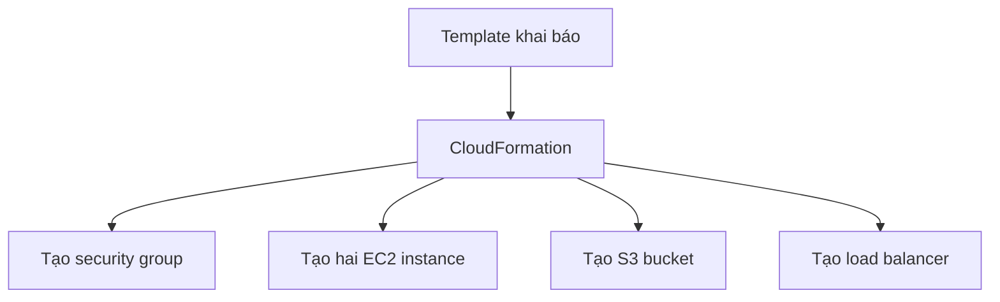

# 🧱 CloudFormation: Quản lý hạ tầng AWS bằng code

> Nguồn: `119-CloudFormation-Overview.txt` · [Udemy](https://ua.udemy.com/course/aws-certified-cloud-practitioner-new/learn/lecture/20056060)

Chào mừng các bạn đến với section mới **Deployments & Managing Infrastructure at Scale** — triển khai và quản lý hạ tầng ở quy mô lớn. Công nghệ đầu tiên mình muốn nói tới cũng chính là nền tảng của mọi thứ trên AWS: **CloudFormation**.

---

### 🎯 CloudFormation là gì?

CloudFormation là cách **declarative (khai báo)** để mô tả hạ tầng AWS của bạn — và hầu hết tài nguyên AWS đều được hỗ trợ.

Ví dụ, trong template bạn chỉ cần "nói":
* Mình muốn một **security group**.
* Mình muốn **hai EC2 instance** dùng security group đó.
* Mình muốn thêm một **S3 bucket**.
* Và một **load balancer** đứng trước tất cả các máy này.

CloudFormation sẽ tự động tạo mọi thứ **theo đúng thứ tự** và với **cấu hình chính xác** như bạn chỉ định.

---

### 💻 Infrastructure as Code: không bao giờ tạo tài nguyên bằng tay

Lợi ích lớn nhất của CloudFormation: **toàn bộ hạ tầng của bạn là code (Infrastructure as Code)**.

* Bạn sẽ **không bao giờ tạo tài nguyên thủ công** như trong các bài hands-on trước đây — cực tốt cho việc kiểm soát.
* Mọi thay đổi lên cloud đều phải đi qua **code review** — một cách vận hành cloud rất chuyên nghiệp.

Về chi phí, CloudFormation cũng có lợi thế:

* Mọi tài nguyên trong **stack** đều được gắn **tag giống nhau**, dễ quản lý.
* Bạn có thể **ước tính chi phí** tài nguyên từ chính CloudFormation template.
* Bạn có thể xây dựng **chiến lược tiết kiệm**: ví dụ tự động xóa toàn bộ template lúc **5 giờ chiều** rồi tạo lại an toàn lúc **8-9 giờ sáng** — ban đêm không còn tài nguyên chạy, nên bạn tiết kiệm chi phí.

---

### ⚙️ Năng suất và tái sử dụng

* **Destroy và recreate hạ tầng tức thì** — tạo và xóa tài nguyên cực dễ, đúng nguyên lý lớn nhất của cloud.
* **Tự sinh diagram** cho template của bạn.
* **Declarative programming**: bạn không cần tự tính xem phải tạo DynamoDB table trước hay EC2 instance trước — template đủ thông minh để tự sắp thứ tự.
* **Không "phát minh lại bánh xe"**: bạn tận dụng được template có sẵn trên mạng và tài liệu, vì CloudFormation hỗ trợ gần như mọi tài nguyên AWS. Tài nguyên nào chưa được hỗ trợ thì bạn dùng **custom resource**.

*Đừng lo nếu bạn chưa từng viết YAML — chúng ta sẽ thực hành ngay ở bài sau.*

---

### 🗺️ Trực quan hóa và góc nhìn thi cử

Bạn có thể xem trực quan template bằng **Infrastructure Composer**. Với một **WordPress stack**, bạn thấy được **ALB Listener**, **database security group**, **SQL database**, các **security group**, **launch configuration**, **application load balancer**... và cả **mối quan hệ giữa các thành phần** — rất tiện khi cần hiểu architecture diagram.

Về thi cử, hãy nhớ: CloudFormation sẽ được nhắc tới khi đề nói về **infrastructure as code**, hoặc khi cần **lặp lại một kiến trúc** ở nhiều môi trường, nhiều **region**, thậm chí nhiều **AWS account** khác nhau.

---

### 🎯 Tự kiểm tra nhanh

**Câu 1:** CloudFormation mô tả hạ tầng AWS theo cách nào?

<b>Xem đáp án</b>

**Đáp án:** Declarative (khai báo).

Giải thích: Bạn chỉ nói mình muốn gì; CloudFormation tự tạo tài nguyên đúng thứ tự, đúng cấu hình.

Tham chiếu: Mục CloudFormation là gì.

**Câu 2:** Điều gì giúp CloudFormation hỗ trợ được cả tài nguyên AWS chưa nằm trong danh sách chính thức?

<b>Xem đáp án</b>

**Đáp án:** Custom resource.

Giải thích: Đây là cơ chế dành cho các tài nguyên chưa được CloudFormation hỗ trợ.

Tham chiếu: Mục Năng suất và tái sử dụng.

**Câu 3:** CloudFormation giúp tiết kiệm chi phí theo những cách nào?

<b>Xem đáp án</b>

**Đáp án:** Gắn tag giống nhau cho tài nguyên trong stack, ước tính chi phí từ template, và tự động xóa/tạo lại tài nguyên theo lịch.

Giải thích: Ví dụ xóa tài nguyên lúc 5 giờ chiều và tạo lại lúc 8-9 giờ sáng.

Tham chiếu: Mục Infrastructure as Code.

**Câu 4:** Vì sao nói CloudFormation mang lại năng suất cao?

<b>Xem đáp án</b>

**Đáp án:** Vì có thể destroy và recreate hạ tầng tức thì, tự sinh diagram, và declarative nên không phải tự suy nghĩ thứ tự tạo tài nguyên.

Giải thích: Template tự hiểu cách sắp xếp mọi thứ cho bạn.

Tham chiếu: Mục Năng suất và tái sử dụng.

**Câu 5:** Theo giảng viên, CloudFormation xuất hiện trong đề thi khi nào?

<b>Xem đáp án</b>

**Đáp án:** Khi đề nói về infrastructure as code, hoặc cần lặp lại kiến trúc ở nhiều môi trường, nhiều region, nhiều AWS account.

Giải thích: Đây là tình huống sử dụng điển hình của CloudFormation.

Tham chiếu: Mục Trực quan hóa và góc nhìn thi cử.

---

Vậy là các bạn đã nắm được bức tranh tổng thể về CloudFormation. Ở bài tiếp theo, chúng ta sẽ **thực hành tạo stack đầu tiên** và tận mắt thấy CloudFormation dựng hạ tầng thay mình.

Hẹn gặp các bạn ở bài hands-on! 🚀
