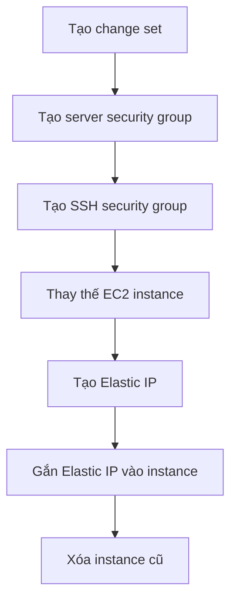

# 🔧 CloudFormation Hands-On: Tạo stack EC2 đầu tiên và cập nhật hạ tầng

> Nguồn: `120-CloudFormation-Hands-On.txt` · [Udemy](https://ua.udemy.com/course/aws-certified-cloud-practitioner-new/learn/lecture/20216528)

Bài này mình sẽ hướng dẫn nhanh để các bạn hiểu CloudFormation hoạt động thế nào qua thực hành: tạo stack, cập nhật stack và dọn dẹp. *Cứ mở AWS console ra và làm theo mình nhé!*

---

### 🌍 Bước 0: Chuyển region sang US East 1

Trước hết, các bạn phải chắc chắn mình đang ở region **US East 1 (N. Virginia)** — vì template mình chuẩn bị chỉ chạy được ở đó. Lý do nằm trong chính template:

* **Availability Zone** được ghi cứng là **us-east-1a**.
* **AMI ID** (ID của ảnh máy ảo) chỉ có phạm vi trong từng region.

Vì hai lý do này, hãy chuyển region về **US East 1** trước khi bắt đầu.

---

### 📄 Bước 1: Tạo stack đầu tiên với template EC2

Vào CloudFormation, tạo stack và chuẩn bị template. Có nhiều lựa chọn: dùng template có sẵn, template mẫu, hoặc dựng từ Application Composer — mình chọn **existing template** và upload file.

Trong course code, dưới thư mục CloudFormation, có file **`0-just-EC2.yaml`** — một file YAML rất đơn giản:

* Một **resource block** tạo instance tên **MyInstance**.
* Type là **EC2 instance**.
* Các properties: **Availability Zone us-east-1a**, **Image ID (AMI)**, **instance type t2.micro**.

Sau khi upload, bạn có thể mở template trong **Application Composer** — công cụ cho bạn **hiểu trực quan** template: xem lại code YAML/JSON và thấy trên canvas một component EC2 instance duy nhất.

Tiếp tục: đặt stack name là **demo CloudFormation**, parameters để trống (template chưa định nghĩa tham số nào), thêm tag **CFDemo** để xem tag hoạt động ra sao, bỏ qua permissions và các options. Nhấn **Submit** — các event chạy rất nhanh và một **EC2 instance đã được tạo**. Code sinh ra tài nguyên — vì vậy nó được gọi là **Infrastructure as Code**.

Kiểm tra trong EC2 console: instance đang **running**, đúng type **t2.micro**, đúng **AMI ID** trong template. Vào tab tags, bạn thấy CloudFormation tự gắn: **tên stack**, **logical ID**, **stack ID**, cùng tag **CFDemo** mình đặt.

---

### 🔄 Bước 2: Cập nhật stack — thêm Security Group và Elastic IP

Giờ mình **update stack** và thay template hiện tại bằng file **`1-ec2-with-sg-eip`** — file đầy đủ hơn:

* Có **parameter section** để đặt security group description.
* EC2 instance có **hai security group**.
* Có **Elastic IP** gắn vào instance.
* Một security group cho **SSH** (mở **port 22**).
* **Server security group** mở **port 80 cho mọi người** và **port 22 từ một IP cụ thể**.

CloudFormation hỏi parameter — mình nhập **demo description**. Vì đây là update, hệ thống tạo **change set** để xem trước thay đổi: thêm Elastic IP, SSH security group, server security group; **MyInstance bị modify với replacement true** — nghĩa là instance cũ sẽ bị **xóa và thay bằng instance mới**. *Lưu ý: nếu instance cũ có data, bạn sẽ mất data đấy!*

Sau khi submit, CloudFormation tự biết làm gì trước:

Instance mới chuyển từ **pending** sang **running**, sau đó **MyEIP** được tạo và gắn vào instance. Kiểm tra trang **Elastic IP** và tab **networking** của instance để xác nhận. Trong Events, bạn thấy Elastic IP created rồi **cleanup in progress** — instance cũ đã bị terminate. Tab **Resources** liệt kê mọi thứ CloudFormation tạo, còn **Application Composer** cho bạn xem kiến trúc mới: EC2 instance nối với Elastic IP và hai security group.

---

### 🧹 Bước 3: Dọn dẹp đúng cách

*Đừng xóa tay từng tài nguyên như Elastic IP hay EC2 instance* — khi dùng CloudFormation, bạn **không nên chạm vào gì thủ công**.

Thay vào đó, hoặc **update template**, hoặc bấm **Delete** — CloudFormation sẽ xóa toàn bộ tài nguyên trong stack **theo đúng thứ tự** để dọn sạch mọi thứ.

CloudFormation thật sự là dịch vụ mạnh mẽ để làm infrastructure as code vì tính **declarative**: bạn chỉ nói mình muốn gì, CloudFormation lo phần còn lại. Học cách dùng và viết template là một kỹ năng rất đáng giá trên AWS.

---

Vậy là bạn đã tạo, cập nhật và dọn dẹp một stack hoàn chỉnh. Ở bài tiếp theo, chúng ta sẽ tìm hiểu cách viết hạ tầng bằng **ngôn ngữ lập trình** với **AWS CDK**.

Hẹn gặp các bạn ở bài sau! 🚀
