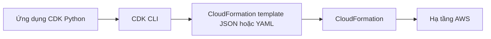

# 🧩 AWS CDK: Viết hạ tầng cloud bằng ngôn ngữ lập trình bạn yêu thích

> Nguồn: `121-CDK-Overview.txt` · [Udemy](https://ua.udemy.com/course/aws-certified-cloud-practitioner-new/learn/lecture/26623490)

Tiếp theo chương trình, mình giới thiệu **CDK — AWS Cloud Development Kit**: cách định nghĩa hạ tầng cloud bằng **ngôn ngữ lập trình quen thuộc** thay vì YAML. *Nếu bạn thích JavaScript, TypeScript, Python, Java hay .NET thì đây chính là món dành cho bạn.*

---

### 🎯 CDK là gì?

CDK là cách để bạn **định nghĩa hạ tầng cloud bằng ngôn ngữ lập trình**. Nếu bạn không muốn dùng **CloudFormation** trực tiếp vì phải viết **YAML**, mà bạn thích **JavaScript, TypeScript, Python, Java hay .NET**, CDK cho phép bạn viết hạ tầng bằng chính những ngôn ngữ đó.

Sau khi viết xong, **CDK sẽ compile (biên dịch) code của bạn thành CloudFormation template** ở định dạng **JSON hoặc YAML** — và template này mới là thứ đem đi deploy.

---

### ⚙️ CDK hoạt động như thế nào?

Ví dụ mình chọn **Python**:

1. Bạn viết một **ứng dụng CDK bằng Python**, định nghĩa **Lambda function**, **bảng DynamoDB** và nhiều dịch vụ AWS khác.
2. **CDK CLI** biến ứng dụng này thành **CloudFormation template**.
3. Template sinh ra được đưa vào **CloudFormation** để deploy hạ tầng.

---

### 💡 Vì sao dùng CDK thay vì CloudFormation?

* **Deploy chung hạ tầng và code runtime**: vì hạ tầng và ứng dụng có thể dùng **cùng một ngôn ngữ** — rất tuyệt cho **Lambda function**, **Docker container** trong **ECS** và **EKS**.
* **Type safety**: code được kiểm tra kiểu dữ liệu.
* **Constructs quen thuộc** hơn với lập trình viên.
* **Nhanh hơn**, **tái sử dụng code**, và có cả **for loop** — những thứ YAML không có.

---

### 🧪 Một ví dụ code CDK

Ví dụ code dưới đây (JavaScript hoặc TypeScript) định nghĩa:

* Một **VPC**.
* Một **ECS cluster**.
* Một **Application Load Balancer** đi kèm **Fargate service**.

Ba thành phần này sẽ được **CDK CLI compile thành CloudFormation template** dùng được, để bạn upload và deploy.

---

### 🎯 Tự kiểm tra nhanh

**Câu 1:** CDK cho phép bạn viết hạ tầng bằng gì?

<b>Xem đáp án</b>

**Đáp án:** Ngôn ngữ lập trình quen thuộc như JavaScript, TypeScript, Python, Java, .NET.

Giải thích: Thay vì viết YAML trực tiếp cho CloudFormation.

Tham chiếu: Mục CDK là gì.

**Câu 2:** Code CDK được biên dịch thành gì?

<b>Xem đáp án</b>

**Đáp án:** CloudFormation template ở định dạng JSON hoặc YAML.

Giải thích: Chính template này mới được đem đi deploy.

Tham chiếu: Mục CDK là gì.

**Câu 3:** Vì sao CDK đặc biệt phù hợp với Lambda, ECS và EKS?

<b>Xem đáp án</b>

**Đáp án:** Vì hạ tầng và code runtime có thể dùng cùng một ngôn ngữ, nên deploy chung với nhau.

Giải thích: Điều này rất tiện cho Lambda function và Docker container trong ECS, EKS.

Tham chiếu: Mục Vì sao dùng CDK.

**Câu 4:** Ví dụ code CDK trong bài định nghĩa những gì?

<b>Xem đáp án</b>

**Đáp án:** Một VPC, một ECS cluster, và một Application Load Balancer với Fargate service.

Giải thích: Sau đó CDK CLI compile thành CloudFormation template để upload và deploy.

Tham chiếu: Mục Một ví dụ code CDK.

**Câu 5:** Lợi ích nào khiến lập trình viên thích CDK hơn YAML?

<b>Xem đáp án</b>

**Đáp án:** Type safety, constructs quen thuộc, làm nhanh hơn, tái sử dụng code và dùng được for loop.

Giải thích: Đây đều là những thứ ngôn ngữ lập trình có mà YAML không có.

Tham chiếu: Mục Vì sao dùng CDK.

---

Vậy là các bạn đã biết CDK giúp viết hạ tầng bằng chính ngôn ngữ mình giỏi. Ở bài tiếp theo, chúng ta sẽ chuyển sang một dịch vụ cực kỳ thân thiện với developer: **Elastic Beanstalk**.

Hẹn gặp các bạn ở bài sau! 🚀
