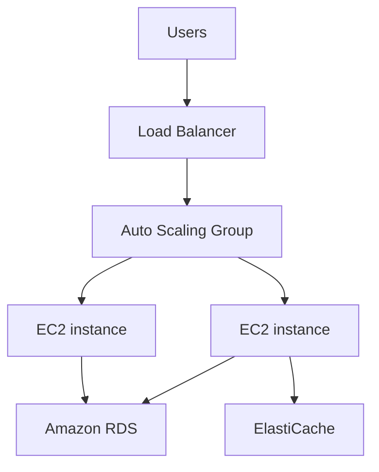

# 🌱 Elastic Beanstalk: Deploy ứng dụng web mà không cần quản hạ tầng

> Nguồn: `122-Beanstalk-Overview.txt` · [Udemy](https://ua.udemy.com/course/aws-certified-cloud-practitioner-new/learn/lecture/20056068)

Sau CloudFormation, mình muốn giới thiệu **Elastic Beanstalk** — dịch vụ sinh ra để developer chỉ tập trung vào **code**, còn hạ tầng để AWS lo. *Đây là một trong những dịch vụ thân thiện nhất với người mới.*

---

### 🏗️ Kiến trúc 3 tầng quen thuộc của ứng dụng web

Khi deploy một ứng dụng web trên AWS, chúng ta thường dùng kiến trúc **3-tier (ba tầng)**:

* Người dùng nói chuyện với **load balancer** — có thể nằm ở nhiều **Availability Zone**.
* Load balancer chuyển traffic tới nhiều **EC2 instance** được quản lý bởi **auto scaling group**.
* Các EC2 instance cần lưu dữ liệu, nên dùng **Amazon RDS** — cơ sở dữ liệu quan hệ để đọc/ghi.
* Nếu cần **in-memory cache**, chúng dùng thêm **ElastiCache** để lưu session data hoặc cached data.

Kiến trúc này có thể dựng thủ công, hoặc dựng bằng CloudFormation — nhưng vẫn còn một cách tốt hơn.

---

### 🌱 Beanstalk ra đời để giải quyết điều gì?

Khi là developer trên AWS, bạn **không muốn quản lý hạ tầng** — bạn chỉ muốn **deploy code**. Bạn không muốn ngồi cấu hình database, load balancer... mà vẫn muốn ứng dụng của mình **scale** được. Và vì hầu hết web application đều có kiến trúc giống hoặc tương tự nhau, **Elastic Beanstalk** chính là câu trả lời.

Elastic Beanstalk là **góc nhìn lấy developer làm trung tâm** khi deploy ứng dụng trên AWS. Phía sau Beanstalk vẫn là những thành phần quen thuộc: **EC2 instance**, **auto scaling group**, **Elastic Load Balancer**, **RDS database**... nhưng tất cả được gom vào **một giao diện duy nhất, dễ hiểu**. Bạn vẫn có quyền kiểm soát cấu hình của mọi thành phần — chỉ là tất cả nằm trong Beanstalk.

Từ góc nhìn cloud, Beanstalk là **PaaS (Platform as a Service — nền tảng như dịch vụ)**: bạn chỉ lo về code. Trước đó chúng ta đã gặp **IaaS (Infrastructure as a Service)**, và sau này sẽ gặp thêm **SaaS (Software as a Service)** ở các dịch vụ khác.

---

### 💰 Managed service: bạn trả tiền cho cái gì?

* **Dùng Beanstalk là miễn phí** — nhưng bạn trả tiền cho các **instance bên dưới**.
* Elastic Beanstalk là **managed service**: toàn bộ cấu hình EC2 instance và **hệ điều hành** do Beanstalk xử lý.
* **Deployment strategy** có thể tùy chỉnh, nhưng việc deploy do Elastic Beanstalk thực hiện.
* **Capacity provisioning** qua auto scaling group và **load balancing** đều do Beanstalk làm.
* **Health monitoring** và khả năng phản hồi của ứng dụng cũng nằm trong dashboard của Beanstalk.

Vậy trách nhiệm của bạn là gì? Chỉ còn **application code** — và đó là điều khiến Beanstalk trở thành dịch vụ cực kỳ thân thiện với developer.

---

### 🧭 Ba mô hình kiến trúc của Beanstalk

| Mô hình | Thành phần | Phù hợp cho |
|---|---|---|
| Single instance | Một EC2 instance | Môi trường development |
| Load balancer và ASG | Elastic Load Balancer và auto scaling group | Production hoặc pre-production web app |
| Chỉ ASG | Auto scaling group độc lập | Ứng dụng non-web, ví dụ worker |

Beanstalk hỗ trợ rất nhiều platform: **Go, Java, .NET, Node.js, PHP, Python, Ruby, Packer, Docker, Multi Docker, Preconfigured Docker**... *Bạn không cần nhớ danh sách này cho kỳ thi* — chỉ cần biết Beanstalk hỗ trợ đa dạng ngôn ngữ và cả Docker.

---

### 📊 Health monitoring — câu hỏi hay gặp trong đề thi

Một câu hỏi có thể xuất hiện trong đề thi là về **health monitoring**. Beanstalk có sẵn một **bộ monitoring đầy đủ** ngay trong dịch vụ:

* Mỗi EC2 instance trong Beanstalk có một **health agent** đẩy metrics lên **CloudWatch**.
* Trong Beanstalk, bạn xem được các metrics này và theo dõi ứng dụng.
* Beanstalk cũng kiểm tra **application health** và công bố các **health event**.

---

### 🎯 Tự kiểm tra nhanh

**Câu 1:** Kiến trúc web application điển hình gồm những gì?

<b>Xem đáp án</b>

**Đáp án:** Load balancer ở nhiều Availability Zone, EC2 instance do auto scaling group quản lý, Amazon RDS và có thể thêm ElastiCache.

Giải thích: Đây là kiến trúc 3 tầng quen thuộc mà Beanstalk có thể dựng thay bạn.

Tham chiếu: Mục Kiến trúc 3 tầng quen thuộc.

**Câu 2:** Elastic Beanstalk thuộc nhóm dịch vụ nào?

<b>Xem đáp án</b>

**Đáp án:** PaaS — Platform as a Service.

Giải thích: Bạn chỉ lo code, nền tảng bên dưới do Beanstalk quản lý.

Tham chiếu: Mục Beanstalk ra đời để giải quyết điều gì.

**Câu 3:** Dùng Elastic Beanstalk có mất phí không?

<b>Xem đáp án</b>

**Đáp án:** Dùng Beanstalk miễn phí, nhưng bạn trả tiền cho các instance bên dưới.

Giải thích: Beanstalk là managed service, tiền nằm ở tài nguyên nó tạo ra.

Tham chiếu: Mục Managed service.

**Câu 4:** Trách nhiệm của developer khi dùng Beanstalk là gì?

<b>Xem đáp án</b>

**Đáp án:** Chỉ cần lo application code.

Giải thích: Cấu hình EC2, OS, capacity provisioning, load balancing, health monitoring đều do Beanstalk xử lý.

Tham chiếu: Mục Managed service.

**Câu 5:** Health agent trong Beanstalk đẩy metrics đi đâu?

<b>Xem đáp án</b>

**Đáp án:** Lên CloudWatch.

Giải thích: Sau đó bạn xem metrics ngay trong Beanstalk; Beanstalk còn kiểm tra application health và publish health events.

Tham chiếu: Mục Health monitoring.

---

Vậy là các bạn đã hiểu vì sao Beanstalk được xem là "người bạn thân" của developer. Ở bài tiếp theo, chúng ta sẽ **thực hành tạo môi trường Beanstalk đầu tiên** trên console.

Hẹn gặp các bạn ở bài hands-on! 🚀
