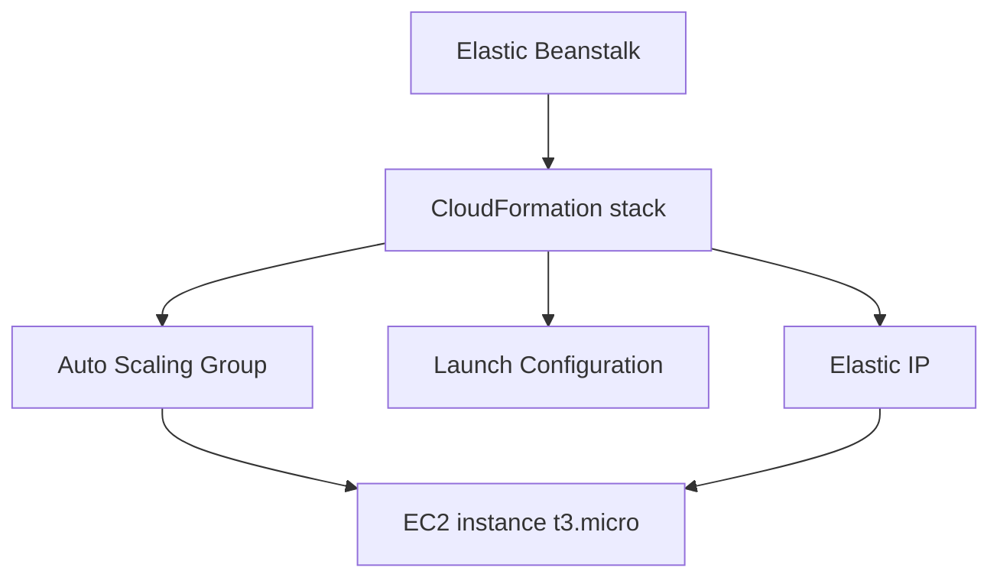

# 🌱 Beanstalk Hands-On: Tạo môi trường web server đầu tiên

> Nguồn: `123-Beanstalk-Hands-On.txt` · [Udemy](https://ua.udemy.com/course/aws-certified-cloud-practitioner-new/learn/lecture/20216530)

Giờ chúng ta cùng thực hành **Elastic Beanstalk**: tạo application đầu tiên và xem Beanstalk dựng hạ tầng đằng sau như thế nào. *Cứ mở Elastic Beanstalk console và làm theo mình từng bước nhé!*

---

### 🚀 Tạo application và environment

Vào Elastic Beanstalk console và tạo application đầu tiên. Bạn có hai lựa chọn:

* **Web server environment** — chạy website.
* **Worker environment** — xử lý các task lấy từ queue.

Mình chọn **web server environment**. Đặt application name là **My Application**, rồi điền environment information: mình gọi environment này là **My Application Dev** vì nó đại diện cho môi trường development. Một **domain name** sẽ được sinh tự động cho ứng dụng — đây là cách bạn truy cập web server.

Tiếp theo chọn **platform** (Beanstalk quản lý platform này): mình chọn **Node.js** và để các giá trị mặc định. *Bạn có thể thấy giao diện khác mình một chút, nhưng chỉ cần dùng defaults mới nhất là ổn.*

Về **application code**, mình dùng **sample application** (bạn hoàn toàn có thể upload code của riêng mình). Cuối cùng là **presets** — Beanstalk có thể khá phức tạp trong khâu cấu hình, nên nó cho sẵn các mức gợi ý: **single instance** (đủ điều kiện free tier), **high availability** (có load balancer), hoặc **custom configuration**. Mình chọn **single instance** cho đơn giản.

---

### 🔐 Cấu hình service access

Ở bước này bạn cần cấp quyền cho Beanstalk hoạt động:

1. **Service role**: mình tạo một role cho Beanstalk environment, các permission policy đã được điền sẵn, tên là **AWS Elastic Beanstalk service role** — chỉ cần bấm tạo.
2. **EC2 instance profile**: làm tương tự, tạo role cho **Beanstalk Compute**, các policy cũng có sẵn.
3. Sau đó **refresh** và chọn các role vừa tạo. Còn một trường tùy chọn, mình để trống.

Các bước cấu hình networking (bước 3, 4, 5) mình bỏ qua và đi thẳng tới **review**, vì mình chỉ dùng các giá trị mặc định của chế độ single instance. Hãy chắc chắn rằng **service role** và **EC2 instance profile** đều đã được chọn, rồi bấm **Submit** — Beanstalk sẽ tạo environment đầu tiên cho bạn.

---

### ☕ CloudFormation — "bếp sau" của Beanstalk

Trong tab **Events** của Beanstalk, bạn sẽ thấy một loạt sự kiện đang diễn ra. Điều thú vị: những event này đến từ **CloudFormation**.

Vào CloudFormation console, bạn thấy **Elastic Beanstalk stack** của mình. Các event chạy từ **Create in progress** tới **Create Complete**. Tab **Resources** cho thấy Beanstalk đã tạo **auto scaling group**, **launch configuration**, **Elastic IP**... và nếu mở template trong **Application Composer**, bạn thấy trực quan **launch configuration**, **security group**, **Elastic IP**, **wait condition** và **condition handle**.

---

### 🔍 Kiểm tra kết quả và các tùy chọn

Quay lại Beanstalk: Beanstalk tạo security group, Elastic IP, rồi chờ EC2 instance launch. Sang EC2 console, bạn thấy **một instance đang chạy, type t3.micro**, có **public IP**. Trang **Elastic IPs** cho thấy địa chỉ đã được cấp cho instance, còn trong **auto scaling groups**, ASG đang quản lý instance duy nhất — đó là lý do mô hình này gọi là **single EC2 instance**.

Khi mọi thứ hoàn tất, Beanstalk báo **successfully launched** và **health OK**, kèm một **domain name**. Mở domain đó ra, bạn sẽ thấy dòng chữ: *"Congratulations, you are now running Elastic Beanstalk on this EC2 instance"* — tuyệt vời phải không?

Trong environment của bạn còn rất nhiều tùy chọn:

* **Upload new version** — deploy phiên bản mới tự động lên EC2 instance.
* **Health** — thông tin health check của các instance.
* **Logs**, **Monitoring** — xem log và metrics của ứng dụng.
* **Alarms**, **Managed updates** — quản lý cảnh báo và cập nhật môi trường.
* **Configuration** — xem và chỉnh cấu hình environment.

Quan trọng hơn: dưới **My Application**, bạn có thể tạo thêm environment thứ hai, ví dụ **My Application Prod**, để tách môi trường dev và production.

---

### 🧹 Ghi nhớ và dọn dẹp

Hãy nhớ sự khác biệt: **Beanstalk xoay quanh code và environment cho code**, còn **CloudFormation deploy các stack tùy ý với bất kỳ loại hạ tầng nào**.

* Nếu bạn đang học tiếp khóa **Certified Developer**, **đừng xóa application** — sẽ còn dùng lại.
* Nếu đã xong phần Beanstalk và thấy đủ cho kỳ thi, hãy vào application → **Actions** → **Delete application** để dọn dẹp.

---

Vậy là bạn đã tạo thành công một môi trường Beanstalk hoàn chỉnh và hiểu những gì diễn ra bên dưới. Ở bài tiếp theo, chúng ta sẽ tìm hiểu **CodeDeploy** — dịch vụ tự động nâng cấp ứng dụng từ phiên bản này sang phiên bản khác.

Hẹn gặp các bạn ở bài sau! 🚀
