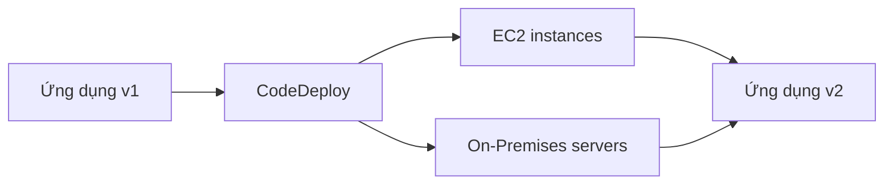

# 🚢 CodeDeploy: Tự động nâng cấp ứng dụng từ v1 lên v2

> Nguồn: `124-CodeDeploy-Overview.txt` · [Udemy](https://ua.udemy.com/course/aws-certified-cloud-practitioner-new/learn/lecture/20056074)

Sau CloudFormation và Beanstalk, mình giới thiệu **CodeDeploy** — một cách khác để deploy ứng dụng tự động, nhưng "dễ tính" hơn hai dịch vụ trước. *Đây là dịch vụ nâng cao nên mình chỉ giới thiệu lý thuyết, nhưng kiến thức này rất hay gặp trong đề thi.*

---

### 🎯 CodeDeploy là gì?

CodeDeploy là cách để **deploy ứng dụng của bạn một cách tự động**. Điểm khác biệt: CodeDeploy **khá permissive (dễ tính)** — nó **không cần dùng Beanstalk hay CloudFormation**, mà hoàn toàn **độc lập**.

Ví dụ: ứng dụng của bạn đang ở **phiên bản 1 (v1)** và bạn muốn nâng cấp lên **phiên bản 2 (v2)**. CodeDeploy sẽ tìm cách thực hiện việc đó cho bạn.

---

### 🌐 Hybrid service: EC2 và On-Premises

CodeDeploy hoạt động với **hai loại môi trường**:

* **EC2 instances** — nâng cấp nhiều instance từ v1 lên v2 cùng lúc.
* **On-Premises servers (máy chủ đặt tại chỗ)** — nếu bạn có server chạy nội bộ, CodeDeploy cũng giúp chúng nâng cấp ứng dụng từ v1 lên v2.

Vì hỗ trợ cả hai, CodeDeploy được gọi là **hybrid service (dịch vụ lai)**.

Một điều kiện quan trọng: bạn phải **tự provision (chuẩn bị) server trước**, và **cài CodeDeploy agent** trên đó — agent này chính là thành phần hỗ trợ quá trình nâng cấp.

---

### 💡 Điều cần nhớ cho kỳ thi

* CodeDeploy cho phép nâng cấp ứng dụng trên **cả EC2 instance lẫn On-Premises server** từ v1 lên v2 **tự động, từ một giao diện duy nhất**.
* Nó giúp doanh nghiệp **chuyển từ On-Premises lên AWS** bằng cách dùng **cùng một cách deploy** cho cả server cũ và instance mới.
* Đây là dịch vụ nâng cao nên mình không demo trực tiếp — nhưng hãy nhớ: **độc lập với Beanstalk/CloudFormation**, cần **CodeDeploy agent** trên server.

---

### 🎯 Tự kiểm tra nhanh

**Câu 1:** CodeDeploy dùng để làm gì?

<b>Xem đáp án</b>

**Đáp án:** Tự động deploy và nâng cấp ứng dụng từ phiên bản này sang phiên bản khác, ví dụ v1 lên v2.

Giải thích: CodeDeploy không cần Beanstalk hay CloudFormation, hoàn toàn độc lập.

Tham chiếu: Mục CodeDeploy là gì.

**Câu 2:** CodeDeploy hỗ trợ những loại server nào?

<b>Xem đáp án</b>

**Đáp án:** EC2 instance và On-Premises server.

Giải thích: Vì hỗ trợ cả hai nên nó được gọi là hybrid service.

Tham chiếu: Mục Hybrid service.

**Câu 3:** Vì sao CodeDeploy được gọi là hybrid service?

<b>Xem đáp án</b>

**Đáp án:** Vì nó hoạt động cả trên On-Premises lẫn EC2 instance.

Giải thích: Cùng một dịch vụ phục vụ hai môi trường khác nhau.

Tham chiếu: Mục Hybrid service.

**Câu 4:** Bạn phải chuẩn bị gì trên server trước khi dùng CodeDeploy?

<b>Xem đáp án</b>

**Đáp án:** Provision server trước và cài CodeDeploy agent.

Giải thích: Agent này hỗ trợ thực hiện các bản nâng cấp.

Tham chiếu: Mục Hybrid service.

**Câu 5:** Lợi ích lớn nhất của CodeDeploy khi doanh nghiệp chuyển lên AWS là gì?

<b>Xem đáp án</b>

**Đáp án:** Dùng cùng một cách deploy cho cả On-Premises lẫn EC2, từ một giao diện duy nhất.

Giải thích: Giúp việc chuyển đổi từ on-premises lên AWS diễn ra thuận lợi.

Tham chiếu: Mục Điều cần nhớ cho kỳ thi.

---

Vậy là bạn đã nắm được vai trò của CodeDeploy trong bộ công cụ deployment của AWS. Ở bài tiếp theo, chúng ta sẽ bắt đầu với nhóm **code-related tools**, mở đầu là **CodeCommit**.

Hẹn gặp các bạn ở bài sau! 🚀
