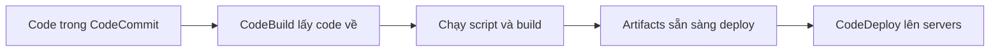

# 🔨 CodeBuild: Build code trên cloud mà không cần quản lý server

> Nguồn: `126-CodeBuild-Overview.txt` · [Udemy](https://ua.udemy.com/course/aws-certified-cloud-practitioner-new/learn/lecture/24682562)

Sau khi đã làm quen với CodeCommit và CodeDeploy, hôm nay chúng ta đến với **AWS CodeBuild** — dịch vụ giúp các bạn build code ngay trên cloud. Tên dịch vụ đã nói rõ mục đích: *build your code in the cloud*.

Nếu từng phải tự dựng server chỉ để compile code hay chạy test, các bạn sẽ thấy CodeBuild là một cú nâng cấp rất đáng giá. Cùng mình đi qua nhé!

---

### 🎯 CodeBuild làm gì?

Khi dùng CodeBuild, source code của các bạn sẽ được xử lý tự động:

* **Compile** (biên dịch) mã nguồn.
* **Run tests** (chạy kiểm thử).
* **Đóng gói thành packages** — sẵn sàng để deploy, ví dụ bởi **CodeDeploy**, lên servers để ứng dụng chạy được.

Nói cách khác, đầu ra của CodeBuild là các **artifact sẵn sàng để deploy**, chứ không còn là code thô nữa.

---

### 🗺️ Luồng hoạt động

Giả sử code của các bạn đang nằm trong **CodeCommit**. CodeBuild sẽ lấy code về, chạy script mà các bạn định nghĩa, rồi build ra artifact:

Điểm hay là các bạn chỉ cần **định nghĩa script build**, còn lại AWS lo hết.

---

### 💰 Vì sao nên dùng CodeBuild?

Các lợi ích chính:

* **Fully managed** (được quản lý hoàn toàn) và **serverless** — *không có server nào để các bạn phải quản lý cả*.
* **Continuously scalable** (mở rộng liên tục) và **highly available** (sẵn sàng cao).
* **Secure** (bảo mật).
* **Pay-as-you-go** (trả theo mức dùng): các bạn chỉ trả tiền cho **thời gian code được build**.

Nhờ đó, các bạn chỉ cần tập trung vào việc code, và AWS sẽ tự build mỗi khi bạn push code update lên repository CodeCommit.

---

### 🎯 Tự kiểm tra nhanh

**Câu 1:** CodeBuild xử lý source code của bạn như thế nào?

<b>Xem đáp án</b>

**Đáp án:** Compile code, chạy test và tạo ra packages sẵn sàng để deploy.

Giải thích: Đầu ra là các artifact sẵn sàng được deploy, ví dụ bởi CodeDeploy.

Tham chiếu: Mục CodeBuild làm gì.

**Câu 2:** Trong ví dụ của bài, CodeBuild lấy source code từ đâu?

<b>Xem đáp án</b>

**Đáp án:** Từ CodeCommit.

Giải thích: CodeBuild retrieve code từ CodeCommit, chạy script build rồi tạo artifact.

Tham chiếu: Mục Luồng hoạt động.

**Câu 3:** Mô hình tính phí của CodeBuild là gì?

<b>Xem đáp án</b>

**Đáp án:** Pay-as-you-go — chỉ trả cho thời gian code được build.

Giải thích: Không phải trả cho server, vì CodeBuild là serverless.

Tham chiếu: Mục Vì sao nên dùng CodeBuild.

**Câu 4:** Vì sao nói CodeBuild không cần quản lý server?

<b>Xem đáp án</b>

**Đáp án:** Vì CodeBuild là fully managed và serverless.

Giải thích: AWS lo phần hạ tầng, bạn chỉ lo code.

Tham chiếu: Mục Vì sao nên dùng CodeBuild.

**Câu 5:** Bạn cần chuẩn bị gì để CodeBuild build đúng cách?

<b>Xem đáp án</b>

**Đáp án:** Định nghĩa script build để CodeBuild chạy.

Giải thích: CodeBuild lấy code, chạy script bạn định nghĩa, rồi trả về artifact.

Tham chiếu: Mục Luồng hoạt động.

---

Vậy là xong CodeBuild! *Chỉ cần nhớ: build trên cloud, không server, trả tiền theo thời gian build.*

Ở bài tiếp theo, chúng ta sẽ gặp "nhạc trưởng" **CodePipeline** — dịch vụ kết nối CodeCommit, CodeBuild và CodeDeploy thành một pipeline hoàn chỉnh. Hẹn gặp các bạn! 🚀
