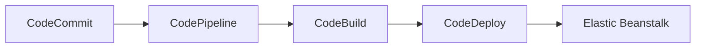

# 🔗 CodePipeline: Nhạc trưởng điều phối pipeline CI/CD trên AWS

> Nguồn: `127-CodePipeline-Overview.txt` · [Udemy](https://ua.udemy.com/course/aws-certified-cloud-practitioner-new/learn/lecture/24682564)

Chúng ta đã có CodeCommit để lưu code, CodeBuild để build code và CodeDeploy để deploy. Vậy làm sao kết nối tất cả lại với nhau? Câu trả lời chính là **AWS CodePipeline** — lớp điều phối giúp code được tự động đẩy lên production.

Bài này khá ngắn nhưng cực kỳ quan trọng vì **CodePipeline xuất hiện rất nhiều trong đề thi**. Cùng mình tìm hiểu nhé!

---

### 🎼 CodePipeline là gì?

CodePipeline là cách để các bạn **orchestrate** (điều phối) các bước khác nhau, nhờ đó **code được tự động pushed to production**.

Một pipeline có thể:

1. Lấy code về.
2. Build code.
3. Test code.
4. Provision (cung cấp) servers.
5. Deploy ứng dụng lên các servers đó.

Tất nhiên thực tế có thể phức tạp hơn, và để điều phối toàn bộ các bước này, bạn cần một **pipeline tool** — chính là CodePipeline.

---

### 🔁 CI/CD — khái niệm bạn cần nắm

Các bạn có thể đã nghe đến **CI/CD**, viết tắt của **Continuous Integration and Continuous Delivery** (tích hợp liên tục và chuyển giao liên tục).

Ý tưởng rất đơn giản: **mỗi khi developer push code vào repository, code sẽ được build, test và deploy lên servers** — tất cả diễn ra tự động.

---

### 🗺️ Một pipeline mẫu

CodePipeline đóng vai trò lớp orchestration: lấy code từ CodeCommit, build bằng CodeBuild, rồi quyết định deploy bằng CodeDeploy — ví dụ vào một môi trường **Elastic Beanstalk**:

*Lưu ý: đây chỉ là một cách dựng pipeline, còn rất nhiều cách khác nhau.*

---

### ✅ Lợi ích và mẹo thi

Lợi ích của CodePipeline:

* **Fully managed** (được quản lý hoàn toàn).
* **Tương thích với rất nhiều dịch vụ**: CodeCommit, CodeBuild, CodeDeploy, Elastic Beanstalk, CloudFormation, GitHub, cùng các dịch vụ bên thứ ba và custom plugins.
* Mang lại **fast delivery** (giao hàng nhanh) và **rapid updates** (cập nhật nhanh).

Vì vậy CodePipeline là **hạt nhân của các dịch vụ CI/CD trong AWS**. Mẹo thi cực quan trọng: *khi đề bài nhắc đến "orchestration of pipeline", hãy nghĩ ngay đến **AWS CodePipeline***.

---

### 🎯 Tự kiểm tra nhanh

**Câu 1:** CodePipeline giải quyết việc gì?

<b>Xem đáp án</b>

**Đáp án:** Điều phối (orchestrate) các bước để code được tự động đẩy lên production.

Giải thích: Pipeline lấy code, build, test, provision servers rồi deploy ứng dụng.

Tham chiếu: Mục CodePipeline là gì.

**Câu 2:** CI/CD là viết tắt của gì?

<b>Xem đáp án</b>

**Đáp án:** Continuous Integration and Continuous Delivery.

Giải thích: Mỗi lần developer push code, code được build, test và deploy tự động.

Tham chiếu: Mục CI/CD — khái niệm bạn cần nắm.

**Câu 3:** Trong pipeline mẫu, CodePipeline lấy code từ đâu?

<b>Xem đáp án</b>

**Đáp án:** Từ CodeCommit.

Giải thích: Sau đó build bằng CodeBuild rồi deploy bằng CodeDeploy — ví dụ vào Elastic Beanstalk.

Tham chiếu: Mục Một pipeline mẫu.

**Câu 4:** CodePipeline có tương thích với GitHub không?

<b>Xem đáp án</b>

**Đáp án:** Có — cùng với CodeCommit, CodeBuild, CodeDeploy, Elastic Beanstalk, CloudFormation, dịch vụ bên thứ ba và custom plugins.

Giải thích: Đây là một trong những lợi ích chính của dịch vụ.

Tham chiếu: Mục Lợi ích và mẹo thi.

**Câu 5:** Khi đề thi nói đến "orchestration of pipeline", bạn nghĩ đến dịch vụ nào?

<b>Xem đáp án</b>

**Đáp án:** AWS CodePipeline.

Giải thích: CodePipeline là hạt nhân của các dịch vụ CI/CD trong AWS.

Tham chiếu: Mục Lợi ích và mẹo thi.

---

Vậy là các bạn đã hiểu vai trò "nhạc trưởng" của CodePipeline trong bộ dịch vụ CI/CD. *Nhớ nhé: cứ thấy orchestration là nghĩ đến CodePipeline.*

Ở bài tiếp theo, chúng ta sẽ tìm hiểu **CodeArtifact** — kho lưu trữ software packages và dependencies cho team của bạn. Hẹn gặp các bạn! 🚀
