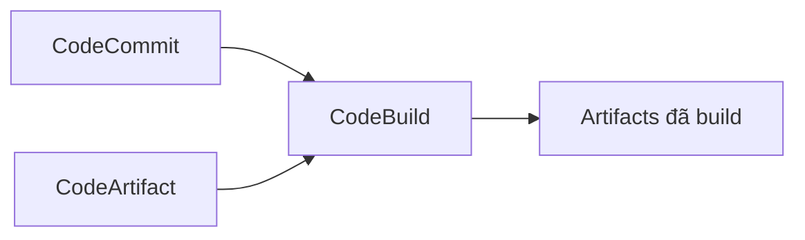

# 📦 CodeArtifact: Kho quản lý dependency an toàn cho team phát triển

> Nguồn: `128-CodeArtifact-Overview.txt` · [Udemy](https://ua.udemy.com/course/aws-certified-cloud-practitioner-new/learn/lecture/24682568)

Hôm nay chúng ta tìm hiểu **AWS CodeArtifact** — dịch vụ còn ít được biết đến nhưng rất hữu ích khi làm việc nhóm. Nghe tên có vẻ lạ, nhưng vấn đề nó giải quyết thì rất quen thuộc: **quản lý code dependencies**.

*Đừng lo nếu bạn chưa từng nghe đến "artifact" bao giờ* — mình sẽ giải thích từ đầu.

---

### 🧩 Vấn đề: code dependencies và artifact management

Các software packages mà developer tạo ra thường **phụ thuộc lẫn nhau** để có thể build được — tạo thành một kiến trúc các package. Những phụ thuộc này còn được gọi là **code dependencies** (phụ thuộc mã nguồn).

Để **lưu trữ và truy xuất** các dependencies này, người ta cần **artifact management** (quản lý artifact). Cách truyền thống là bạn phải tự dựng hệ thống riêng:

* Trên **Amazon S3**, hoặc
* Dùng phần mềm tùy chỉnh trên **EC2 instances**.

Cách này khá phức tạp — và đó là lý do CodeArtifact ra đời.

---

### ☁️ CodeArtifact là gì?

**AWS CodeArtifact** là dịch vụ **artifact management an toàn, scalable (mở rộng được) và cost-effective (hiệu quả chi phí)** dành cho phát triển phần mềm.

Thay vì tự dựng hạ tầng, các bạn chỉ cần dùng CodeArtifact. Tất cả các **dependency management tool phổ biến** mà developer hay dùng đều có thể "nói chuyện" với CodeArtifact để lưu và lấy dependencies:

* **Maven**
* **Gradle**
* **npm**
* **yarn**
* **twine**
* **pip**
* **NuGet**

---

### 🗺️ CodeArtifact nằm ở đâu trong luồng CI/CD?

Developer push code lên **CodeCommit**, **CodeBuild** build code — và CodeBuild có thể **lấy dependencies trực tiếp từ CodeArtifact**:

Nhờ đó, team của bạn luôn có một nơi **mặc định và an toàn** để lưu trữ, truy xuất dependencies.

---

### 🎯 Mẹo thi

Khi đề thi nói rằng **team cần một artifact management system**, hoặc cần **nơi lưu trữ code dependencies**, các bạn hãy nghĩ ngay đến **CodeArtifact**.

---

### 🎯 Tự kiểm tra nhanh

**Câu 1:** Artifact management là gì?

<b>Xem đáp án</b>

**Đáp án:** Là việc lưu trữ và truy xuất code dependencies.

Giải thích: Các package phần mềm phụ thuộc lẫn nhau, cần nơi quản lý các phụ thuộc đó.

Tham chiếu: Mục Vấn đề: code dependencies và artifact management.

**Câu 2:** Trước khi có CodeArtifact, đội phát triển có thể tự dựng hệ thống artifact ở đâu?

<b>Xem đáp án</b>

**Đáp án:** Trên Amazon S3 hoặc dùng phần mềm tùy chỉnh trên EC2 instances.

Giải thích: Cách truyền thống này khá phức tạp, nên AWS tạo ra CodeArtifact.

Tham chiếu: Mục Vấn đề: code dependencies và artifact management.

**Câu 3:** Kể tên các dependency management tool được CodeArtifact hỗ trợ.

<b>Xem đáp án</b>

**Đáp án:** Maven, Gradle, npm, yarn, twine, pip và NuGet.

Giải thích: Chúng đều có thể trao đổi với CodeArtifact để lưu và lấy dependencies.

Tham chiếu: Mục CodeArtifact là gì.

**Câu 4:** Trong luồng CI/CD, CodeBuild lấy dependencies từ đâu?

<b>Xem đáp án</b>

**Đáp án:** Trực tiếp từ CodeArtifact.

Giải thích: Sau khi code được push lên CodeCommit, CodeBuild build và retrieve dependencies từ CodeArtifact.

Tham chiếu: Mục CodeArtifact nằm ở đâu trong luồng CI/CD.

**Câu 5:** Đề thi mô tả team cần nơi lưu code dependencies — đáp án là dịch vụ nào?

<b>Xem đáp án</b>

**Đáp án:** AWS CodeArtifact.

Giải thích: Đây là từ khóa nhận diện CodeArtifact trong đề thi.

Tham chiếu: Mục Mẹo thi.

---

Vậy là xong CodeArtifact — một dịch vụ nhỏ nhưng giải quyết đúng "nỗi đau" của các team phát triển phần mềm.

Ở bài tiếp theo, chúng ta sẽ chuyển sang **AWS Systems Manager (SSM)** — dịch vụ quản lý "đội quân" EC2 và on-premises servers ở quy mô lớn. Hẹn gặp các bạn! 🚀
