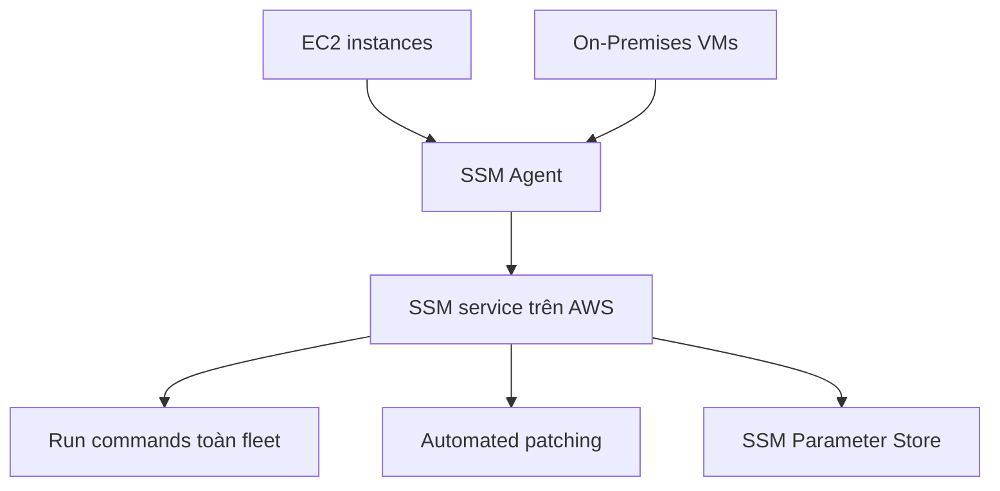

# 🛠️ Systems Manager (SSM): Quản lý cả EC2 lẫn on-premises ở quy mô lớn

> Nguồn: `129-Systems-Manager-SSM-Overview.txt` · [Udemy](https://ua.udemy.com/course/aws-certified-cloud-practitioner-new/learn/lecture/20056088)

Tiếp theo chương trình, chúng ta làm quen với **AWS Systems Manager** (viết tắt là **SSM**) — dịch vụ giúp quản lý "đội quân" servers của bạn, cả trên AWS lẫn tại chỗ (on-premises).

Đây là một dịch vụ nâng cao, mình sẽ không thực hành (hands-on), nhưng **kiến thức trong bài rất hay được hỏi trong đề thi**. Cùng nắm những điểm cốt lõi nhé!

---

### 🌉 Một dịch vụ hybrid đúng nghĩa

SSM giúp bạn quản lý **fleet of EC2 instances** (đội máy chủ EC2) và **On-Premises systems** ở quy mô lớn. Vì quản lý được cả môi trường on-premises lẫn AWS, SSM được gọi là một **Hybrid AWS service** (dịch vụ AWS lai).

---

### 🧰 SSM làm được những gì?

SSM cho bạn **operational insights** (thông tin vận hành) về trạng thái hạ tầng, cùng quyền truy cập vào **bộ hơn 10 sản phẩm**. *Bạn không cần nhớ hết mọi sản phẩm để đi thi* — chỉ cần nắm những điểm quan trọng nhất:

* **Automated patching** (vá lỗi tự động) cho toàn bộ servers và instances, giúp tăng cường **compliance** (tuân thủ).
* **Run a command** (chạy lệnh) trên toàn bộ fleet ngay từ SSM.
* **Store configuration** (lưu trữ cấu hình) với **SSM Parameter Store**.

Ngoài ra, SSM hoạt động với **Linux, Windows, macOS và Raspberry Pi**.

---

### ⚙️ SSM hoạt động như thế nào?

Điểm mấu chốt: bạn phải **cài SSM agent** lên các hệ thống cần quản lý. Đây là một chương trình nhỏ chạy nền, và **mặc định đã được cài sẵn** nếu bạn dùng **Amazon Linux AMI** hoặc **Ubuntu AMI** trên AWS.

SSM agent trên EC2 instances lẫn on-premises VMs sẽ **báo cáo về SSM service** trong AWS — chính điều này khiến SSM trở thành dịch vụ hybrid. Khi agent đã được cài, bạn có thể:

1. Chạy commands trên tất cả servers.
2. Patch tất cả cùng lúc.
3. Cấu hình chúng một cách nhất quán.

*Nếu một instance không thể được SSM điều khiển, nguyên nhân gần như luôn nằm ở agent.*

---

### 🎯 Mẹo thi

* Thấy đề hỏi cách **patch fleet of EC2 instances hoặc on-premises servers** → nghĩ đến **SSM**.
* Thấy đề hỏi cách **run a command nhất quán trên mọi servers** → cũng là **SSM**.

---

### 🎯 Tự kiểm tra nhanh

**Câu 1:** SSM là dịch vụ thuộc loại nào?

<b>Xem đáp án</b>

**Đáp án:** Hybrid AWS service — quản lý cả tài nguyên trên AWS lẫn on-premises.

Giải thích: SSM agent báo cáo về SSM service từ cả EC2 instances và on-premises VMs.

Tham chiếu: Mục Một dịch vụ hybrid đúng nghĩa.

**Câu 2:** Ba tác vụ quan trọng nhất của SSM là gì?

<b>Xem đáp án</b>

**Đáp án:** Automated patching, run command trên toàn fleet, và lưu cấu hình với SSM Parameter Store.

Giải thích: Đây là những sản phẩm/tính năng quan trọng nhất cho kỳ thi.

Tham chiếu: Mục SSM làm được những gì.

**Câu 3:** Để SSM quản lý được một instance, bạn cần gì?

<b>Xem đáp án</b>

**Đáp án:** Cài SSM agent lên hệ thống đó.

Giải thích: Agent là chương trình nhỏ chạy nền; mặc định có sẵn trên Amazon Linux AMI và Ubuntu AMI.

Tham chiếu: Mục SSM hoạt động như thế nào.

**Câu 4:** SSM hỗ trợ những hệ điều hành nào?

<b>Xem đáp án</b>

**Đáp án:** Linux, Windows, macOS và Raspberry Pi.

Giải thích: Đây là một trong những điểm mạnh của SSM.

Tham chiếu: Mục SSM làm được những gì.

**Câu 5:** Nếu một instance không được SSM điều khiển, nguyên nhân thường là gì?

<b>Xem đáp án</b>

**Đáp án:** Vấn đề với SSM agent trên instance đó.

Giải thích: Khi agent đã cài đúng, SSM có thể run commands, patch và configure instance.

Tham chiếu: Mục SSM hoạt động như thế nào.

---

Vậy là các bạn đã nắm được "linh hồn" của SSM: **hybrid, agent, và 3 tác vụ chính**. *Chỉ cần nhớ thế là đủ tự tin cho đề thi.*

Ở bài tiếp theo, chúng ta sẽ thực hành luôn với **SSM Session Manager** — cách mở secure shell mà không cần SSH. Hẹn gặp các bạn! 🚀
