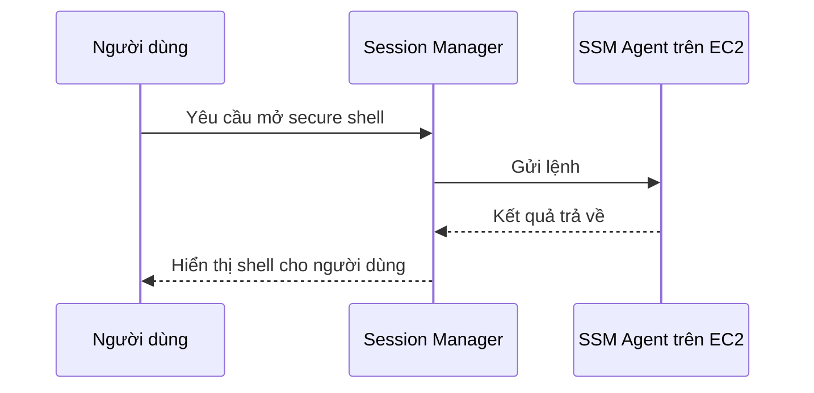

# 🔐 SSM Session Manager: Secure shell không cần SSH key hay bastion host

> Nguồn: `130-SSM-Session-Manager.txt` · [Udemy](https://ua.udemy.com/course/aws-certified-cloud-practitioner-new/learn/lecture/29102378)

Hôm nay chúng ta thực hành một tính năng rất thú vị của Systems Manager: **SSM Session Manager**. Đây là cách mở **secure shell** (shell bảo mật) lên EC2 instances và on-premises servers **mà không cần SSH access, không cần bastion host, cũng không cần SSH keys**.

Nghe hơi "phép thuật" đúng không? *Đừng lo, bài này mình làm hands-on từng bước, các bạn cứ mở AWS console làm theo là hiểu ngay.*

---

### 🚪 Vì sao Session Manager an toàn hơn?

Vì không cần SSH, **port 22 trên EC2 instance của bạn có thể đóng hoàn toàn** — không còn cổng từ xa nào để kẻ xấu dòm ngó. *Càng ít cổng mở, càng an toàn.*

---

### 🗺️ Session Manager hoạt động thế nào?

EC2 instance của bạn có **SSM Agent**, và agent này kết nối tới **Session Manager service**. Người dùng đi qua Session Manager service để truy cập instance và chạy lệnh:

Session Manager hỗ trợ **Linux, macOS và Windows**, và bạn có thể **gửi log data đến Amazon S3 hoặc CloudWatch Logs** để tăng cường bảo mật.

---

### 🧪 Hands-on: Tạo EC2 và mở shell không cần SSH

**Bước 1 — Launch EC2 instance:**

1. Chọn AMI **Amazon Linux 2**, instance type **t2.micro**.
2. **Không dùng key pair**.
3. **Disable SSH traffic** — security group của instance sẽ không cho phép gì cả: không HTTP, không HTTPS, không SSH.

**Bước 2 — Gắn IAM instance profile để instance nói chuyện được với SSM:**

1. Tạo IAM role mới, chọn service **Amazon EC2**.
2. Tìm và chọn policy **Amazon SSM managed instance core**.
3. Đặt tên role, ví dụ **demo EC2 role for SSM**.
4. Refresh, gắn role này vào instance rồi launch.

**Bước 3 — Kiểm tra trong Systems Manager:**

* Vào **Fleet Manager** — nơi hiển thị tất cả EC2 instances đã đăng ký với SSM, gọi là **managed nodes**.
* Chờ instance boot xong rồi refresh: bạn sẽ thấy instance đang chạy, **SSM Agent online**, platform Amazon Linux 2 và phiên bản SSM Agent.

**Bước 4 — Mở session:**

* Vào **Session Manager** → **Start session**.
* Chú ý: instance **không có inbound rule nào** — vậy mà vẫn mở được secure shell.
* Thử chạy `ping google.com` — lệnh chạy tốt.
* Chạy `hostname` để lấy host name — kết quả trả về IP `172-31-1-148`, đúng bằng **private IP** của instance.

**Bước 5 — Dọn dẹp:**

* Terminate session — **session history sẽ được lưu lại dưới dạng logs**, rất tiện để tra cứu sau này.
* Terminate EC2 instance để tránh phát sinh chi phí.

---

### 📊 Ba cách truy cập EC2 instance

| Cách truy cập | Cần SSH key? | Cần mở port 22? |
|---|---|---|
| SSH truyền thống | Có | Có |
| EC2 Instance Connect | Không — key được upload tạm thời | Có |
| SSM Session Manager | Không | Không |

Với **SSM Session Manager**, điều kiện là instance (Amazon Linux 2) có **IAM role** cho phép instance truy cập Systems Manager — chính role này giúp bạn mở được secure shell.

---

Vậy là bạn đã biết thêm một cách truy cập EC2 "sạch" và an toàn hơn hẳn SSH truyền thống. *Hãy tự tay làm lại một lần cho nhớ nhé — bài này mà làm được thì đề thi chỉ là chuyện nhỏ.*

Ở bài tiếp theo, chúng ta sẽ tìm hiểu **SSM Parameter Store** — nơi lưu cấu hình và secrets an toàn trên AWS. Hẹn gặp các bạn! 🚀
