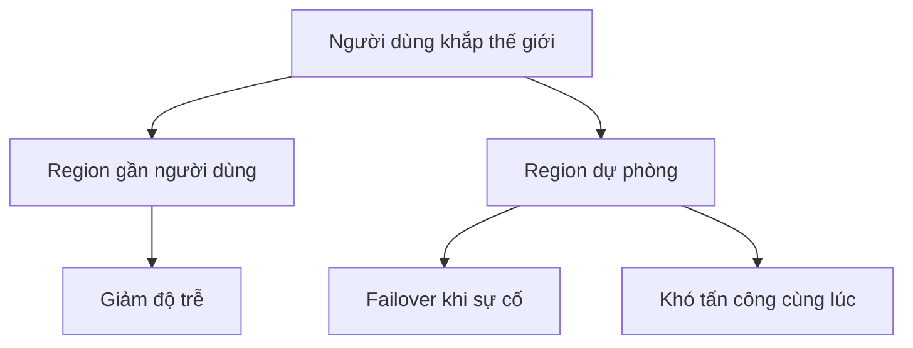

# 🌍 Vì sao cần ứng dụng toàn cầu? Bức tranh hạ tầng Global của AWS

> Nguồn: `133-Why-Global-Applications.txt` · [Udemy](https://ua.udemy.com/course/aws-certified-cloud-practitioner-new/learn/lecture/20056110)

Chào mừng các bạn đến với section mới về **Global Infrastructure (hạ tầng toàn cầu)** của AWS! Trước khi đi vào từng dịch vụ, mình muốn các bạn hiểu vì sao chúng ta cần xây dựng **ứng dụng toàn cầu** — đây chính là nền tảng cho toàn bộ section này.

*Đừng lo nếu bạn chưa có nền IT — mọi thứ đều rất trực quan, mình sẽ giải thích từng bước.*

---

### 🎯 Ứng dụng toàn cầu là gì?

**Global application (ứng dụng toàn cầu)** là ứng dụng được triển khai ở **nhiều khu vực địa lý** khác nhau. Trên AWS, điều đó có nghĩa là bạn deploy ứng dụng lên nhiều **Region (vùng)** hoặc **Edge Location (điểm biên)**.

Lợi ích đầu tiên, dễ thấy nhất là **giảm latency (độ trễ)**. Latency là thời gian để một gói tin mạng đi từ người dùng tới server. Trái đất rất rộng, nên gói tin từ châu Á tới Mỹ sẽ mất nhiều thời gian hơn.

Ví dụ: người dùng ở Ấn Độ mà server đặt tại Mỹ sẽ bị lag nhiều hơn. Nhưng nếu bạn deploy ứng dụng ở cả Mỹ lẫn châu Á, thì cả hai nhóm người dùng đều có trải nghiệm nhanh hơn — *một mũi tên trúng hai đích!*

---

### 💪 Ba lý do để xây ứng dụng toàn cầu

Đây là phần rất hay được hỏi trong đề thi, các bạn nhớ kỹ nhé:

1. **Giảm độ trễ:** đưa ứng dụng đến gần người dùng hơn, ở đâu cũng nhanh.
2. **Kế hoạch disaster recovery (khôi phục sau thảm họa):** không phụ thuộc vào một data center hay một region duy nhất. Nếu cả một region gặp sự cố — động đất, bão, mất điện, yếu tố chính trị... — bạn có thể **failover (chuyển sang)** region khác và ứng dụng vẫn hoạt động. Nhờ đó **availability (tính sẵn sàng)** của ứng dụng được tăng lên.
3. **Chống tấn công:** khi ứng dụng trải rộng trên nhiều region, hacker sẽ **khó tấn công tất cả các địa điểm cùng lúc** hơn, nhờ đó bạn được bảo vệ tốt hơn.

---

### 🗺️ Bản đồ hạ tầng toàn cầu của AWS

AWS có một website rất hay — bản đồ thế giới cho bạn xem toàn bộ sự hiện diện của AWS. Mình cùng điểm qua các thành phần nhé:

* **Region (ô màu cam):** nơi bạn deploy ứng dụng và hạ tầng. Có region khắp thế giới, nhưng không phải ở mọi nơi. Ví dụ khu vực châu Âu có Spain, London, Ireland, Paris, Frankfurt, Milan và Stockholm.
* **Availability Zone (AZ):** mỗi region gồm nhiều AZ. Ví dụ Northern Virginia có **6 AZ**, còn Paris có **3 AZ**. Các AZ nằm cách xa nhau để nếu có sự cố ở phía Bắc Paris thì AZ phía Nam Paris vẫn an toàn — nhưng chúng được nối với nhau bằng mạng cực nhanh.
* **Edge Location / Point of Presence (chấm hồng):** dùng cho **content delivery (phân phối nội dung)**. Bạn **không thể deploy ứng dụng** ở đây, nhưng các dịch vụ như **CloudFront** sẽ sử dụng chúng. Ví dụ California có rất nhiều điểm hồng như vậy.
* **Network (mạng):** các liên kết thực tế giữa region, AZ và Point of Presence. Đây là **mạng riêng tư của AWS** — AWS thậm chí lắp cáp dưới biển để nối châu Âu với Mỹ, châu Âu với châu Phi... giúp kết nối nhanh và ổn định giữa mọi khu vực.

*Các bạn cứ mở bản đồ này ngắm thử, nó giúp hình dung rất rõ cách cloud cho bạn hiện diện toàn cầu.*

---

### 🧰 Bốn dịch vụ sẽ học trong section này

Mình tóm tắt trước để các bạn nắm bức tranh lớn — đây là một section khá "nặng đô" đấy:

* **Route 53 — Global DNS (hệ thống tên miền toàn cầu):** định tuyến người dùng tới deployment gần nhất với độ trễ thấp nhất, và cực kỳ hữu ích cho chiến lược disaster recovery.
* **CloudFront — Global CDN (mạng phân phối nội dung):** sao chép một phần ứng dụng ra các Edge Location để giảm latency, đồng thời **cache (lưu đệm)** các request phổ biến nhằm cải thiện trải nghiệm người dùng.
* **S3 Transfer Acceleration:** tăng tốc upload và download toàn cầu vào **Amazon S3**.
* **AWS Global Accelerator:** cải thiện availability và performance toàn cầu của ứng dụng bằng mạng lưới toàn cầu của AWS.

---

### 🎯 Tự kiểm tra nhanh

**Câu 1:** Latency là gì?

<b>Xem đáp án</b>

**Đáp án:** Là thời gian để một gói tin mạng đi từ người dùng tới server.

Giải thích: Deploy ứng dụng gần người dùng hơn sẽ giảm latency.

Tham chiếu: Mục Ứng dụng toàn cầu là gì.

**Câu 2:** Ba lý do xây dựng ứng dụng toàn cầu là gì?

<b>Xem đáp án</b>

**Đáp án:** Giảm độ trễ, có kế hoạch disaster recovery, và chống tấn công tốt hơn.

Giải thích: Đây là bộ ba lý do chuẩn trong đề thi.

Tham chiếu: Mục Ba lý do để xây ứng dụng toàn cầu.

**Câu 3:** Edge Location còn được gọi là gì và dùng để làm gì?

<b>Xem đáp án</b>

**Đáp án:** Còn gọi là Point of Presence, dùng cho content delivery/CDN — không thể deploy ứng dụng tại đây.

Giải thích: CloudFront là dịch vụ sử dụng các điểm này.

Tham chiếu: Mục Bản đồ hạ tầng toàn cầu của AWS.

**Câu 4:** Dịch vụ DNS toàn cầu của AWS tên là gì?

<b>Xem đáp án</b>

**Đáp án:** Amazon Route 53.

Giải thích: Nó định tuyến người dùng tới deployment gần nhất và hỗ trợ disaster recovery.

Tham chiếu: Mục Bốn dịch vụ sẽ học trong section này.

**Câu 5:** CloudFront giúp ích gì cho ứng dụng toàn cầu?

<b>Xem đáp án</b>

**Đáp án:** Sao chép một phần ứng dụng ra các Edge Location và cache request phổ biến để giảm latency.

Giải thích: Đây là dịch vụ CDN của AWS, giúp tăng tốc phân phối nội dung.

Tham chiếu: Mục Bốn dịch vụ sẽ học trong section này.

---

Vậy là các bạn đã nắm được lý do và bức tranh tổng thể về hạ tầng toàn cầu của AWS. *Section này khá nhiều nội dung, nhưng cứ đi từng bước một — các bạn sẽ thấy mọi thứ rất logic.*

Ở bài tiếp theo, chúng ta sẽ bắt đầu với dịch vụ đầu tiên: **Amazon Route 53** và DNS. Hẹn gặp các bạn ở đó! 🚀
