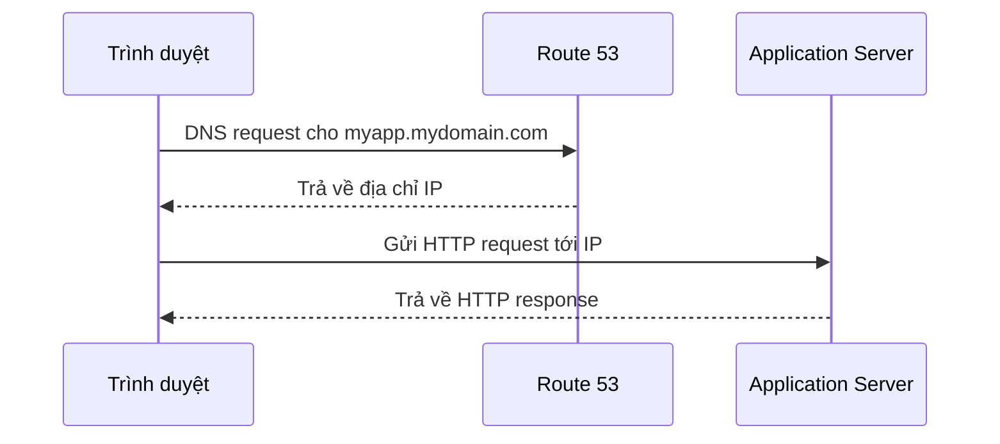

# 🧭 Route 53: "Danh bạ điện thoại" của Internet và 4 routing policy bạn phải nhớ

> Nguồn: `134-Route-53-Overview.txt` · [Udemy](https://ua.udemy.com/course/aws-certified-cloud-practitioner-new/learn/lecture/20056112)

Dịch vụ đầu tiên và cũng quan trọng nhất để deploy ứng dụng toàn cầu chính là **Amazon Route 53**. Đây là kiến thức chắc chắn xuất hiện trong đề thi, nên các bạn chú ý nhé — mình sẽ đi từ khái niệm DNS đến các routing policy.

*Đừng lo nếu bạn chưa từng nghe đến DNS — ví dụ "danh bạ điện thoại" bên dưới sẽ làm mọi thứ sáng tỏ.*

---

### ☎️ DNS và Route 53 là gì?

**Route 53** là một **managed DNS (Domain Name System — hệ thống tên miền được quản lý)**.

Vậy DNS làm gì? Hãy tưởng tượng DNS giống như một **cuốn danh bạ điện thoại**: đó là tập hợp các quy tắc và **records (bản ghi)**, giúp client tìm đúng server thông qua **URL** thay vì phải nhớ địa chỉ IP.

Với góc nhìn thi cử, các bạn chỉ cần nhớ: **Route 53 là managed DNS**. Nhưng hãy hiểu thêm một chút về cách nó hoạt động, vì phần routing policy ngay sau đây rất hay được hỏi.

---

### 📇 Các loại bản ghi phổ biến

Trong AWS có vài loại record phổ biến mà các bạn nên biết:

| Loại record | Dùng để làm gì |
|---|---|
| **A record** | Map tên miền (vd `www.google.com`) tới địa chỉ **IPv4** |
| **AAAA record** | Map tên miền tới địa chỉ **IPv6** dài |
| **CNAME** | Map **host name này** sang **host name khác** |
| **Alias** | Map host name tới một **tài nguyên AWS** |

**Alias record** là loại đặc biệt, hoạt động tốt với **ELB (Elastic Load Balancer)**, **CloudFront**, **S3**, database **RDS**...

*Tin vui: bước vào đề thi, các bạn không cần biết hết mọi loại record — mình chỉ điểm qua để các bạn có bức tranh tổng quan thôi.*

---

### 🔄 Luồng hoạt động của một A record

Hãy cùng xem chuyện gì xảy ra với một **A record** trong thực tế:

1. Trình duyệt web của bạn ở một bên, và một **Application Server** có public IPv4 đã được deploy ở bên kia.
2. Bạn vào Route 53 tạo một **A record** để truy cập server bằng URL bình thường.
3. Khi trình duyệt gửi **DNS request** cho `myapp.mydomain.com`, DNS sẽ trả về địa chỉ **IP** tương ứng.
4. Trình duyệt dùng IP đó để kết nối tới đúng server, rồi nhận về **HTTP response**.

Đó là nguyên lý cơ bản của DNS ở mức rất cao. *Nghe đơn giản đúng không nào?*

---

### 🚦 Bốn Routing Policy cần nhớ

Phần này cực kỳ quan trọng với đề thi: bạn cần biết ở mức high-level và chọn đúng policy theo **use case**.

Cùng đi qua từng policy qua ví dụ cụ thể:

* **Simple Routing Policy:** trình duyệt gửi DNS query và nhận về một địa chỉ IPv4. Đây là loại cơ bản nhất và **không có health check**.
* **Weighted Routing Policy:** phân phối traffic theo **trọng số (weight)** giữa nhiều instance. Ví dụ gán weight 70, 20, 10 thì client nhận **70%, 20%, 10%** traffic tương ứng — đây thực chất là một dạng **load balancing**. Policy này **có thể dùng health check**.
* **Latency Routing Policy:** dùng khi ứng dụng được hiển thị toàn cầu, ví dụ một deployment ở California và một ở Australia. Route 53 xem người dùng đang ở đâu rồi hướng họ tới server gần nhất — nhằm **giảm thiểu latency**.
* **Failover Routing Policy:** có một **primary instance** và một **failover instance**. Route 53 health check instance chính; nếu instance chính gặp lỗi, người dùng được chuyển sang instance dự phòng — hỗ trợ đắc lực cho **disaster recovery**.

| Routing policy | Mục đích chính | Health check? |
|---|---|---|
| **Simple** | Trả về một giá trị cơ bản | **Không** |
| **Weighted** | Chia traffic theo trọng số 70/20/10 | Có |
| **Latency** | Người dùng kết nối server gần nhất | Có |
| **Failover** | Chuyển sang server dự phòng khi server chính lỗi | Có |

Tóm gọn lại: **chỉ Simple là không có health check**, các policy còn lại đều có và phục vụ các mục đích khác nhau — *các bạn nhớ kỹ ý này, đề thi rất thích hỏi đấy!*

---

### 🎯 Tự kiểm tra nhanh

**Câu 1:** Route 53 là dịch vụ gì?

<b>Xem đáp án</b>

**Đáp án:** Là managed DNS của AWS.

Giải thích: DNS giống cuốn danh bạ điện thoại giúp client tìm server qua URL.

Tham chiếu: Mục DNS và Route 53 là gì.

**Câu 2:** Loại record nào map host name tới một tài nguyên AWS như ELB, CloudFront hay S3?

<b>Xem đáp án</b>

**Đáp án:** Alias record.

Giải thích: A record map tới IPv4, AAAA map tới IPv6, CNAME map host name tới host name, còn Alias map tới tài nguyên AWS.

Tham chiếu: Mục Các loại bản ghi phổ biến.

**Câu 3:** Routing policy nào không có health check?

<b>Xem đáp án</b>

**Đáp án:** Simple Routing Policy.

Giải thích: Ba policy còn lại (Weighted, Latency, Failover) đều có health check.

Tham chiếu: Mục Bốn Routing Policy cần nhớ.

**Câu 4:** Bạn muốn chia traffic 70% / 20% / 10% cho ba instance. Dùng policy nào?

<b>Xem đáp án</b>

**Đáp án:** Weighted Routing Policy.

Giải thích: Policy này phân phối traffic theo trọng số, tương tự load balancing.

Tham chiếu: Mục Bốn Routing Policy cần nhớ.

**Câu 5:** Policy nào giúp chuyển người dùng sang server dự phòng khi server chính gặp sự cố?

<b>Xem đáp án</b>

**Đáp án:** Failover Routing Policy.

Giải thích: Route 53 health check primary; nếu primary lỗi, người dùng được đưa sang failover — hỗ trợ disaster recovery.

Tham chiếu: Mục Bốn Routing Policy cần nhớ.

---

Vậy là các bạn đã nắm được Route 53, DNS và 4 routing policy quan trọng nhất cho kỳ thi. *Nhớ nhé: Simple không health check, Weighted chia traffic, Latency tối ưu độ trễ, Failover cho disaster recovery.*

Ở bài tiếp theo, chúng ta sẽ vào **AWS Console** thực hành đăng ký domain và định tuyến theo độ trễ. Hẹn gặp các bạn ở đó! 🚀
