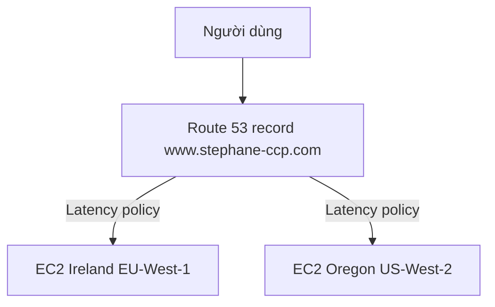

# 🧪 Hands-on Route 53: Đăng ký domain và định tuyến latency thực chiến

> Nguồn: `135-Route-53-Hands-On.txt` · [Udemy](https://ua.udemy.com/course/aws-certified-cloud-practitioner-new/learn/lecture/20056118)

Được rồi, giờ là lúc chúng ta mở **Route 53 Console** và làm thật! Bài này cần **đăng ký một tên miền** — việc này tốn tiền, nên nếu bạn chưa muốn chi thì cứ **xem mình làm** rồi thực hành lại sau cũng không sao.

*Mình sẽ dùng tên miền `stephane-ccp.com` làm ví dụ, và cuối bài sẽ có phần dọn dẹp để các bạn không bị phát sinh chi phí.*

---

### 🌐 Đăng ký tên miền trên Route 53

Trong Route 53 Console, các bạn vào **Registered domains** ở menu bên trái để bắt đầu:

1. Chọn tên miền bạn muốn — mình chọn `stephane-ccp.com` và kiểm tra xem còn trống không.
2. Tên miền này khả dụng, mình mua với giá **12 USD/năm**.
3. Thêm vào giỏ hàng, bấm **Continue**, rồi điền thông tin đăng ký.
4. Hoàn tất đơn hàng — quá trình này cần chút thời gian xử lý. Sau khoảng **10–15 phút**, bạn sẽ thấy tên miền của mình xuất hiện cùng ngày hết hạn.

*Lưu ý nhỏ: đây là tên miền thật, được đăng ký thật, nên ở phần dọn dẹp cuối bài mình sẽ nhắc các bạn về gia hạn tự động.*

---

### 🗂️ Hosted Zone — nơi đặt bản ghi DNS

Sau khi tên miền đã sẵn sàng, các bạn vào **Hosted zones** ở menu bên trái. Ở đây sẽ có một hosted zone được tạo sẵn cho `stephane-ccp.com` — **đây chính là nơi chúng ta đặt các DNS record**.

Hiện tại hosted zone chỉ có **2 DNS record mặc định**. Nhiệm vụ của chúng ta là tạo các **EC2 instance** ở nhiều region, rồi tạo DNS record trỏ về chúng.

---

### ⚙️ Tạo hai EC2 instance ở hai region

Mình tạo instance theo cách đã học ở các bài trước (nên thao tác sẽ nhanh hơn):

1. **Ireland — region EU-West-1:** launch một EC2 instance, bỏ qua việc chọn **key pair** (vì chỉ cần HTTP, không cần SSH), tạo **security group** cho phép **HTTP traffic**, và ở phần **advanced details** dán **user data** hiển thị "Hello world from Ireland".
2. Lấy **public IPv4** của instance này và lưu lại vào một file để dùng sau — đây là IP của Ireland.
3. **US West 2 — Oregon:** chuyển sang region này và làm y hệt. Mình chọn instance type **t2.micro**. *Các bạn để ý nhé: thao tác hơi chậm hơn một chút vì region này ở xa mình — một ví dụ trực quan về latency!*
4. Security group cho phép HTTP từ mọi nơi, user data sửa thành "Hello world from the US".

Sau khi cả hai instance chạy, mình truy cập thử từng **public IPv4**: một IP trả về "Hello world from Ireland", IP kia trả về "Hello world from the US". *Tuyệt vời — cả hai đều hoạt động!*

---

### 🔀 Tạo bản ghi định tuyến theo Latency

Giờ quay lại Route 53 và tạo records. Mình tạo **A record** cho sub-domain `www.stephane-ccp.com`:

* **Record 1:** value là IP của instance Ireland, routing policy chọn **Latency based** (vì mình muốn được định tuyến tới instance gần mình nhất về độ trễ), region ghi **EU-West-1**, record ID đặt là "my instance from Ireland".
* **Record 2:** vẫn là `www.stephane-ccp.com`, type **A**, value là IP của instance US, routing policy **Latency**, region **US-West-2 (Oregon)**, record ID "My US Instance".

Như vậy với `www` chúng ta có **2 record**: một gắn với region **US-West**, một gắn với region **EU**.

---

### 🧪 Kiểm chứng bằng VPN và dọn dẹp

Bây giờ là lúc kiểm tra kết quả:

1. Mở tab mới, vào `www.stephane-ccp.com` — mình nhận được **"Hello World from Ireland"**, đúng là instance gần mình nhất. Refresh trang thì vẫn giữ nguyên Ireland.
2. Bật **VPN** (mình dùng NordVPN), kết nối sang **United States** để giả lập kết nối từ Mỹ.
3. Mở cửa sổ riêng tư, truy cập lại tên miền — lần này mình nhận về **"hello world from the US"**, vì kết nối đang gần instance ở Mỹ nhất.

Vậy là Route 53 đã hoạt động đúng: nó **đưa người dùng tới instance có độ trễ thấp nhất** so với họ.

Trước khi kết thúc, đừng quên **dọn dẹp**:

* **Terminate** các EC2 instance ở mọi region để tránh phát sinh chi phí.
* Bạn có thể **xóa hosted zone** nếu muốn — chi phí **0.5 USD/tháng**.
* Tên miền đã mua vẫn tính khoảng **12 USD/năm** — nếu không muốn gia hạn tiếp vào năm sau, hãy **tắt auto renewal** (tự động gia hạn).

*Ở phạm vi kỳ thi Cloud Practitioner, các bạn chỉ cần nắm như trên. Nếu học lên các chứng chỉ associate, bạn sẽ cần tìm hiểu sâu hơn về các loại record khác.*

---

Vậy là chúng ta đã thực hành xong Route 53 với định tuyến theo latency. *Các bạn nhớ dọn dẹp tài nguyên sau mỗi bài hands-on nhé — thói quen này giúp bạn không bao giờ bị "cháy" credit.*

Ở bài tiếp theo, chúng ta chuyển sang dịch vụ phân phối nội dung **Amazon CloudFront**. Hẹn gặp các bạn ở đó! 🚀
