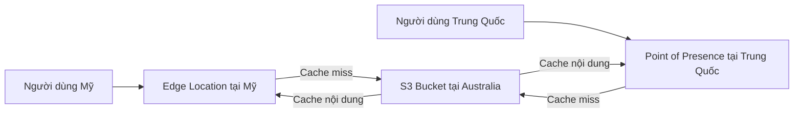

# ⚡ CloudFront: CDN toàn cầu giúp tăng tốc website và chống DDoS

> Nguồn: `136-CloudFront-Overview.txt` · [Udemy](https://ua.udemy.com/course/aws-certified-cloud-practitioner-new/learn/lecture/20056120)

Tiếp nối Route 53, chúng ta đến với **Amazon CloudFront** — dịch vụ phân phối nội dung toàn cầu. **Mẹo thi cực quan trọng: hễ thấy chữ CDN trong đề, hãy nghĩ ngay đến CloudFront!**

*Nếu bạn còn mơ hồ về edge location, cứ yên tâm — bài này sẽ làm rõ tất cả.*

---

### 🚀 CloudFront là gì?

**CloudFront** là một **CDN (Content Delivery Network — mạng phân phối nội dung)**. Nó cải thiện **read performance (hiệu năng đọc)** bằng cách **cache (lưu đệm) nội dung website** tại nhiều **edge locations** khác nhau.

Vì nội dung được cache khắp thế giới, người dùng ở bất kỳ đâu cũng có **latency thấp hơn** — trải nghiệm tốt hơn hẳn. CloudFront gồm **hàng trăm points of presence** toàn cầu, bao gồm các edge location và edge cache.

Một điểm cộng lớn: vì nội dung được phân tán toàn cầu, bạn còn được **bảo vệ chống DDoS**. DDoS là kiểu tấn công khiến tất cả server của bạn bị tấn công cùng lúc. CloudFront giúp bạn phòng chống nhờ ứng dụng trải rộng khắp thế giới, kết hợp với **Shield** và **Web Application Firewall** — *hai dịch vụ này mình sẽ nói kỹ trong section bảo mật nhé.*

---

### 🔄 CloudFront hoạt động như thế nào?

Hãy tưởng tượng bạn có một **S3 bucket chứa website đặt tại Australia**, nhưng người dùng lại ở Mỹ:

1. Người dùng Mỹ request nội dung từ **edge location tại Mỹ** thông qua CloudFront.
2. Edge location này sẽ **fetch nội dung từ Australia** về (lần đầu tiên).
3. Nếu một người dùng Mỹ khác request cùng nội dung, nội dung được **phục vụ trực tiếp từ edge** — không cần đi xa tới Australia nữa.
4. Tương tự, người dùng ở Trung Quốc sẽ nói chuyện với một **point of presence tại Trung Quốc**, nội dung được lấy từ S3 rồi được **cache tại edge**.

Về bản chất: client gửi **HTTP request** tới edge location. Nếu edge **không có trong cache**, nó sẽ tới **origin** để lấy kết quả, rồi **cache lại cục bộ** — lần sau client khác request cùng nội dung từ edge đó sẽ không cần đi tới origin nữa.

*Ví dụ tại Los Angeles hay São Paulo (Brazil) cũng diễn ra y hệt: nội dung nằm trong S3 bucket ở một region, nhưng được phân phối toàn cầu qua edge locations qua kết nối mạng riêng.*

---

### 🗄️ Các loại Origin của CloudFront

**Origin** là backend mà CloudFront kết nối tới. Có ba loại chính:

| Loại origin | Dùng cho | Ghi chú |
|---|---|---|
| **Amazon S3 bucket** | Phân phối và cache file tại edge; upload file trực tiếp vào S3 qua CloudFront | Bảo mật bằng **OAC** |
| **VPC origin** | Ứng dụng private trong VPC, private subnet | Private ALB, private NLB hoặc private EC2 |
| **Custom origin (HTTP)** | Backend HTTP công khai, ví dụ S3 static website hoặc public load balancer | Với S3 website phải bật static S3 website trước |

Điểm đáng chú ý: truy cập giữa CloudFront và Amazon S3 được bảo mật bằng **Origin Access Control (OAC)** — kết hợp chỉnh sửa **bucket policy** của S3, và kết nối giữa edge location với S3 bucket là **kết nối riêng tư**.

---

### 🆚 CloudFront vs S3 Cross-Region Replication

Đây là câu hỏi rất hay gặp, các bạn phân biệt rõ nhé — **hai dịch vụ phục vụ mục đích hoàn toàn khác nhau**:

* **CloudFront:** dùng **Global Edge network** với khoảng **216 points of presence**. File được **cache tại từng edge location, có thể khoảng một ngày**. Cực tốt cho **nội dung tĩnh** cần sẵn sàng khắp thế giới.
* **S3 Cross-Region Replication:** phải **thiết lập cho từng region** bạn muốn replicate — không phải mọi region trên thế giới. File được cập nhật **gần như real time**, **không có caching**, và **chỉ đọc (read only)**. Phù hợp với **nội dung động** thay đổi liên tục và cần độ trễ thấp ở **một vài region**.

Tóm gọn: CloudFront là CDN cache nội dung toàn cầu, còn S3 cross-region replication là **sao chép nguyên một bucket sang region khác**.

---

### 🎯 Tự kiểm tra nhanh

**Câu 1:** Trong đề thi, khi thấy chữ CDN, bạn nghĩ đến dịch vụ nào?

<b>Xem đáp án</b>

**Đáp án:** Amazon CloudFront.

Giải thích: CloudFront là CDN của AWS.

Tham chiếu: Mục CloudFront là gì.

**Câu 2:** CloudFront cải thiện hiệu năng đọc bằng cách nào?

<b>Xem đáp án</b>

**Đáp án:** Cache nội dung website tại các edge location trên toàn thế giới.

Giải thích: Nhờ cache toàn cầu, người dùng có latency thấp hơn.

Tham chiếu: Mục CloudFront là gì.

**Câu 3:** OAC dùng để làm gì?

<b>Xem đáp án</b>

**Đáp án:** Bảo mật truy cập giữa CloudFront và Amazon S3 (Origin Access Control), kèm chỉnh sửa bucket policy.

Giải thích: Kết nối giữa edge location và S3 bucket là kết nối riêng tư.

Tham chiếu: Mục Các loại Origin của CloudFront.

**Câu 4:** CloudFront khác S3 Cross-Region Replication ở điểm cốt lõi nào?

<b>Xem đáp án</b>

**Đáp án:** CloudFront dùng global edge network khoảng 216 PoPs và cache nội dung; S3 CRR phải thiết lập theo từng region, cập nhật gần real time, không cache, chỉ đọc.

Giải thích: CloudFront hợp với nội dung tĩnh toàn cầu; CRR hợp với nội dung động cần cập nhật liên tục ở vài region.

Tham chiếu: Mục CloudFront vs S3 Cross-Region Replication.

**Câu 5:** VPC origin của CloudFront dùng để kết nối tới những gì?

<b>Xem đáp án</b>

**Đáp án:** Ứng dụng private trong VPC — private Application Load Balancer, private Network Load Balancer hoặc private EC2.

Giải thích: Đây là origin cho ứng dụng nằm trong private subnet của bạn.

Tham chiếu: Mục Các loại Origin của CloudFront.

---

Vậy là các bạn đã hiểu CloudFront, các loại origin và cách phân biệt với S3 replication. *Nhớ nhé: CDN → CloudFront, cache tại edge → latency thấp!*

Ở bài tiếp theo, chúng ta sẽ **thực hành tạo CloudFront distribution** trên nền S3 bucket. Hẹn gặp các bạn ở đó! 🚀
