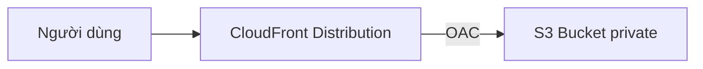

# 🛠️ Hands-on CloudFront: Phân phối file S3 riêng tư qua CDN toàn cầu

> Nguồn: `137-CloudFront-Hands-On.txt` · [Udemy](https://ua.udemy.com/course/aws-certified-cloud-practitioner-new/learn/lecture/20056122)

Được rồi, chúng ta cùng thực hành CloudFront! Trước hết mình cần tạo một **S3 bucket** để chứa file cho distribution, sau đó tạo **CloudFront distribution**, và cuối cùng là kiểm chứng tốc độ tải nhờ cache.

*Đây là bài hands-on rất thú vị vì bạn sẽ thấy tận mắt cách CloudFront phục vụ file riêng tư mà không cần mở public.*

---

### 🪣 Tạo S3 bucket và upload file

Mình tạo bucket tên **`demo-CloudFront-Stephan-v4`**, giữ nguyên mọi cài đặt mặc định rồi bấm **Create bucket**. Sau đó upload **3 file**:

* `beach`
* `coffee`
* `index.html`

Sau khi upload xong, mình thử mở `index.html` theo hai cách:

* **Object URL:** bị **Access Denied** — vì object của mình **không public**.
* **Nút Open:** AWS tạo một **pre-signed URL (URL có chữ ký tạm thời)** để truy cập object. Mình thấy chữ "I love coffee" và "hello world", *nhưng hình ảnh vẫn không hiển thị vì bản thân file ảnh cũng không public*.

Vậy làm sao để người dùng truy cập được mọi file **mà không cần mở public**? Đó chính là lúc CloudFront tỏa sáng!

---

### 🌐 Tạo CloudFront Distribution

Mở **CloudFront Console** (đóng popup pricing bằng "don't show it again" cho gọn), rồi bấm tạo distribution:

1. **Chọn plan:** CloudFront có nhiều plan với tính năng khác nhau. **Gói free là quá đủ cho chúng ta** — đủ requests và allowance mỗi tháng, có **always-on DNS protection**, **geographic traffic blocking**, **global CDN, DNS** và **free TLS certificates**. Nếu cần những thứ như **edge key-value store**, **advanced DDoS protection**, **uptime SLA** hay bảo vệ WordPress thì mới cần plan cao hơn. Ngoài ra còn có tùy chọn **pay-as-you-go** trả theo traffic sử dụng.
2. **Đặt tên:** `demo-new-CloudFront`, chọn phạm vi **single site or app**. Chúng ta không cần domain, nhưng có thể thêm domain và **provision TLS certificate** nếu muốn.
3. **Chọn origin type:** các lựa chọn gồm **Amazon S3**, **Elastic Load Balancer**, **API Gateway**, **Elemental MediaPackage** hoặc **other**. Còn **VPC origin** (kết nối tới private EC2 hoặc ALB private) **chỉ có ở plan business** — nhưng mình vẫn giới thiệu để các bạn biết CloudFront làm được gì. Ở đây mình chọn **Amazon S3** → browse bucket `demo-CloudFront-stephane-v4`.
4. **Bảo mật:** cho phép **private S3 bucket access** tới CloudFront (**Yes**), dùng **recommended origin settings** và **recommended cache settings** để phục vụ nội dung S3.
5. **WAF:** có thể bật **Web Application Firewall** hoặc bảo vệ **layer 7**, nhưng các tính năng này thuộc plan business — *bài demo của chúng ta không cần gì thêm.*
6. Kiểm tra lại **free plan**, review toàn bộ cấu hình rồi bấm tạo distribution.

---

### 🔐 Bucket policy được tạo tự động

Một điều rất hay: sau khi distribution được tạo, bạn vào **S3 → Permissions → Bucket policy** sẽ thấy một **bucket policy cho phép CloudFront distribution truy cập bucket** của bạn.

* Ở bài demo, mình thấy **2 policy** vì trước đó đã có một cái test, cộng thêm cái vừa tạo cho các bạn.
* Policy này được **nền tảng tự động thêm vào** ngay trong quá trình deploy distribution — bạn không cần viết tay.

Nhờ vậy, CloudFront có thể **truy cập riêng tư** vào S3 bucket mà bucket vẫn private.

---

### 🧪 Truy cập qua CloudFront và cảm nhận cache

Distribution đã xong, mình bấm vào **domain name**, mở tab mới:

1. Truy cập vào gốc `/` → **Access Denied** — *đừng lo, chỉ vì mình cần nhập đúng đường dẫn file.*
2. `/coffee.jpg` → ảnh coffee hiện lên.
3. `/beach.jpeg` → ảnh beach hiện lên.
4. `/index.html` → hiện đầy đủ "I love coffee", "hello world" và cả hình ảnh.

Điểm đáng chú ý: **tất cả object trong bucket đều private**, nhưng nhờ bucket policy cho phép CloudFront, mình vẫn xem được mọi thứ cần xem qua CloudFront.

Và phần thưởng cuối cùng: quay lại `/beach.jpeg` lần nữa, ảnh đã được **cache** nên tải **gần như tức thì**. *Đó chính là lợi ích lớn nhất của CloudFront!*

---

Vậy là chúng ta đã tạo thành công **CloudFront distribution với gói free**, lấy **S3 làm origin**, thấy **bucket policy tự động** và trải nghiệm sức mạnh của cache. *Các bạn nhớ: mọi file vẫn private, chỉ CloudFront được phép truy cập — vừa an toàn vừa nhanh.*

Ở bài tiếp theo, chúng ta tìm hiểu cách tăng tốc upload/download toàn cầu với **S3 Transfer Acceleration**. Hẹn gặp các bạn ở đó! 🚀
