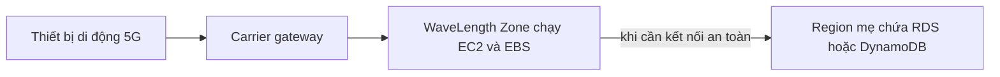

# 📡 AWS WaveLength: Ultra-low latency cho ứng dụng trên mạng 5G

> Nguồn: `141-AWS-WaveLength.txt` · [Udemy](https://ua.udemy.com/course/aws-certified-cloud-practitioner-new/learn/lecture/26623492)

Tiếp theo hành trình hạ tầng toàn cầu, chúng ta đến với **AWS WaveLength** — dịch vụ đưa ứng dụng ra tận **edge của mạng 5G** để đạt độ trễ cực thấp (ultra-low latency). *Mẹo nhỏ cho đề thi: hễ thấy chữ **5G** trong câu hỏi, khả năng rất cao đáp án là WaveLength.*

---

### 📶 WaveLength Zones là gì?

**WaveLength Zones** là các **infrastructure deployment (triển khai hạ tầng)** được nhúng ngay trong **data center của các nhà cung cấp dịch vụ viễn thông (telecommunications providers)**, tại **edge của mạng 5G**.

Điều này cho phép bạn **deploy một số dịch vụ AWS trực tiếp ra edge trên mạng 5G**, ví dụ:

* **EC2 instances**
* **EBS volumes**
* Thậm chí cả **VPC**

---

### 🔗 WaveLength hoạt động như thế nào?

Hãy tưởng tượng một nhà mạng viễn thông có mạng 5G và có một WaveLength Zone. Thông qua **carrier gateway**, bạn có thể deploy một **EC2 instance** ngay trong Zone đó.

Vì Zone này **thuộc chính mạng 5G**, khi người dùng dùng thiết bị di động 5G truy cập ứng dụng, họ nhận được độ trễ **cực kỳ thấp** — bởi ứng dụng được deploy ngay tại edge. Mục tiêu cả WaveLength là **mang lại ultra-low latency cho ứng dụng qua mạng 5G**.

Một điểm rất hay: traffic trong ví dụ này **không bao giờ rời khỏi mạng của nhà mạng (CSP — Communication Service Provider)**, thậm chí không đi tới AWS. Tuy nhiên, khi cần **kết nối an toàn tới AWS**, bạn vẫn có thể làm được.

---

### 🗄️ Kết nối với Region mẹ

WaveLength Zone được **kết nối với parent region (region mẹ)**. Ví dụ, nếu EC2 instance trong WaveLength Zone cần truy cập database như **RDS** hoặc **DynamoDB** nằm trong Region mẹ, kết nối đó hoàn toàn khả thi.

Đặc biệt dễ chịu: **không phát sinh thêm chi phí hay service agreement nào** khi dùng WaveLength.

---

### 🎯 Ứng dụng phù hợp với WaveLength

Các use case rất đa dạng, miễn là yêu cầu độ trễ thấp và ở gần người dùng:

* Smart Cities (thành phố thông minh)
* ML-assisted diagnostics (chẩn đoán y tế có hỗ trợ machine learning)
* Connected Vehicles (xe kết nối)
* Interactive Live Video Streams (livestream tương tác)
* AR và VR
* Real-time Gaming (game thời gian thực)

Tất cả đều là những ứng dụng cần **độ trễ cực thấp** và **ở rất gần người dùng cuối** — điều mà mạng 5G mở ra.

---

### 🎯 Tự kiểm tra nhanh

**Câu 1:** WaveLength Zones được triển khai ở đâu?

<b>Xem đáp án</b>

**Đáp án:** Trong data center của các nhà cung cấp dịch vụ viễn thông, tại edge của mạng 5G.

Tham chiếu: Mục WaveLength Zones là gì.

**Câu 2:** Từ khóa nào trong đề thi giúp nhận diện WaveLength?

<b>Xem đáp án</b>

**Đáp án:** 5G.

Giải thích: Thấy 5G trong câu hỏi thì khả năng cao là WaveLength.

**Câu 3:** Bạn có thể deploy những gì vào WaveLength Zone?

<b>Xem đáp án</b>

**Đáp án:** EC2 instances, EBS volumes, thậm chí cả VPC.

Tham chiếu: Mục WaveLength Zones là gì.

**Câu 4:** Traffic của ứng dụng có bắt buộc đi qua AWS không?

<b>Xem đáp án</b>

**Đáp án:** Không — traffic không rời khỏi mạng CSP và không tới AWS; chỉ khi cần kết nối an toàn tới AWS thì mới có.

Tham chiếu: Mục WaveLength hoạt động như thế nào.

**Câu 5:** Dùng WaveLength có phát sinh thêm chi phí hay cam kết dịch vụ không?

<b>Xem đáp án</b>

**Đáp án:** Không — không có additional charges hay service agreements.

Tham chiếu: Mục Kết nối với Region mẹ.

---

Vậy là các bạn đã nắm được WaveLength: hạ tầng AWS nhúng trong mạng 5G, phục vụ ứng dụng ultra-low latency. *Chỉ cần nhớ cặp bài trùng "5G → WaveLength" là bạn đã ăn điểm một câu trong đề.*

Ở bài tiếp theo, chúng ta sẽ tìm hiểu **AWS Local Zones** — cách mở rộng region để đưa compute, storage và database đến gần người dùng hơn. Hẹn gặp các bạn ở đó! 🚀
