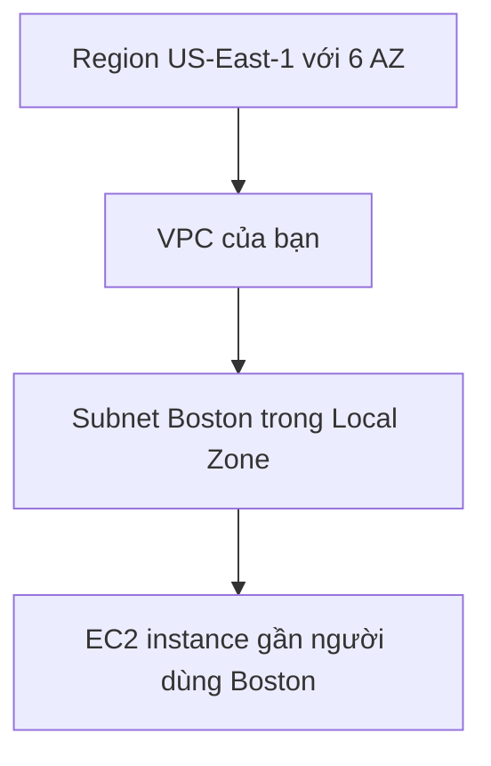

# 🏙️ AWS Local Zones: Đưa compute, storage, database đến sát người dùng

> Nguồn: `142-AWS-Local-Zones.txt` · [Udemy](https://ua.udemy.com/course/aws-certified-cloud-practitioner-new/learn/lecture/29102322)

Đây là chủ đề mà **đề thi hiện nay có hỏi**, nên các bạn đừng bỏ qua: **AWS Local Zones**. Ý tưởng rất dễ nhớ — thay vì bắt người dùng đi xa đến region, ta **mở rộng region** để đưa các dịch vụ được chọn đến gần họ hơn. Cùng xem chi tiết nhé!

---

### 🔍 Local Zones là gì?

Chúng ta đã có **Availability Zones** và **regions** khắp thế giới. Giờ có thêm khái niệm **Local Zones**: cho phép đặt **compute, storage, database và một số dịch vụ được chọn** **gần người dùng cuối hơn**, để chạy các **latency sensitive applications (ứng dụng nhạy cảm với độ trễ)**.

Cách hiểu đơn giản: bạn **mở rộng AWS region** của mình tới một hoặc nhiều địa điểm — mỗi địa điểm được coi như một "availability zone" bổ sung — và chúng được gọi là **Local Zones**.

Local Zones tương thích với nhiều dịch vụ như: **EC2, RDS, ECS, EBS, ElastiCache, Direct Connect** và nhiều dịch vụ khác.

Ví dụ: region **Northern Virginia (US-East-1)** mặc định có **6 AZ**, nhưng có thể mở rộng thêm bằng các Local Zones tại **Boston, Chicago, Dallas, Houston, Miami**...

---

### 🧪 Hands-on: Xem Local Zones trên console

Mình đã vào **EC2 console** để các bạn thấy thực tế:

1. **Chọn một region không có Local Zone** — ví dụ Europe (Ireland). Vào **Settings → Zones**, bạn chỉ thấy **3 AZ** được enable mặc định, không có Local Zone nào.
2. **Chuyển sang US-East-1 (Northern Virginia)**: có rất nhiều lựa chọn — **Local Zones**, rồi **WaveLength Zones**, và **Availability Zones** (6 AZ mặc định).
3. **Enable Local Zone Boston:** chọn **Manage → enable Local Zone → update zone group → Yes, enable**. Chờ một chút rồi refresh — **US-East-1-Boston-1** đã được enable.
4. **Launch instance:** chọn **Amazon Linux 2**, instance type **T2 micro**; ở phần network, ta vẫn có VPC và 6 subnet cũ, nhưng có thể **tạo subnet mới** — mình đặt tên "Boston subnets", chọn AZ là **US-East-1-Boston-1**, CIDR block **172.31.96.0/20**.
5. Quay lại launch wizard, ta có thể chọn subnet mới này — chứng minh rằng **VPC có thể mở rộng tới Local Zones** và deploy EC2 instance gần người dùng hơn.

*Phần CIDR block khá nâng cao và **không xuất hiện trong đề thi** — bạn không hiểu cũng không sao, chỉ cần nhớ khả năng mở rộng VPC tới Local Zone là đủ.* Mình cũng không tạo instance thật, chỉ dừng ở bước chọn subnet.

---

### 💡 Điểm cần nhớ cho đề thi

* **Local Zones = mở rộng region** để chạy workload nhạy cảm độ trễ gần người dùng.
* Đặt được **compute, storage, database** và một số dịch vụ được chọn.
* Các dịch vụ tiêu biểu: **EC2, RDS, ECS, EBS, ElastiCache, Direct Connect**.
* Ví dụ địa điểm: **Boston, Chicago, Dallas, Houston, Miami**.
* Khác với WaveLength (gắn với **5G**), Local Zones là giải pháp mở rộng hạ tầng **theo địa lý** trong khuôn khổ một region.

---

### 🎯 Tự kiểm tra nhanh

**Câu 1:** Local Zones cho phép bạn làm gì?

<b>Xem đáp án</b>

**Đáp án:** Đặt compute, storage, database và một số dịch vụ được chọn gần người dùng cuối hơn để chạy ứng dụng nhạy cảm độ trễ.

Tham chiếu: Mục Local Zones là gì.

**Câu 2:** Local Zone được coi là gì của một region?

<b>Xem đáp án</b>

**Đáp án:** Là phần mở rộng của region tới một hoặc nhiều địa điểm — mỗi nơi được coi như một "availability zone" bổ sung.

Tham chiếu: Mục Local Zones là gì.

**Câu 3:** Kể tên một vài dịch vụ tương thích với Local Zones.

<b>Xem đáp án</b>

**Đáp án:** EC2, RDS, ECS, EBS, ElastiCache, Direct Connect...

Tham chiếu: Mục Local Zones là gì.

**Câu 4:** US-East-1 có bao nhiêu AZ mặc định và những Local Zone nào?

<b>Xem đáp án</b>

**Đáp án:** 6 AZ mặc định; Local Zones ví dụ như Boston, Chicago, Dallas, Houston, Miami.

Tham chiếu: Mục Local Zones là gì.

**Câu 5:** Trong hands-on, CIDR block của subnet Boston là gì và có phải nhớ cho đề thi không?

<b>Xem đáp án</b>

**Đáp án:** 172.31.96.0/20 — đây là phần nâng cao, không xuất hiện trong đề thi.

Tham chiếu: Mục Hands-on.

---

Vậy là các bạn đã hiểu Local Zones và thậm chí thấy cách enable, tạo subnet trỏ về Local Zone trên console. *Chỉ cần nhớ: Local Zones = mở rộng region để giảm độ trễ cho người dùng ở xa.*

Ở bài tiếp theo, chúng ta sẽ ráp tất cả kiến thức hạ tầng lại thành **kiến trúc ứng dụng toàn cầu** — từ single AZ đến active-active. Hẹn gặp các bạn ở đó! 🚀
