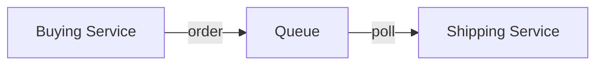

# 🚀 Cloud Integrations: Khi các ứng dụng cần "nói chuyện" với nhau

> Nguồn: `145-Cloud-Integrations-Overview.txt` · [Udemy](https://ua.udemy.com/course/aws-certified-cloud-practitioner-new/learn/lecture/20219084)

Chào mừng các bạn đến với section **Cloud Integrations (tích hợp trên cloud)**! Khi hệ thống phình to, các ứng dụng sẽ phải giao tiếp với nhau — và có hai kiểu pattern để làm việc đó. Bài này sẽ giúp các bạn có bức tranh tổng thể trước khi đi sâu vào từng dịch vụ.

---

### 🔄 Hai kiểu giao tiếp: đồng bộ và bất đồng bộ

**1. Synchronous communication (giao tiếp đồng bộ):** các ứng dụng gọi trực tiếp lẫn nhau. Ví dụ bạn có **buying service (service mua hàng)** cần nói chuyện với **shipping service (service vận chuyển)** — hai service tích hợp trực tiếp, "mặt đối mặt".

**2. Asynchronous / Event-based (bất đồng bộ, dựa trên sự kiện):** hai service không gọi nhau trực tiếp mà trao đổi qua một **queue (hàng đợi)**.

Ví dụ kinh điển: mỗi khi có đơn hàng mới, buying service **đẩy order vào queue**; shipping service **đọc order từ queue** để xử lý. Lúc này hai service được gọi là **decoupled (tách rời)** — queue đóng vai trò trung gian.

---

### ⚠️ Vì sao giao tiếp đồng bộ dễ "vỡ trận"?

Hãy tưởng tượng traffic của bạn **đột ngột tăng vọt (sudden spike)**, hoặc bạn cần **encode 1000 video** trong khi bình thường chỉ có **10 video**. Khi đó, service bị gọi trực tiếp rất dễ **quá tải (overwhelmed)**, và việc encode có thể **thất bại**.

*Đây chính là lúc tư duy decouple phát huy sức mạnh.*

Thay vì để các ứng dụng gọi nhau trực tiếp, ta tách chúng ra và dùng các dịch vụ trung gian chuyên dụng.

---

### 🧰 Bộ dịch vụ giúp decouple ứng dụng

AWS có sẵn những dịch vụ cho bài toán này:

* **SQS** — mô hình **queue (hàng đợi)**.
* **SNS** — mô hình **pub/sub (publish/subscribe — phát và đăng ký nhận tin)**.
* **Kinesis** — dùng cho **real-time data streaming (truyền dữ liệu thời gian thực)**.

Khi đã decoupled, các ứng dụng có thể **scale độc lập với nhau** — mỗi bên tự tăng giảm quy mô theo nhu cầu, không kéo theo bên còn lại.

---

### 🎯 Trọng tâm của section này

Trong section này, chúng ta sẽ có một cái nhìn sâu hơn về **SQS** và **SNS** — hai dịch vụ xuất hiện cực nhiều trong đề thi CLF-C02. Ngoài ra, các bạn cũng sẽ gặp **Kinesis** và **Amazon MQ** ở những bài sau.

*Đừng lo nếu bạn chưa từng nghe đến những cái tên này* — mình sẽ giải thích từng dịch vụ bằng ví dụ thật dễ hiểu.

---

### 🧪 Tự kiểm tra nhanh

**Câu 1:** Hai kiểu pattern giao tiếp giữa các ứng dụng là gì?

<b>Xem đáp án</b>

**Đáp án:** Synchronous (đồng bộ) và asynchronous / event-based (bất đồng bộ, dựa trên sự kiện).

Giải thích: Đồng bộ là gọi trực tiếp; bất đồng bộ là trao đổi gián tiếp qua queue.

Tham chiếu: Mục Hai kiểu giao tiếp.

**Câu 2:** Giao tiếp synchronous có thể gây vấn đề gì?

<b>Xem đáp án</b>

**Đáp án:** Khi traffic tăng vọt hoặc khối lượng công việc lớn hơn bình thường (ví dụ 1000 video thay vì 10), service bị gọi có thể quá tải và thất bại.

Giải thích: Vì service gọi trực tiếp phải "gánh" toàn bộ tải tăng thêm ngay lập tức.

Tham chiếu: Mục Vì sao giao tiếp đồng bộ dễ vỡ trận.

**Câu 3:** Ba dịch vụ giúp decouple ứng dụng là gì?

<b>Xem đáp án</b>

**Đáp án:** SQS (queue model), SNS (pub/sub model) và Kinesis (real-time data streaming).

Giải thích: Mỗi dịch vụ phù hợp với một kiểu tích hợp khác nhau.

Tham chiếu: Mục Bộ dịch vụ giúp decouple ứng dụng.

**Câu 4:** Lợi ích chính của việc decouple ứng dụng là gì?

<b>Xem đáp án</b>

**Đáp án:** Các ứng dụng có thể scale độc lập với nhau.

Giải thích: Không còn phụ thuộc trực tiếp, mỗi service tự mở rộng theo nhu cầu.

Tham chiếu: Mục Bộ dịch vụ giúp decouple ứng dụng.

**Câu 5:** Trong ví dụ bất đồng bộ, buying service và shipping service liên lạc qua đâu?

<b>Xem đáp án</b>

**Đáp án:** Qua một queue — buying service đẩy order vào queue, shipping service đọc order từ queue.

Giải thích: Có queue ở giữa nên hai service được gọi là decoupled.

Tham chiếu: Mục Hai kiểu giao tiếp.

---

Vậy là các bạn đã hiểu vì sao decouple ứng dụng lại quan trọng đến vậy. Ở bài tiếp theo, chúng ta sẽ tìm hiểu chi tiết dịch vụ đầu tiên: **Amazon SQS**. Hẹn gặp các bạn ở đó! 🚀
