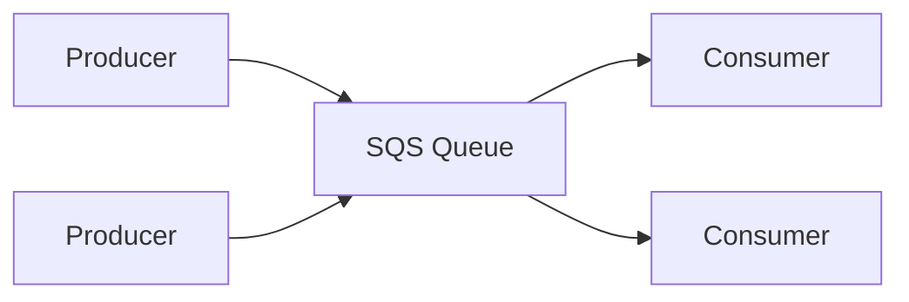

# 📬 Amazon SQS: Hàng đợi giúp tách rời ứng dụng (Tổng quan)

> Nguồn: `146-SQS-Overview.txt` · [Udemy](https://ua.udemy.com/course/aws-certified-cloud-practitioner-new/learn/lecture/20056162)

Tiếp nối bài trước, chúng ta cùng tìm hiểu dịch vụ đầu tiên giúp decouple ứng dụng: **Amazon SQS**. Đây là một trong những dịch vụ "ăn điểm" chắc chắn trong đề thi CLF-C02, nên các bạn chú ý nhé!

---

### 🎯 SQS là gì và queue hoạt động thế nào?

**SQS** viết tắt của **Simple Queue Service (dịch vụ hàng đợi đơn giản)**. Khi tạo một **SQS queue**:

1. **Producers (nhà sản xuất)** gửi message vào queue — có thể chỉ một producer, mà cũng có thể nhiều producer.
2. Message được **lưu trong queue**.
3. **Consumers (người tiêu thụ)** đọc message bằng cách **poll** queue — nghĩa là gửi yêu cầu lấy message về.

Có thể có một hoặc nhiều consumer. Khi nhiều consumer cùng poll, chúng sẽ **chia nhau công việc**: mỗi consumer nhận những message khác nhau. Xử lý xong (ví dụ encode video), consumer sẽ **xóa message** khỏi queue — message biến mất.

Nhờ cơ chế này, producer và consumer **hoàn toàn decoupled** và có thể xử lý với tốc độ khác nhau.

---

### 📜 Những đặc điểm quan trọng của SQS

* Đây là **dịch vụ lâu đời nhất của AWS** — hơn **10 năm tuổi**, một trong những dịch vụ đầu tiên xuất hiện trên AWS cloud.
* **Fully managed (được quản lý hoàn toàn)** — là dịch vụ **serverless**: bạn không phải provision server.
* Dùng để **decouple ứng dụng**.

👉 **Exam tip:** hễ trong đề thấy từ **"decouple"** thì nghĩ ngay đến **SQS**.

Các con số cần nhớ:

* Scale mượt mà từ **1 message/giây** lên tới **hàng chục nghìn message/giây**.
* **Retention (thời gian lưu message) mặc định là 4 ngày, tối đa 14 ngày** — message phải được xử lý trong khoảng thời gian này.
* **Không có giới hạn** số message trong queue.
* Consumer đọc xong **phải xóa message** khỏi queue.
* **Độ trễ thấp — dưới 10 milliseconds**.

Consumer chia nhau đọc message và **scale horizontally (mở rộng theo chiều ngang)**.

---

### 🏗️ Kiến trúc kinh điển: web tier ↔ video processing tier

Một solution architecture rất hay gặp và rất đáng nhớ:

* **Web servers** nhận request (qua **load balancer**), chạy trên **EC2 instances trong Auto Scaling Group**.
* Khi người dùng cần xử lý video, thay vì gửi trực tiếp, ứng dụng **đẩy message vào SQS queue**.
* Một **video processing layer** gồm **Auto Scaling Group + EC2** đọc message từ queue và xử lý video.

Điểm tuyệt vời: **hai Auto Scaling Group scale độc lập với nhau**, thậm chí việc scale có thể dựa trên **số message đang có trong queue**. Kết quả là trải nghiệm người dùng tốt nhất, tối ưu chi phí và linh hoạt trong việc scale.

---

### 📥 FIFO Queue — khi thứ tự message là bắt buộc

**FIFO = First In First Out (vào trước, ra trước)** — nói về **thứ tự của message trong queue**.

Nếu producer gửi message theo thứ tự **1, 2, 3, 4** thì consumer cũng đọc đúng thứ tự **1, 2, 3, 4**. Với **standard queue** thông thường, consumer có thể đọc message theo thứ tự khác nhau. Còn **SQS FIFO queue** thì đảm bảo đúng thứ tự — đây là feature các bạn cần nhớ cho đề thi.

---

### 🧪 Tự kiểm tra nhanh

**Câu 1:** SQS viết tắt của gì?

<b>Xem đáp án</b>

**Đáp án:** Simple Queue Service.

Giải thích: Đúng như tên gọi — một dịch vụ hàng đợi đơn giản, fully managed.

Tham chiếu: Mục SQS là gì và queue hoạt động thế nào.

**Câu 2:** Consumer lấy message từ queue bằng cách nào?

<b>Xem đáp án</b>

**Đáp án:** Poll queue — gửi yêu cầu lấy message về.

Giải thích: Nhiều consumer cùng poll sẽ chia nhau message, mỗi người nhận message khác nhau.

Tham chiếu: Mục SQS là gì và queue hoạt động thế nào.

**Câu 3:** Retention mặc định và tối đa của message trong SQS là bao lâu?

<b>Xem đáp án</b>

**Đáp án:** Mặc định 4 ngày, tối đa 14 ngày.

Giải thích: Message phải được xử lý trong khoảng retention này, sau đó consumer phải xóa message.

Tham chiếu: Mục Những đặc điểm quan trọng của SQS.

**Câu 4:** Trong đề thi, từ khóa nào khiến bạn nghĩ ngay đến SQS?

<b>Xem đáp án</b>

**Đáp án:** "Decouple" (tách rời ứng dụng).

Giải thích: SQS là dịch vụ chuyên dùng để decouple các application tier.

Tham chiếu: Mục Những đặc điểm quan trọng của SQS.

**Câu 5:** FIFO queue đảm bảo điều gì?

<b>Xem đáp án</b>

**Đáp án:** Thứ tự của message — vào trước ra trước.

Giải thích: Producer gửi 1, 2, 3, 4 thì consumer đọc đúng 1, 2, 3, 4; standard queue không đảm bảo điều này.

Tham chiếu: Mục FIFO Queue.

---

Vậy là các bạn đã nắm được SQS từ khái niệm đến con số và cả exam tip. Ở bài tiếp theo, chúng ta sẽ vào AWS console và **thực hành tạo queue, gửi — nhận — xóa message** cùng nhau. Hẹn gặp các bạn ở đó! 🚀
