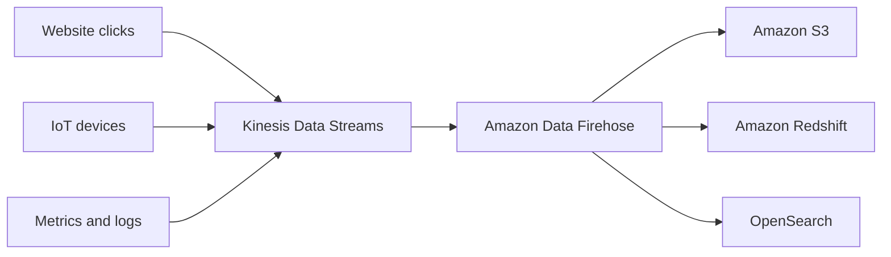

# 🌊 Amazon Kinesis: Truyền dữ liệu thời gian thực (Tổng quan)

> Nguồn: `148-Kinesis-Overview.txt` · [Udemy](https://ua.udemy.com/course/aws-certified-cloud-practitioner-new/learn/lecture/24682600)

Tiếp theo, chúng ta cùng nói về **Amazon Kinesis Data Streams** — dịch vụ gắn liền với **real-time big data streaming** trên AWS. Trong đề thi, hễ thấy **Kinesis** thì gần như chắc chắn câu hỏi xoay quanh việc **truyền dữ liệu thời gian thực**.

---

### 🎯 Kinesis Data Streams là gì?

Dưới góc nhìn thi cử, **Kinesis Data Streams** là dịch vụ dùng để **collect (thu thập), process (xử lý) và analyze (phân tích) dữ liệu streaming theo thời gian thực ở mọi quy mô**.

*Nếu bạn mới nghe đến "streaming data" — hiểu đơn giản là dữ liệu liên tục sinh ra và cần được xử lý ngay, thay vì chờ gom thành từng lô.*

---

### 🔥 Amazon Data Firehose — đưa dữ liệu đến đích

Bên cạnh Kinesis Data Streams, còn có **Amazon Data Firehose** — dịch vụ dùng để **load các luồng dữ liệu từ Kinesis Data Streams vào những đích đến (target destination)**, ví dụ:

* **Amazon S3**
* **Amazon Redshift**
* **OpenSearch**
* ...và nhiều đích khác nữa.

---

### 🗺️ Luồng dữ liệu tổng thể

Các nguồn dữ liệu ở đây được gọi là **fast data sources** — dữ liệu được tạo ra **theo thời gian thực (real time)**, chẳng hạn:

* Người dùng **click trên website** của bạn.
* Một **thiết bị kết nối Internet (IoT device)**.
* **Metrics hoặc logs** trên application server.

Tất cả các data point này được gửi vào **Amazon Kinesis Data Streams** để **phân tích**, rồi nếu muốn, bạn dùng **Amazon Data Firehose** để chuyển tiếp chúng tới **S3 bucket**, **Redshift database** và nhiều đích khác.

---

### 💡 Chốt lại để đi thi

* **Kinesis Data Streams** — thu thập, xử lý và phân tích dữ liệu streaming thời gian thực.
* **Amazon Data Firehose** — đưa luồng dữ liệu đó vào các destination như S3, Redshift, OpenSearch.
* Nhớ đúng một câu: **Kinesis là dịch vụ stream dữ liệu** — thế là đủ cho đề Cloud Practitioner.

*Đừng lo nếu bạn chưa từng làm việc với streaming data — với đề thi, mức hiểu này là quá đủ.*

---

### 🧪 Tự kiểm tra nhanh

**Câu 1:** Trong đề thi, Kinesis thường gắn với khái niệm nào?

<b>Xem đáp án</b>

**Đáp án:** Real-time big data streaming (truyền dữ liệu lớn theo thời gian thực).

Giải thích: Đây là "từ khóa nhận diện" Kinesis trong đề CLF-C02.

Tham chiếu: Mục Kinesis Data Streams là gì.

**Câu 2:** Kinesis Data Streams được dùng để làm gì?

<b>Xem đáp án</b>

**Đáp án:** Thu thập, xử lý và phân tích dữ liệu streaming theo thời gian thực ở mọi quy mô.

Giải thích: Đây là định nghĩa dịch vụ dưới góc nhìn thi cử.

Tham chiếu: Mục Kinesis Data Streams là gì.

**Câu 3:** Amazon Data Firehose có vai trò gì?

<b>Xem đáp án</b>

**Đáp án:** Load các luồng dữ liệu từ Kinesis Data Streams vào target destination.

Giải thích: Ví dụ các đích đến như S3, Redshift, OpenSearch.

Tham chiếu: Mục Amazon Data Firehose.

**Câu 4:** Đâu là ví dụ của fast data source?

<b>Xem đáp án</b>

**Đáp án:** Người dùng click trên website, thiết bị IoT, metrics hoặc logs trên application server.

Giải thích: Đây là dữ liệu được tạo ra theo thời gian thực.

Tham chiếu: Mục Luồng dữ liệu tổng thể.

**Câu 5:** Nếu đề hỏi về destination của dữ liệu streaming, đâu là câu trả lời hợp lý?

<b>Xem đáp án</b>

**Đáp án:** Amazon S3, Amazon Redshift hoặc OpenSearch.

Giải thích: Đó là các đích đến mà Amazon Data Firehose có thể đưa dữ liệu tới.

Tham chiếu: Mục Amazon Data Firehose.

---

Vậy là các bạn đã nắm được vai trò của Kinesis trong bức tranh cloud integration. Ở bài tiếp theo, chúng ta sẽ chuyển sang dịch vụ decouple thứ hai: **Amazon SNS** — một message gửi tới vạn người nhận. Hẹn gặp các bạn ở đó! 🚀
